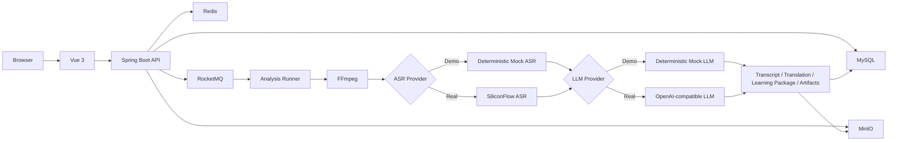

<div align="center">
  <h1>LectureLens</h1>
  <p><strong>课程视频，也可以像文档一样阅读</strong></p>
  <p>A course video learning workspace</p>
</div>

<div align="center">
  
  
  
  
  
  
</div>

LectureLens 是一个基于 Java 21、Spring Boot、Node.js 24 LTS 和 Vue 3 构建的课程视频学习平台。用户上传课程录屏、讲座或网课视频后，系统通过异步 AI Pipeline 生成时间轴字幕、中文翻译、课程摘要、术语表、问答和可下载学习资料。

LectureLens is a course video learning workspace built with Java 21, Spring Boot, and Vue 3. It turns course recordings, lectures, and online-class videos into timestamped transcripts, translations, study notes, glossaries, Q&A, and downloadable learning artifacts through an asynchronous AI pipeline.

为保持既有代码和数据库兼容性，部分内部标识仍保留 `courselingo` 前缀；clone 后无需手动重命名 package。

## 本地 Demo 端口与隔离

无密钥 Demo 默认使用非标准主机端口：MySQL `13306`、Redis `16379`、MinIO `19000/19001`、RocketMQ nameserver `19876`、proxy `18081`、broker `20909/20911/20912`。这样可避免占用常见本地服务端口；可在未提交的 `.env.demo.local` 中按需覆盖。

每个 Demo 通过符合 `^[a-z0-9-]{1,32}$` 的 `LECTURELENS_DEMO_INSTANCE` 生成独立的 Docker Compose project 和 volumes。停止 Demo 使用 `scripts/demo/stop-infrastructure.ps1` 或 `scripts/demo/stop-infrastructure.sh`，默认只停止该实例且保留 volumes；只有明确不再需要该实例数据时，才手动执行 `docker compose --project-name lecturelens-demo-<instance> down -v`。

Demo 使用约 2 秒的合成示例视频和本地 Mock ASR/LLM，不需要 API Key，也不会访问作者服务器。真实 AI 模式需要你在 `.env.real-ai.local` 中提供自己的 Key。

## 项目预览

以下界面使用本地 Mock Pipeline 和完全合成的数据生成，不包含真实账号、视频或服务信息。

| 首页 | 登录 |
| --- | --- |
|  |  |

| 上传课程 | 我的课程 |
| --- | --- |
|  |  |

| 课程阅读 | 异步处理 |
| --- | --- |
|  |  |

## LectureLens 能做什么

LectureLens 把“播放视频”和“整理学习资料”放在同一个课程工作区。上传完成后，原视频可在线播放；后台分析任务通过消息队列执行媒体处理、语音转写、字幕翻译、学习包生成和文件导出。完成后，可以按时间轴阅读原文与译文，查看摘要、重点、术语和问答，并下载 SRT、VTT、Markdown、JSON 学习资料。

仓库提供两种明确分开的本地模式：默认推荐的无密钥 Demo 使用确定性 Mock ASR 与 Mock LLM，不访问外部 AI；真实 AI 模式由使用者自行配置 SiliconFlow ASR 和 OpenAI-compatible LLM 凭据。

## 核心功能

- 账号注册、登录、JWT 访问令牌与刷新令牌轮换。
- 大文件分片上传、缺失分片查询、暂停/继续、MD5 完整性校验和 MinIO 存储。
- RocketMQ 驱动的异步分析任务、Redis 执行 claim、进度快照与 SSE 状态更新。
- FFmpeg 音频提取、ASR 时间轴字幕、对齐翻译和结构化学习包。
- 课程摘要、重点、术语表、内置问答，以及基于当前课程证据的单轮课程问答。
- 按需课程章节、原文/译文/时间轴阅读和视频定位。
- SRT、VTT、Markdown、JSON 四类制品生成与鉴权下载。
- 课程列表筛选、失败任务重试、运行任务取消和终态课程批量逻辑删除。
- Owner Scope 校验、敏感字段脱敏、低基数指标和受限 Actuator 端点。

## 系统架构



HTTP 请求只创建和查询任务；耗时的媒体与 AI 步骤由 RocketMQ Consumer 和有界 Runner 在后台执行。MySQL 保存业务事实，Redis 保存短期协调状态，MinIO 保存上传视频和生成制品。

## 五分钟本地体验

Demo 模式不需要任何 API Key。先复制配置并启动依赖：

```powershell
Copy-Item .env.demo.example .env.demo.local
powershell -NoProfile -ExecutionPolicy Bypass -File .\scripts\demo\check-prerequisites.ps1
powershell -NoProfile -ExecutionPolicy Bypass -File .\scripts\demo\start-infrastructure.ps1
```

分别在两个终端启动后端和前端：

```powershell
powershell -NoProfile -ExecutionPolicy Bypass -File .\scripts\demo\start-backend.ps1
npm --prefix frontend run dev
```

生成约 2 秒示例视频：

```powershell
powershell -NoProfile -ExecutionPolicy Bypass -File .\scripts\demo\generate-sample-video.ps1
```

打开 `http://localhost:5173`，注册后上传 `.demo/lecturelens-sample.mp4`。完整 Windows 与 Linux/macOS 步骤、预期结果和安全停止方式见 [Quick Start](docs/QUICKSTART.md)。后端健康检查为 `http://localhost:8080/actuator/health`。

## 真实 AI 模式

真实 AI 模式使用 [.env.real-ai.example](.env.real-ai.example) 作为最小模板。使用者需要自行申请服务凭据，将模板复制为本地 `.env`，确认 MySQL、Redis、MinIO、RocketMQ、JWT、FFmpeg 和 Pipeline 配置，再启用 SiliconFlow ASR 与 OpenAI-compatible LLM。

API Key 只能保存在未跟踪的本地 `.env` 中，不得提交到 Git，不得粘贴到 Issue、日志或截图。Demo 模式完全不需要 Key；切换真实模式时必须保持 `MOCK_ASR_ENABLED=false` 和 `DEMO_MOCK_LLM_ENABLED=false`。真实 AI 配置模板见 [.env.real-ai.example](.env.real-ai.example)。

## 技术栈

| 层 | 技术 |
| --- | --- |
| 后端 | Java 21、Spring Boot 3.5.15、Maven Wrapper、MyBatis-Plus 3.5.16、Flyway |
| 前端 | Node.js 24 LTS、Vue 3.5、TypeScript 5.9、Vite 8、Pinia 3、Element Plus 2.14、Axios |
| 数据与协调 | MySQL 8.4 LTS、Redis 8.8、MinIO、RocketMQ 5.3.4 |
| 媒体与 AI | FFmpeg 8、SiliconFlow-compatible ASR、OpenAI-compatible LLM、LangChain4j 适配 |
| 质量保障 | JUnit 5、Mockito、AssertJ、Vue Type Check、GitHub Actions、Dependabot |

## 项目目录

```text
.
├── backend/                 # Spring Boot API、Pipeline、Flyway 与测试
├── frontend/                # Vue 3 课程学习工作区
├── infra/                   # RocketMQ 本地配置
├── scripts/demo/            # 跨平台 Demo 检查、启动与样例视频脚本
├── docs/images/             # 使用合成数据生成的界面预览
├── docs/QUICKSTART.md       # Windows 与 Linux/macOS 本地体验步骤
├── compose.yaml             # MySQL、Redis、MinIO、RocketMQ
└── .env.demo.example        # 默认无密钥 Demo 配置
```

## API 与数据模型

后端统一使用 `/api` 路径，覆盖认证、分片上传、课程任务、SSE、结果、章节、问答、媒体播放和制品下载。受保护资源的 owner 从服务端认证上下文解析，不信任客户端传入的用户标识。

核心数据围绕用户、刷新令牌、上传会话、分析任务、任务日志、字幕段、翻译段、学习包、制品、AI 调用记录、课程章节和课程问答记录组织。接口契约与字段边界见 [API](docs/API.md)，表结构与索引见 [数据库设计](docs/DB_SCHEMA.md)。

## 测试与质量保障

```powershell
# 后端完整测试
cd backend
.\mvnw.cmd test

# 前端类型检查与构建
cd ..\frontend
npm ci
npm run type-check
npm run build
```

默认测试使用 Mock、Fake 或禁用配置，不依赖真实 AI Key。GitHub Actions 在 push 和 pull request 上执行后端测试与前端构建；Dependabot 每周检查 Maven、npm 和 Actions 依赖。完整分层策略见 [TEST_PLAN.md](TEST_PLAN.md)。

## 安全与隐私

- `.env`、本地凭据、上传内容、生成目录和构建产物不进入版本控制。
- API 不向前端暴露对象存储 key、本地路径、令牌、Prompt 或原始模型响应。
- 日志、指标和追踪字段经过边界约束，不记录字幕全文、学习包全文或密钥。
- 上传完成阶段校验扩展名、大小、MD5、分片事实和基础媒体头。
- 本地 Docker 服务只用于开发体验，不应暴露到公网。

漏洞报告与当前安全非目标见 [SECURITY.md](SECURITY.md)。请只使用占位值和合成数据描述问题。

## 当前能力边界

- Demo Provider 只为验证完整本地链路提供稳定演示输出，不代表真实模型质量。
- 课程问答是当前课程范围内、基于已保存证据的单轮非流式问答，不是通用 Agent Loop。
- 项目没有向量数据库、Embedding 检索或任意视频理解承诺。
- 视觉分析、OCR 和真实 AI 依赖本地显式配置；无密钥 Demo 默认关闭这些可选外部能力。
- 当前交付目标是可复现的本地学习与简历项目，不包含线上托管、商业多租户隔离或服务可用性承诺。

## 相关文档

- [Quick Start](docs/QUICKSTART.md)
- [架构设计](docs/ARCHITECTURE.md)
- [API 契约](docs/API.md)
- [数据库设计](docs/DB_SCHEMA.md)
- [前端 UX](docs/FRONTEND_UX.md)
- [测试计划](TEST_PLAN.md)
- [安全策略](SECURITY.md)

## 参与贡献

欢迎通过分支和 Pull Request 提交范围清晰、可验证的改进。提交前请运行相关后端测试与前端检查，并确保没有密钥、大视频或生成目录。具体约定见 [CONTRIBUTING.md](CONTRIBUTING.md)。

## License

本项目使用 [MIT License](LICENSE)。
