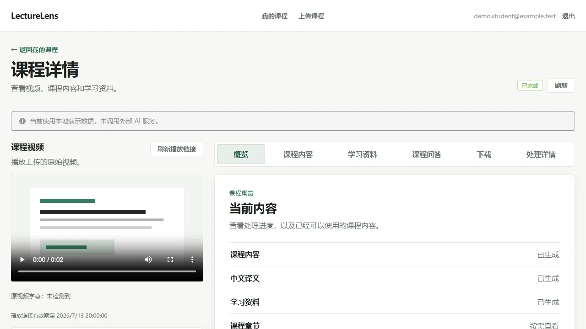
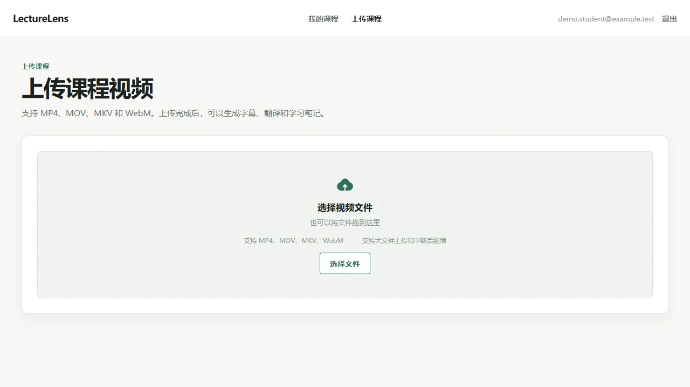
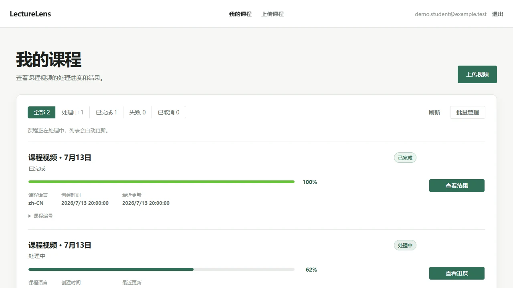
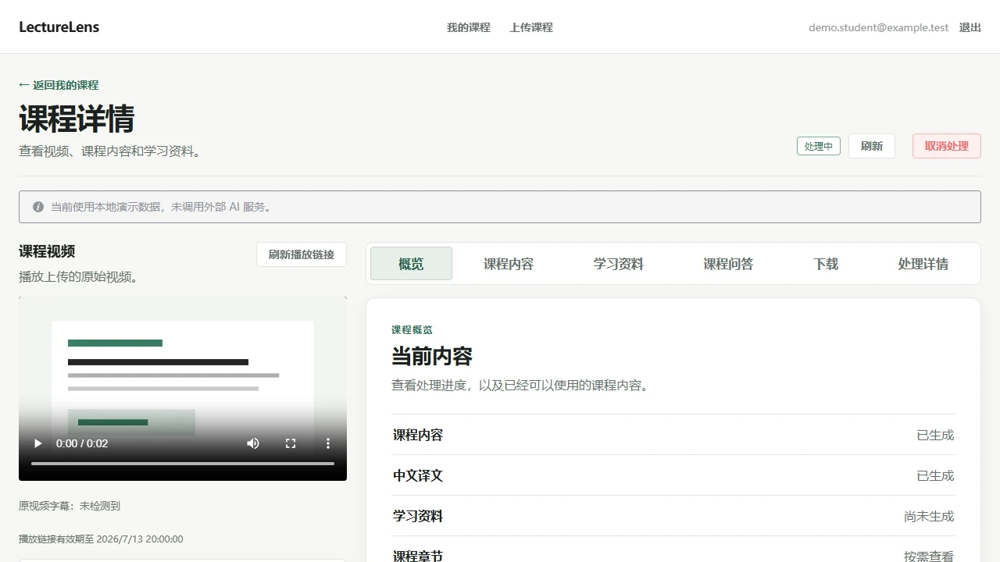
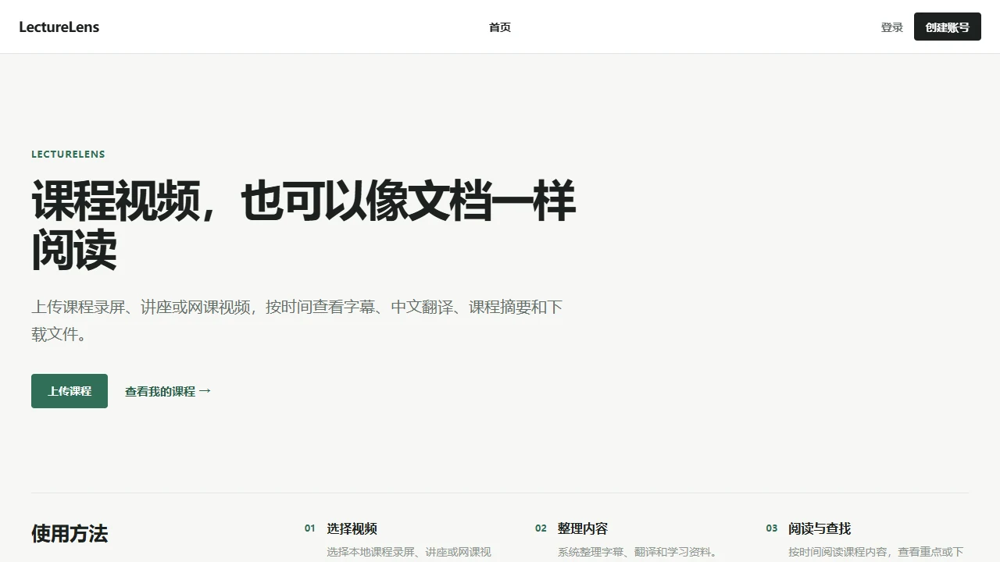
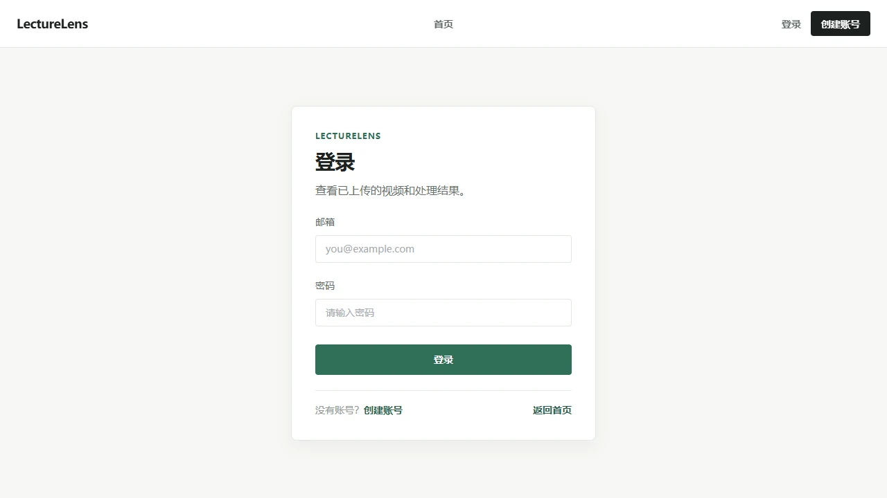
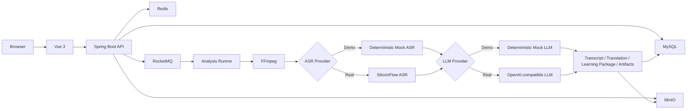

<div align="center">
  <h1>LectureLens</h1>
  <p><strong>课程视频，也可以像文档一样阅读</strong></p>
  <p>A course video learning workspace</p>
</div>

<div align="center">
  
  
  
  
  
  
</div>

LectureLens 是一个基于 Java 21、Spring Boot、Node.js 24 LTS 和 Vue 3 构建的课程视频学习平台：它把课程录屏、讲座和网课视频整理为可按时间阅读的字幕、翻译与学习资料。

LectureLens is a Java and Vue course video learning workspace that turns course recordings into timestamped transcripts, translations, study notes, Q&A, and downloadable learning artifacts through an asynchronous AI pipeline.

## 无密钥也能体验完整业务闭环

- 上传课程视频，生成时间轴字幕与中文翻译。
- RocketMQ 异步执行 FFmpeg、Mock ASR、Mock LLM 和学习包 Pipeline。
- 查看课程摘要、重点、术语与问答，并下载 SRT、VTT、Markdown、JSON 学习资料。
- Demo 不需要 API Key，也不会访问作者服务器。

## 项目预览

以下界面使用本地 Mock Pipeline 和完全合成的数据生成，不包含真实账号、视频或服务信息。

### 课程阅读工作区



| 上传课程 | 我的课程 |
| --- | --- |
|  |  |
| **异步处理** | **首页** |
|  |  |

<details>
<summary>查看登录页面</summary>



</details>

## LectureLens 能做什么

LectureLens 把“播放视频”和“整理学习资料”放在同一个课程工作区。上传后可以在线播放原视频；后台异步完成媒体处理、语音转写、字幕翻译、学习包生成和文件导出。处理完成后，可以按时间轴阅读原文与译文，定位视频内容，查看摘要、重点、术语与课程问答。

仓库提供两种清晰分离的运行模式：默认无密钥 Demo 使用确定性 Mock ASR 与 Mock LLM；真实 AI 模式由使用者自行配置 SiliconFlow ASR 和 OpenAI-compatible LLM 凭据。

## 核心技术模块

### 可靠的大文件上传

- 支持分片上传、缺失分片查询，以及暂停后继续上传。
- 上传完成阶段执行扩展名、大小、MD5、分片事实和基础媒体头校验。
- MinIO 保存原始视频与生成的学习制品。

### 异步 AI Pipeline

- RocketMQ 将耗时处理移出 HTTP 请求线程，由有界 Runner 执行媒体与 AI 步骤。
- MySQL 保存任务事实，Redis claim 防止重复执行并保存进度快照，SSE 推送处理状态。
- 任务与课程管理支持列表筛选、失败任务重试、运行任务取消和终态课程批量逻辑删除。

### 结构化课程学习资料

- FFmpeg 提取音频，ASR 生成时间轴字幕，LLM 完成字幕翻译和学习包生成。
- 学习包包含课程摘要、重点、术语与问答，并关联原文、译文、时间轴和视频定位。
- 支持按需课程章节，以及 SRT、VTT、Markdown、JSON 鉴权下载。

### 安全与可观测性

- 账号注册与登录使用 JWT access/refresh rotation，受保护资源执行 Owner Scope 校验。
- Artifact 下载需要鉴权，API 不向前端暴露对象存储 key、本地路径、令牌、Prompt 或原始模型响应。
- 日志对敏感字段脱敏，不记录字幕与学习包全文或密钥；指标保持低基数，Actuator 只开放受限端点。

## 系统架构

HTTP 请求只负责创建和查询任务，耗时的媒体与 AI 步骤由 RocketMQ Consumer 和有界 Runner 异步执行。



MySQL 保存业务事实，Redis 保存短期协调状态，MinIO 保存上传视频和生成制品；Demo 与真实 Provider 共用同一条任务链路。

## 五分钟本地体验

Demo 模式不需要任何 API Key。使用 Windows PowerShell 启动依赖、后端和前端：

```powershell
Copy-Item .env.demo.example .env.demo.local
powershell -NoProfile -ExecutionPolicy Bypass -File .\scripts\demo\check-prerequisites.ps1
powershell -NoProfile -ExecutionPolicy Bypass -File .\scripts\demo\start-infrastructure.ps1
powershell -NoProfile -ExecutionPolicy Bypass -File .\scripts\demo\start-backend.ps1
npm --prefix frontend run dev
```

生成约 2 秒的合成示例视频：

```powershell
powershell -NoProfile -ExecutionPolicy Bypass -File .\scripts\demo\generate-sample-video.ps1
```

打开 `http://localhost:5173`，注册后上传 `.demo/lecturelens-sample.mp4`。Demo 默认使用独立的 Docker Compose 实例和非标准本地主机端口，不会复用已有项目数据。完整 Windows、Linux、实例隔离、端口覆盖和安全停止步骤见 [Quick Start](docs/QUICKSTART.md)。后端健康检查地址为 `http://localhost:8080/actuator/health`。

## 真实 AI 模式

真实 AI 模式使用 [.env.real-ai.example](.env.real-ai.example) 作为最小模板。使用者需要自行申请服务凭据，将模板复制为未跟踪的本地 `.env`，确认 MySQL、Redis、MinIO、RocketMQ、JWT、FFmpeg 和 Pipeline 配置，再启用 SiliconFlow ASR 与 OpenAI-compatible LLM。

API Key 不得提交到 Git，也不得粘贴到 Issue、日志或截图。切换真实模式时需要关闭 Mock Provider：`MOCK_ASR_ENABLED=false`、`DEMO_MOCK_LLM_ENABLED=false`。

## 技术栈

| 层 | 技术 |
| --- | --- |
| 后端 | Java 21、Spring Boot 3.5.15、Maven Wrapper、MyBatis-Plus 3.5.16、Flyway |
| 前端 | Node.js 24 LTS、Vue 3.5、TypeScript 5.9、Vite 8、Pinia 3、Element Plus 2.14、Axios |
| 数据与协调 | MySQL 8.4 LTS、Redis 8.8、MinIO、RocketMQ 5.3.4 |
| 媒体与 AI | FFmpeg 8、SiliconFlow-compatible ASR、OpenAI-compatible LLM、LangChain4j 适配 |
| 质量保障 | JUnit 5、Mockito、AssertJ、Vue Type Check、GitHub Actions、Dependabot |

## 项目目录

```text
.
├── backend/                 # Spring Boot API、Pipeline、Flyway 与测试
├── frontend/                # Vue 3 课程学习工作区
├── infra/                   # RocketMQ 本地配置
├── scripts/demo/            # 跨平台 Demo 检查、启动与样例视频脚本
├── docs/images/             # 使用合成数据生成的界面预览
├── docs/QUICKSTART.md       # Windows 与 Linux 本地体验步骤
├── compose.yaml             # MySQL、Redis、MinIO、RocketMQ
└── .env.demo.example        # 默认无密钥 Demo 配置
```

为保持既有代码和数据库兼容性，部分内部标识仍保留 `courselingo` 前缀；clone 后无需手动重命名 package。

## API 与数据模型

后端统一使用 `/api` 路径，覆盖认证、分片上传、课程任务、SSE、结果、章节、问答、媒体播放和制品下载。受保护资源的 owner 从服务端认证上下文解析，不信任客户端传入的用户标识。

核心数据围绕用户、刷新令牌、上传会话、分析任务、任务日志、字幕段、翻译段、学习包、制品、AI 调用记录、课程章节和课程问答记录组织。接口契约见 [API](docs/API.md)，表结构与索引见 [数据库设计](docs/DB_SCHEMA.md)。

## 测试与质量保障

```powershell
# 后端完整测试
cd backend
.\mvnw.cmd test

# 前端类型检查与构建
cd ..\frontend
npm ci
npm run type-check
npm run build
```

默认测试使用 Mock、Fake 或禁用配置，不依赖真实 AI Key。GitHub Actions 在 push 和 pull request 上执行后端测试与前端构建；Dependabot 每周检查 Maven、npm 和 Actions 依赖。完整分层策略见 [TEST_PLAN.md](TEST_PLAN.md)。

## 安全、隐私与能力边界

- `.env`、本地凭据、上传内容、生成目录和构建产物不进入版本控制；本地 Docker 服务不应暴露到公网。
- Demo Mock 输出只用于验证可复现的完整本地链路，不代表真实模型质量；真实 AI 需要使用者自己的 Key。
- 课程问答是当前课程范围内、基于已保存证据的单轮非流式问答，不是通用 Agent Loop。
- 项目没有向量数据库、Embedding 或 RAG 检索，也不承诺任意视频理解。
- 视觉分析和 OCR 只在使用者显式配置对应能力时启用，无密钥 Demo 默认关闭外部能力。
- 当前目标是可复现的本地学习与简历项目，不是在线托管服务或生产级商业 SaaS。

漏洞报告与安全非目标见 [SECURITY.md](SECURITY.md)。请只使用占位值和合成数据描述问题。

## 相关文档

- [Quick Start](docs/QUICKSTART.md)
- [架构设计](docs/ARCHITECTURE.md)
- [API 契约](docs/API.md)
- [数据库设计](docs/DB_SCHEMA.md)
- [前端 UX](docs/FRONTEND_UX.md)
- [测试计划](TEST_PLAN.md)
- [安全策略](SECURITY.md)

## 参与贡献

欢迎通过分支和 Pull Request 提交范围清晰、可验证的改进。提交前请运行相关检查并确认没有密钥、大视频或生成目录。具体约定见 [CONTRIBUTING.md](CONTRIBUTING.md)。

## License

本项目使用 [MIT License](LICENSE)。
