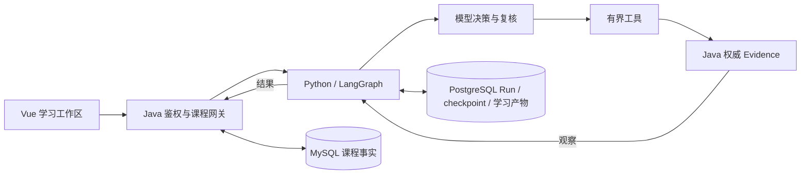

# LectureLens

**基于课程证据的 Study Agent。** 用户提交学习目标，模型在受限工具集中检索、补读和核算，生成有来源的解释与练习；作答、证据反馈和执行历史保存在服务端，支持取消与恢复。

项目处于实验阶段，学习闭环已完成有限课程范围验收，**尚未发布，线上配置保持不变**。验收不代表未见课程泛化；自动评分、长期记忆和复习调度尚未交付。测量结果与证据见下文。

[架构](docs/ARCHITECTURE.md) · [部署](docs/DEPLOYMENT.md) · [Python 服务](agent-service/README.md) · [评测证据](eval/README.md) · [CI](https://github.com/a27497/lecturelens/actions/workflows/ci.yml)

## 学习流程与架构

学习助手支持 **学习目标 → 解释与练习 → 作答 → 证据反馈 → 修改**。模型通过标准 `tool_calls` 选择动作，工具观察和草稿复核意见影响下一步；程序负责权限、预算、版本和停止条件。


```mermaid
flowchart LR
    U[Vue 学习工作区] --> J[Java 鉴权与课程网关]
    J --> P[Python / LangGraph]
    P --> M[模型决策与复核]
    M --> T[有界工具]
    T --> E[Java 权威 Evidence]
    E -->|观察| P
    P <--> D[(PostgreSQL Run / checkpoint / 学习产物)]
    J <--> B[(MySQL 课程事实)]
    P -->|结果| J
```

- **Python** 负责学习任务、上下文、工具编排、Session/Run、学习产物和反馈；PostgreSQL 保存执行状态与派生向量索引。
- **Java** 负责身份、课程与媒体摄取、Evidence 权属/revision/删除检查，以及浏览器签名网关；MySQL 保存业务事实。
- **课程准备**通过分片上传 → MinIO → 事务 outbox / RocketMQ → 有界 Runner，完成字幕、翻译、可选 OCR/VLM、时间线和导出。Redis 提供短期协调与进度缓存。
- **普通课程 QA** 是独立的单轮 RAG 路径。课程准备和 QA 为 Agent 提供基础能力，模型工具循环在 Python 中执行。

## 工程重点

| 能力 | 实现与证据 |
| --- | --- |
| 证据与权限 | 工具边界重查 owner、course、revision 和删除状态；索引不能代替 Java 授权。[职责约束](docs/AGENT_PRODUCT_CONTRACT.md) |
| 持久执行 | LangGraph checkpoint、持久预算、Session 单活、幂等工具结果；取消后的晚到结果不能发布，重启不能重置额度。[运行与恢复](docs/L2_STUDY_AGENT.md) |
| 学习交互 | 不可变作答版本、独立反馈 Run、用户核对记录；新 Run 冻结个人决策/复核模型连接。反馈默认关闭。[学习交互](docs/L3_LEARNING_FLOW.md) · [模型管理](docs/MODEL_MANAGEMENT.md) |
| Retrieval Benchmark | 24 Query / 70 Evidence 对比 Dense、BM25+Dense、RRF 和 Cross-Encoder，测量 Recall / MRR / nDCG / GAR / latency；CE 改善检索但未带来对应答案收益，默认保留 Dense。[检索评测](eval/retrieval-phase-a/README.md) |
| Trace / Replay | 关联实际 token、latency、tool 和 checkpoint，复现历史失败；历史 usage 与新调用分开计量。[Trace 与失败分类](eval/agent-trace-phase-b/README.md) |
| Course MCP | 官方 SDK 的可选 stdio Client/Server，沿用 Java Authority；wrong owner、old revision、deleted course 均拒绝。默认传输为 internal。[协议与验证](eval/course-mcp-phase-c/README.md) |
| 媒体可靠性 | 事务 outbox、数据库执行租约、短事务发布与来源版本检查；外部模型调用不占用业务事务。[可靠性验证](docs/C0_C3_EXECUTION.md) |

## 测量与验证

以下为已有验收记录。执行与隔离、教学质量、生产并发能力是不同的验证结论：**execution / isolation ≠ teaching quality ≠ production concurrency**。

| 检查项 | 结果与范围 |
| --- | --- |
| 真实模型质量 | 冻结 AU：已见公开课程新目标，开发 **31/31**、fresh holdout **8/8**；冻结时 **547** 项 Python/PostgreSQL 机制测试及真实浏览器闭环、恢复、取消、越权、删除检查通过。[AU 报告](eval/phase-completion/FINAL_AU.md) |
| Python / PostgreSQL | Phase E **605 passed、0 skipped**，使用独立测试库；另有 runner 统计测试 **4 passed**。[Phase E](eval/multi-user-phase-e/README.md) |
| Java | Phase E 定向回归 **62 passed、0 skipped**；反馈验收历史全量 **1366 passed**。[Phase E](eval/multi-user-phase-e/README.md) · [反馈验收](eval/feedback-v1/FINAL_ACCEPTANCE.md) |
| 前端 | Phase D **21 files / 85 tests passed**，生产构建与 TypeScript 检查通过，五个真实浏览器演示场景通过。[演示验收](eval/recruiter-demo-phase-d/README.md) |
| MySQL migrations + Mock AI E2E | 历史基线通过，Phase E 未重跑。[基础链路验收](docs/C0_C3_EXECUTION.md) |

**Phase E 并发与隔离实验：** 50 个独立用户通过正常登录、上传和运行链路准备课程。固定响应、五 worker 的 5/20/50-user 组分别 **1/5、10/20、40/50 完成**；真实模型 5/10-user 组分别 **4/5、4/10 完成**（对应 5/10 worker）。**2,160 次负向权限请求，0 次绕过**；取消晚到结果和两类进程崩溃恢复检查通过。并发检索存在 **503 瓶颈**，全部失败保留；完成数不是教学质量分数，也不证明默认部署可同时推理 50 个 Run。Phase E 实验已完成并停止，详见 [并发指标、隔离与 Bad Case](eval/multi-user-phase-e/README.md)。

CI 覆盖 Python lint/真实 PostgreSQL 测试、Java 测试、前端单测/构建/依赖审计和真实基础设施上的 Mock E2E。确定性模型验证执行机制，真实模型质量使用独立评测；失败试验、冻结候选与保留集边界见 [评测索引](eval/README.md)。

## 演示与截图

本机演示路径：**Sample Course → Evidence IDs → 无证据拒答 → 保存作答与反馈 → View Trace**。演示尚未公网发布，准备与验收步骤见 [演示说明](eval/recruiter-demo-phase-d/README.md)。

以下截图使用合成测试数据，不包含真实账号或私人课程。


| 上传课程 | 我的课程 |
| :---: | :---: |
|  |  |

<details>
<summary>辅助页面</summary>

| 任务处理 | 首页 |
| :---: | :---: |
|  |  |


</details>

## 技术栈

| 层次 | 技术 |
| --- | --- |
| Agent | Python 3.12、FastAPI、LangGraph / PostgresSaver |
| 状态与检索 | PostgreSQL / pgvector、本地多语言 ONNX Embedding |
| 业务与 Evidence | Java 21、Spring Boot 3.5、MyBatis-Plus、Flyway、MySQL 8.4 |
| Web | Node.js 24 LTS、Vue 3.5、TypeScript、Vite、Pinia、Element Plus |
| 异步与存储 | RocketMQ、Redis、MinIO、SSE |
| 媒体与模型 | FFmpeg/FFprobe、Tesseract、SiliconFlow ASR、OpenAI-compatible LLM/VLM；LangChain4j 为可选 Java Provider 适配 |
| 验证与部署 | pytest、Ruff、JUnit、Vitest、GitHub Actions、Docker Compose |

## 快速开始

准备 Java 21、Node.js 24 LTS、Python 3.12、uv、Docker Compose 和 FFmpeg/FFprobe。Compose 启动基础设施；Java、Python 和前端分别运行。

```bash
git clone https://github.com/a27497/lecturelens.git
cd lecturelens
test -e .env || cp .env.real-ai.example .env
test -e .env.agent.local || cp .env.agent.example .env.agent.local
```

已有本地配置时保留原文件。填写基础设施密码和 Provider 配置；在 Java/Python 两端设置 `STUDY_AGENT_ENABLED=true`、相同的 `AGENT_SERVICE_SECRET`，并为 Java 启用 Dense 检索。个人模型连接可在启动后通过 `/settings/models` 配置。示例默认关闭 Study Agent 与实验反馈。

```bash
# 仓库根目录，配置完成后启动基础设施。
docker compose --env-file .env up -d
docker compose -f compose.agent.yml up -d
```

按[部署指南](docs/DEPLOYMENT.md)逐行加载 `.env` 和 Java 所需的 Agent 配置后，在独立终端启动 Java；不要直接 `source .env`。

```bash
cd backend
./mvnw spring-boot:run
```

另开终端启动 Python 和前端：

```bash
# 终端 2，从仓库根目录执行。
cd agent-service
uv sync --locked
uv run --env-file ../.env.agent.local uvicorn lecturelens_agent.app:create_app --factory --host 127.0.0.1 --port 8090

# 终端 3，从仓库根目录执行。
npm --prefix frontend ci
npm --prefix frontend run dev
```

注册本地账号并上传课程，处理成功且 Evidence 索引 `READY` 后即可提交学习目标。无 Key 的确定性演示使用 `.env.demo.example`；真实模型失败不会自动回退 Mock。完整配置、演示模式、端口和故障排查见[部署指南](docs/DEPLOYMENT.md)，Python 验证命令见[服务 README](agent-service/README.md)。

## 文档与代码导航

- [架构与故障语义](docs/ARCHITECTURE.md) · [API 契约](docs/API.md) · [数据库设计](docs/DB_SCHEMA.md)
- [Agent 项目约束](docs/AGENT_PRODUCT_CONTRACT.md) · [Evidence 同步](docs/L1_EVIDENCE_SYNC.md) · [学习交互](docs/L3_LEARNING_FLOW.md)
- [评测索引与历史失败](eval/README.md) · [视觉理解与离线评测](docs/ADAPTIVE_VIDEO_UNDERSTANDING_R1.md)
- [测试计划](TEST_PLAN.md) · [安全策略](SECURITY.md) · [贡献指南](CONTRIBUTING.md) · [MIT License](LICENSE)

`agent-service/` 保存 Agent 核心，`backend/` 保存业务与 Evidence 服务，`frontend/` 保存学习工作区，`eval/` 保存公开评测证据，`scripts/` 保存验收与运维入口。部分内部标识保留 `courselingo` 前缀以兼容既有代码与数据库。凭据、下载媒体和私有评测记录不入 Git。
