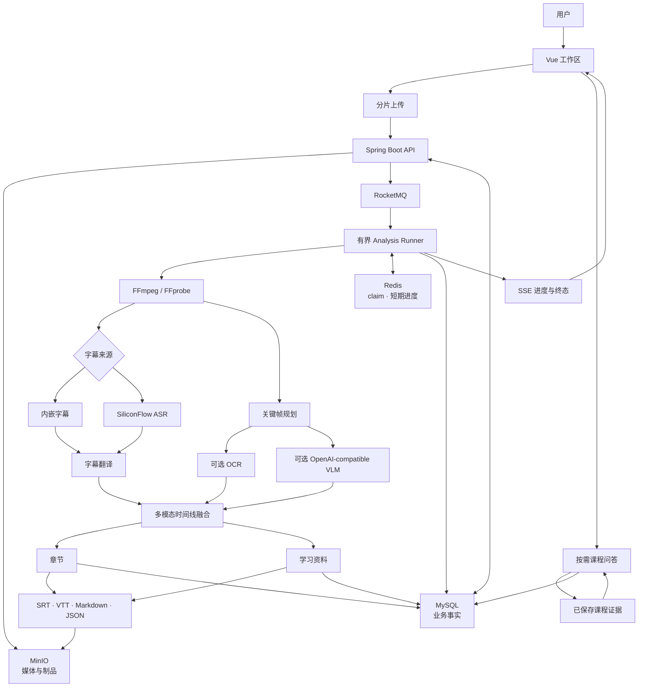

<div align="center">
  <h1>LectureLens</h1>
  <p><strong>面向课程视频的多模态学习工作台</strong></p>
  <p>把长课程转化为可按时间阅读、可定位证据、可问答、可导出的结构化学习资料</p>
  <p><em>A multimodal learning workspace for course videos.</em></p>
  <p>
    <a href="https://github.com/a27497/lecturelens/stargazers"></a>
    
    
    
    
    
    
    <a href="https://github.com/a27497/lecturelens/actions/workflows/ci.yml"></a>
    <a href="LICENSE"></a>
  </p>
</div>

## 项目预览

> 以下截图使用合成测试数据生成，不包含真实账号、私人视频、API Key 或服务地址。

### 课程阅读工作区


| 上传课程 | 我的课程 |
| :---: | :---: |
|  |  |

| 异步处理 | 首页 |
| :---: | :---: |
|  |  |

<details>
<summary>查看登录页面</summary>


</details>

## 项目定位

LectureLens 面向课程录屏、讲座和网课视频，将媒体整理为时间轴原文、翻译、章节、学习资料、课程问答与下载制品。项目由使用者本地部署并配置自己的基础设施密码和 AI Provider 凭据；系统优先利用视频内嵌字幕，在字幕缺失或覆盖不足时调用 SiliconFlow ASR，并可按需启用 OCR 与视觉模型，不依赖作者托管服务器或共享密钥。

## 核心能力

### 1. 🎬 可靠的视频任务链路

> 把大文件上传和长耗时 AI 处理移出请求主链路，避免上传中断、请求阻塞和任务重复执行。

- **可恢复上传**：支持分片上传、缺失分片查询和断点续传；完成阶段核验扩展名、大小、MD5、实际分片与基础媒体头。
- **异步执行**：MinIO 保存原始媒体与生成制品，RocketMQ 投递任务，有界 Analysis Runner 执行 Pipeline；MySQL 记录业务事实，Redis claim 防止重复执行并保存带 TTL 的短期进度。
- **任务控制**：支持失败任务重试、运行任务取消、状态筛选和终态批量逻辑删除；SSE 意外断开后按有界退避重连，并保留最后一次进度。

### 2. 🧩 时序多模态课程理解

> 把语音、字幕、画面文字、视觉描述和时间戳融合为可继续生成学习资料的统一课程时间线。

- **字幕与语音**：FFmpeg/FFprobe 负责媒体处理；优先读取覆盖充分的内嵌字幕，否则可调用真实 SiliconFlow ASR。
- **画面证据**：自适应关键帧规划扫描完整时间轴，通过清晰度、黑屏、空白和重复过滤控制 OCR 输入，并只对预算内高价值帧执行有界 VLM 调用。
- **统一时间线**：原文、翻译、OCR 与视觉描述按时间范围融合；OCR 或视觉 Provider 不可用时允许降级，不阻断已有语音主链。
- **安全调用记录**：保存调用阶段、Provider、模型、聚合状态、调用数量与耗时，不保存 Prompt、原始模型响应、图片内容或 Authorization。

```text
[19:00–20:00]
Transcript   ...
Translation  ...
Visual       ...
Evidence     timestamp / keyframe
```

### 3. 📚 有时间证据的学习工作区

> 学习结果不是脱离视频的普通摘要，而是能回到原始时间轴核验的结构化课程资料。

- **边看边读**：原文与译文按时间轴呈现，点击内容、章节或问答证据即可定位视频。
- **结构化学习**：生成完整覆盖 evidence 与课程首尾的语义章节，以及摘要、重点、术语和预生成问答。
- **课程范围问答**：单轮问答只使用当前课程证据，并返回真实字幕时间范围；没有明确依据时拒绝作答。
- **可验证制品**：导出 SRT、VTT、Markdown 和 JSON，持久化 SHA-256；章节与学习资料通过完整校验后才原子替换旧结果，模型输出不足时仅执行有界 repair 和确定性 fallback。

### 4. 🛡️ 可观测、可恢复与安全边界

> 真实 AI 调用可能超时、部分失败或返回格式异常，因此任务状态、替换边界和敏感数据必须可追踪、可降级。

- **身份与资源边界**：JWT access/refresh rotation，Refresh Token 哈希存储；上传、任务、播放、证据和制品下载统一执行 Owner Scope。
- **失败可追踪**：AI 调用记录区分成功、部分成功和失败；外层业务事务失败时仍可保存调用失败记录，章节、视觉分析和学习资料采用原子替换。
- **前端恢复**：SSE 收到终态后只刷新一次任务详情；正常媒体 Range 断流不再被记录为内部错误。
- **敏感信息控制**：Credential Leak Detector 区分课程术语 `token` 与真实凭据；日志和 API 不暴露对象存储 key、本地路径、密钥、Prompt 或原始响应，登录页不预填账号或密码，Provider 凭据只从部署者本地环境变量读取。

## 真实长视频验证

| 指标 | 场景一：真实外部 ASR 与 VLM | 场景二：68 分钟长课程 |
| --- | --- | --- |
| 视频 | [Bare-Bones Basics of Full-Text Search](https://commons.wikimedia.org/wiki/File:BareBonesSearch.webm) | 未记录可公开引用的标题 |
| 来源与许可 | Wikimedia Commons，CC BY-SA 4.0 | 本地回归素材 |
| 媒体 | 45:17，WebM，39.5 MB | 68:10，H.264 1080p，381.7 MB |
| 转写来源 | SiliconFlow 真实外部 ASR | 内嵌英文字幕 |
| 字幕与融合 | 原文 46 段；译文 46 段；融合时间段 46 | 1461 个 subtitle cues；最终融合段 69 |
| 视觉证据 | 58 个关键帧；OCR 58/58 成功；Qwen3-VL 44/44 成功 | 240 个关键帧 |
| 章节 | 11 章，覆盖 `00:00:00–00:45:17`；空档 0 | 最终时间轴覆盖 100%；最大空档 0 |
| 课程问答 | TF-IDF 问题返回 `19:00–20:00` 的课程证据 | 课程内问题返回时间证据；课程外问题拒答 |
| 导出 | JSON、Markdown、SRT、VTT 全部成功 | JSON、Markdown、SRT、VTT 全部成功 |
| 处理耗时 | `00:07:58` | 未作为公开基准记录 |

以上数据是特定本地环境和模型配置下的回归证据，用于证明链路真实跑通，不代表吞吐量、费用或时延 SLA。

自动化门禁：Backend `1308 tests passed`；Frontend `12 files / 36 tests passed`；TypeScript type-check 与 Production build 通过；Production dependency audit 为 `0 high vulnerabilities`；GitHub Actions 持续执行 `Frontend Build` 与 `Backend Test`。

## 系统流程


```mermaid
flowchart TB
    User["用户"] --> Web["Vue 工作区"]
    Web --> Upload["分片上传"]
    Upload --> API["Spring Boot API"]
    API --> MinIO["MinIO<br/>媒体与制品"]
    API --> MQ["RocketMQ"]
    API <--> MySQL["MySQL<br/>业务事实"]
    MQ --> Runner["有界 Analysis Runner"]
    Runner --> FFmpeg["FFmpeg / FFprobe"]
    FFmpeg --> Subtitle{"字幕来源"}
    Subtitle --> Embedded["内嵌字幕"]
    Subtitle --> ASR["SiliconFlow ASR"]
    FFmpeg --> Frames["关键帧规划"]
    Frames --> OCR["可选 OCR"]
    Frames --> VLM["可选 OpenAI-compatible VLM"]
    Embedded --> Translate["字幕翻译"]
    ASR --> Translate
    Translate --> Fusion["多模态时间线融合"]
    OCR --> Fusion
    VLM --> Fusion
    Fusion --> Chapter["章节"]
    Fusion --> Learning["学习资料"]
    Chapter --> Export["SRT · VTT · Markdown · JSON"]
    Learning --> Export
    Chapter --> MySQL
    Learning --> MySQL
    Web --> QA["按需课程问答"]
    QA --> Evidence["已保存课程证据"]
    Evidence --> QA
    QA --> MySQL
    Export --> MinIO
    Runner <--> Redis["Redis<br/>claim · 短期进度"]
    Runner --> MySQL
    Runner --> SSE["SSE 进度与终态"]
    SSE --> Web
```

MySQL 是最终业务事实来源，Redis 只承担 claim、短期协调与进度，MinIO 保存上传媒体和生成制品，SSE 将任务进度与终态传回前端。课程问答在任务完成后由用户按需发起，不阻塞章节、学习资料和导出制品的生成。

## 技术栈

| 层次 | 技术 | 用途 |
| --- | --- | --- |
| Web | Node.js 24 LTS、Vue 3.5.39、TypeScript 5.9.3、Vite 8.1.0、Pinia 3.0.4、Element Plus 2.14.2 | 课程工作区、上传、播放、时间轴阅读与状态恢复 |
| API | Java 21、Spring Boot 3.5.15、MyBatis-Plus 3.5.16、Flyway | REST API、鉴权、业务编排、持久化与数据库迁移 |
| 异步与状态 | RocketMQ 5.3.4、Redis 8.8.0、SSE | 任务投递、防重复 claim、短期进度和前端事件流 |
| 数据与对象存储 | MySQL 8.4 LTS、MinIO `RELEASE.2025-04-22T22-12-26Z` | 业务事实、原始媒体、证据图与生成制品 |
| 媒体与 AI | FFmpeg/FFprobe 8.0.3、Tesseract OCR、SiliconFlow ASR、OpenAI-compatible LLM/VLM、LangChain4j 1.17.0 | 媒体解析、转写、翻译、视觉理解与结构化生成 |
| 测试与工程 | JUnit 5、Mockito、AssertJ、Vitest 4.1、vue-tsc、GitHub Actions、Dependabot | 自动化回归、类型检查、构建和依赖更新检查 |
| 本地编排 | Docker Compose v2 | 启动 MySQL、Redis、MinIO 与 RocketMQ |

## 安装与使用

### 环境要求

- Java 21、Node.js 24 LTS、npm 和 Git
- Docker Desktop 或 Docker Engine，以及 Docker Compose v2
- 可在终端调用的 FFmpeg 与 FFprobe
- Tesseract OCR（可选；不启用 OCR 时无需安装）
- 使用者自己的第三方 AI Provider 凭据；相关调用费用由使用者承担

### 1. 克隆仓库

PowerShell、Linux 和 macOS 均可使用：

```bash
git clone https://github.com/a27497/lecturelens.git
cd lecturelens
```

### 2. 创建本地配置

Windows PowerShell：

```powershell
Copy-Item .env.real-ai.example .env
```

Linux/macOS：

```bash
cp .env.real-ai.example .env
```

`.env` 已被 Git 忽略。不得把填写后的 `.env` 提交到仓库，也不要粘贴到 Issue、日志或截图中。

### 3. 填写基础设施与 AI 配置

完整模板见 [.env.real-ai.example](.env.real-ai.example)，请按以下类别检查必要变量，不要直接沿用任何 `change-me-*` 值。

#### 基础设施

```text
MYSQL_ROOT_PASSWORD
MYSQL_USERNAME
MYSQL_PASSWORD
REDIS_PASSWORD
MINIO_ROOT_USER
MINIO_ROOT_PASSWORD
STORAGE_MINIO_ACCESS_KEY
STORAGE_MINIO_SECRET_KEY
JWT_ACCESS_SECRET
```

所有默认 `change-me-*` 值都必须更换；`JWT_ACCESS_SECRET` 至少使用 32 个字符的随机字符串。`STORAGE_MINIO_ACCESS_KEY` 与 `STORAGE_MINIO_SECRET_KEY` 必须分别和 Compose 使用的 `MINIO_ROOT_USER` 与 `MINIO_ROOT_PASSWORD` 保持一致。

#### 端口对应关系

| Docker Host Port | 后端连接配置 |
| --- | --- |
| `MYSQL_HOST_PORT` | `MYSQL_JDBC_URL` 中的 MySQL 端口 |
| `REDIS_HOST_PORT` | `REDIS_PORT` |
| `MINIO_API_HOST_PORT` | `STORAGE_MINIO_ENDPOINT` |
| `ROCKETMQ_NAMESRV_HOST_PORT` | `ROCKETMQ_NAME_SERVER` |
| `ROCKETMQ_PROXY_HOST_PORT` | `ROCKETMQ_ENDPOINT` |

修改容器 Host Port 时，必须同步修改右侧后端连接配置。只修改 Host Port 会导致容器正常启动，但后端仍连接旧端口。MinIO Console 端口不用于后端连接；普通使用者通常也不需要修改 RocketMQ Broker 的 `10909`、`10911`、`10912` 端口。

#### ASR

```dotenv
SILICONFLOW_ASR_ENABLED=true
SILICONFLOW_API_KEY=your-own-key
SILICONFLOW_ASR_BASE_URL=https://api.siliconflow.cn
SILICONFLOW_ASR_MODEL=FunAudioLLM/SenseVoiceSmall
COURSELINGO_ASR_TRANSCRIPT_STRATEGY=EMBEDDED_SUBTITLE_FIRST
```

系统默认优先使用覆盖充分的内嵌字幕，只有没有合格字幕时才调用外部 ASR。因此，没有出现 ASR 调用记录不一定代表配置失败。

#### LLM

```dotenv
OPENAI_COMPATIBLE_ENABLED=true
OPENAI_COMPATIBLE_API_KEY=your-own-key
OPENAI_COMPATIBLE_BASE_URL=https://your-provider.example/v1
OPENAI_COMPATIBLE_MODEL=your-model
```

Provider 必须兼容 OpenAI Chat Completions 接口，不限定某一个商业平台。翻译、学习资料、章节、问答和融合模型可分别通过模板中的以下变量覆盖：

```text
COURSELINGO_AI_MODEL_TRANSLATION
COURSELINGO_AI_MODEL_LEARNING_PACKAGE
COURSELINGO_AI_MODEL_CHAPTER
COURSELINGO_AI_MODEL_QA
COURSELINGO_AI_MODEL_FUSION
```

#### VLM

启用视觉模型时：

```dotenv
COURSELINGO_VISION_ANALYSIS_ENABLED=true
OPENAI_COMPATIBLE_VISION_API_KEY=your-own-key
OPENAI_COMPATIBLE_VISION_BASE_URL=https://your-provider.example/v1
OPENAI_COMPATIBLE_VISION_MODEL=your-vision-model
```

视觉 Provider 必须支持 OpenAI-compatible 多模态请求；Vision Base URL 可以和文本 LLM 相同，也可以不同，Vision Model 必须填写 Provider 实际开放的视觉模型，不要假设文本模型一定支持图片输入。[`.env.real-ai.example`](.env.real-ai.example) 提供项目真实长视频回归使用过的配置示例；如果模型被 Provider 下架，请替换为当前可用的视觉模型。

不使用视觉模型时：

```dotenv
COURSELINGO_VISION_ANALYSIS_ENABLED=false
```

关闭 VLM 不影响基础字幕、翻译、学习资料和导出链路；关键帧和 OCR 由独立配置控制。

#### OCR

启用本地 OCR 时：

```dotenv
COURSELINGO_VISION_OCR_ENABLED=true
COURSELINGO_VISION_OCR_COMMAND=tesseract
COURSELINGO_VISION_OCR_LANGUAGE=chi_sim+eng
```

不使用 OCR 时：

```dotenv
COURSELINGO_VISION_OCR_ENABLED=false
```

### 4. 启动基础设施

在仓库根目录执行：

```powershell
docker compose --env-file .env up -d
docker compose --env-file .env ps
```

Compose 会启动 MySQL、Redis、MinIO、RocketMQ NameServer 以及 RocketMQ Broker / Proxy，并初始化 MinIO bucket。确认服务状态正常后再启动后端。

### 5. 启动后端

#### Windows PowerShell

在仓库根目录执行以下进程级环境变量加载方式：

```powershell
foreach ($line in [IO.File]::ReadLines((Resolve-Path ".env"))) {
    $trimmed = $line.Trim()

    if (-not $trimmed -or $trimmed.StartsWith("#")) {
        continue
    }

    $parts = $trimmed -split "=", 2

    if ($parts.Count -ne 2) {
        throw "Invalid .env entry: $trimmed"
    }

    $name = $parts[0].Trim()
    $value = $parts[1].Trim()

    if ($name -notmatch "^[A-Za-z_][A-Za-z0-9_]*$") {
        throw "Invalid environment variable name: $name"
    }

    [Environment]::SetEnvironmentVariable($name, $value, "Process")
}

Set-Location backend
.\mvnw.cmd spring-boot:run
```

变量只加载到当前 PowerShell 进程，不会修改系统或用户级环境变量。后端终端必须保持运行。

#### Linux/macOS Bash

不要直接执行 `source .env`，因为 JDBC URL 等值中可能包含 `&`。在仓库根目录逐行安全加载：

```bash
while IFS= read -r line || [ -n "$line" ]; do
  line="${line%$'\r'}"

  if [ -z "$line" ] || [[ "$line" == \#* ]]; then
    continue
  fi

  key="${line%%=*}"
  value="${line#*=}"

  if [[ ! "$key" =~ ^[A-Za-z_][A-Za-z0-9_]*$ ]]; then
    echo "Invalid environment variable name: $key" >&2
    exit 1
  fi

  export "$key=$value"
done < .env

cd backend
./mvnw spring-boot:run
```

访问 `http://localhost:8080/actuator/health` 检查后端，预期状态为 `UP`。

### 6. 启动前端

在另一个终端、仓库根目录执行：

```powershell
npm --prefix frontend ci
npm --prefix frontend run dev
```

访问 `http://localhost:5173`。开发服务器会把 API 与健康检查请求代理到本地 `8080` 端口。

### 7. 注册并创建分析任务

首次使用：

1. 打开前端并注册本地账号。
2. 登录后进入“上传课程”。
3. 选择本地课程视频。
4. 等待分片上传和媒体校验完成。
5. 选择源语言与目标语言。
6. 创建分析任务。
7. 在任务详情页查看实时进度。
8. 完成后查看原文、翻译、章节、学习资料、问答和视觉证据。
9. 下载 SRT、VTT、Markdown 或 JSON。

视频自带覆盖充分的字幕时，系统可能直接使用内嵌字幕；没有合格字幕时才会调用 ASR。OCR 和 VLM 是否产生结果取决于本地配置，处理时间与第三方费用取决于视频长度、模型和网络环境。

### 8. 停止服务

在前端和后端终端按 `Ctrl+C`，然后在仓库根目录停止中间件：

```powershell
docker compose --env-file .env down
```

不要使用 `down -v`，除非明确希望删除 MySQL、Redis、MinIO 和 RocketMQ 的持久数据。

### 常见问题

| 问题 | 检查方式 |
| --- | --- |
| 后端无法连接 MySQL/Redis | 运行 `docker compose --env-file .env ps`，检查密码和端口 |
| MinIO 上传失败 | 检查 MinIO 用户、密码、endpoint 和 bucket 配置 |
| AI 返回 401 | 检查 API Key、Base URL 和模型名 |
| 没有 ASR 调用记录 | 视频可能已使用内嵌字幕 |
| 没有视觉分析结果 | 检查 VLM 开关、Vision API Key、Vision Base URL 和视觉模型名 |
| 没有 OCR 结果 | 检查 Tesseract 是否安装以及 OCR 开关 |
| 前端无法调用后端 | 检查后端健康地址和 `8080` 端口 |
| 端口冲突 | 修改 Host Port，并同步更新对应的后端连接地址；参见上方端口对应表 |

## 测试与质量保障

```powershell
# 后端
cd backend
.\mvnw.cmd test

# 前端
cd ..\frontend
npm ci
npm run test:unit
npm run type-check
npm run build
npm audit --omit=dev --audit-level=high
```

默认自动化测试使用 Mock、Fake 或禁用配置，不依赖真实 AI Key。GitHub Actions 在 `push` 和 `pull_request` 上运行 Backend Test 与 Frontend Build；Dependabot 每周检查 Maven、npm 和 Actions 依赖。完整策略见 [测试计划](TEST_PLAN.md)。

## 项目结构

```text
LectureLens/
├── backend/              # Spring Boot API、Pipeline、Flyway 与测试
├── frontend/             # Vue 课程学习工作区
├── infra/                # RocketMQ 本地配置
├── scripts/vision/       # 合成课程视频与离线视觉评测
├── docs/                 # 架构、API、数据与 UX 文档
├── compose.yaml          # 本地基础设施编排
└── .env.real-ai.example  # 真实 Provider 配置模板
```

为兼容既有代码与数据库，部分内部 package 和标识保留 `courselingo` 前缀，clone 后无需重命名。

## 安全与能力边界

- 仓库不提供作者托管的后端、共享账号或共享 API Key；使用者在自己的环境中部署基础设施。
- 第三方 AI 请求使用部署者自己的凭据；`.env`、媒体、日志和生成物不得提交到仓库。
- 课程问答是当前课程范围内、证据约束的单轮问答，不是通用聊天机器人。
- 项目没有向量数据库、Embedding、通用 RAG 或 AgentLoop，也不提供在线托管 SaaS。
- 视觉分析和 OCR 只有在使用者显式配置后才启用外部或本地能力；使用者需自行确认第三方服务条款、调用费用和数据合规要求。
- 当前仓库用于可复现的本地学习和工程能力展示，不承诺商业多租户隔离、在线 SaaS 可用性或性能 SLA。

漏洞报告和安全非目标见 [安全策略](SECURITY.md)，请只使用占位值与合成数据描述问题。

## 相关文档

- [架构设计](docs/ARCHITECTURE.md)
- [API 契约](docs/API.md)
- [数据库设计](docs/DB_SCHEMA.md)
- [自适应课程画面理解与离线评测](docs/ADAPTIVE_VIDEO_UNDERSTANDING_R1.md)
- [前端 UX](docs/FRONTEND_UX.md)
- [测试计划](TEST_PLAN.md)
- [安全策略](SECURITY.md)
- [贡献指南](CONTRIBUTING.md)

<details>
<summary>本地离线视觉评测</summary>

仓库提供只依赖 Python 标准库与本机 FFmpeg/FFprobe 的合成视频和三策略评测脚本；默认产物写入系统临时目录，不调用网络或收费 AI。完整命令、预算、生命周期和取舍见上方自适应视觉理解文档。

</details>

## 参与贡献

欢迎通过范围清晰、可验证的 Pull Request 改进项目。提交前请运行与改动相关的检查，并确认没有凭据、大型媒体或生成目录；约定见 [CONTRIBUTING.md](CONTRIBUTING.md)。

## License

许可协议详见 [MIT License](LICENSE)。
