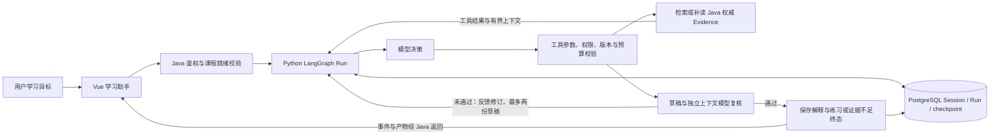
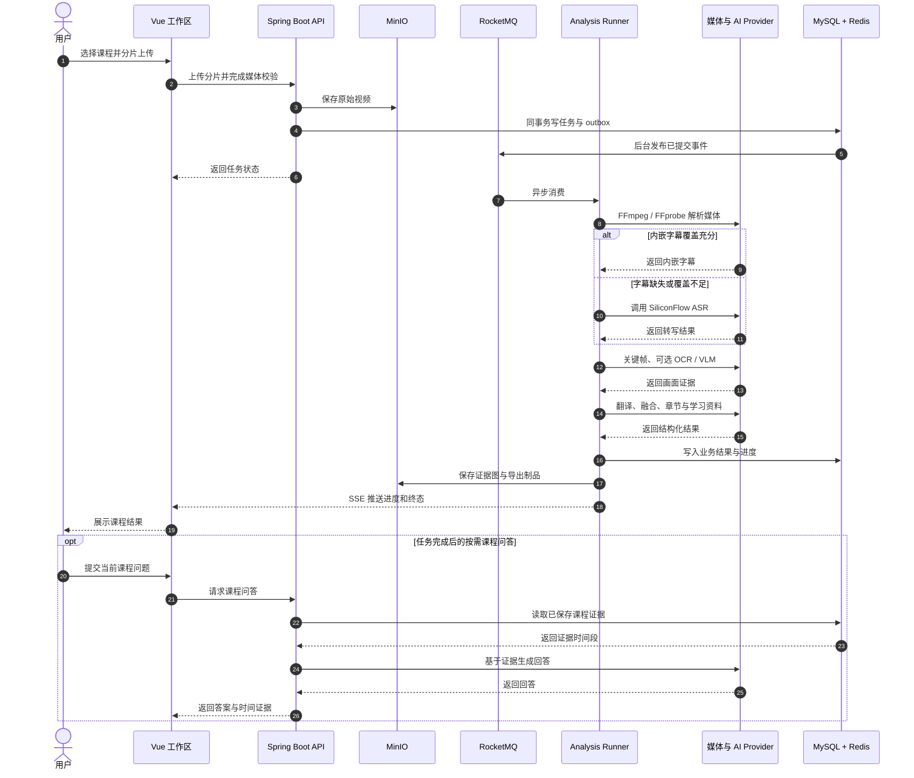

<div align="center">

  <h1>LectureLens</h1>
  <p><strong>基于课程证据的 Study Agent</strong></p>
  <p>从学习目标出发，选择工具、读取课程证据，生成可追溯的解释与练习，并保存可恢复的执行状态</p>
  <p><em>A course-grounded Study Agent with bounded tools, persistent runs and measurable outcomes.</em></p>
  <p>
    
    
    
    
    
    
    <a href="https://github.com/a27497/lecturelens/actions/workflows/ci.yml"></a>
    <a href="LICENSE"></a>
  </p>
</div>


当前状态：**Study Agent 学习闭环已完成有限范围验收，尚未发布。** 冻结 AU 在已见公开课程的新目标上开发集严格 **31/31**、冻结后的全新保留集严格 **8/8**；同时通过 **547** 项 Python/PostgreSQL 机制测试、**1366** 项 Java 测试、**79** 项前端测试与真实浏览器闭环／恢复／取消／越权／删除验收。完整证据见 [AU 完成报告](eval/phase-completion/FINAL_AU.md)。

<p align="center">
  <strong>Model-selected Tools</strong> ·
  <strong>Course-grounded Evidence</strong> ·
  <strong>Persistent Runs &amp; Checkpoints</strong> ·
  <strong>Fresh Holdout 8/8</strong>
</p>

<p align="center">
  <a href="#项目预览">项目预览</a> ·
  <a href="#项目定位">项目定位</a> ·
  <a href="#核心能力">核心能力</a> ·
  <a href="#系统流程">系统流程</a> ·
  <a href="#测试与质量保障">验证结果</a>
</p>

| 想证明什么 | LectureLens 怎么做 | 当前证据 |
| --- | --- | --- |
| 不只是 RAG 问答 | 模型根据学习目标选择检索、补读、计算、保存练习/拒答等工具，工具观察会影响下一步 | 真实课程任务 + 冻结 AU 评测 |
| Agent 能恢复而不是“跑一次算一次” | Session / Run / 工具结果 / checkpoint 持久化到 PostgreSQL，支持取消、幂等恢复和中断续跑 | 独立 PostgreSQL 机制测试与恢复验收 |
| 模型不能越过业务边界 | Java/MySQL 保持课程权属、Evidence revision 和删除的权威判断，Python 只消费已授权证据 | 越权、版本围栏、删除和迟到结果验收 |
| 效果可测而不是只看 Demo | 开发集与冻结后新保留集分开，失败候选不改判，真实模型质量与确定性机制测试分开报告 | 开发 31/31；fresh holdout 8/8；失败历史保留 |

## 项目预览

> 以下截图使用合成测试数据生成，不包含真实账号、私人视频、API Key 或服务地址。

### 课程阅读与学习结果


| 上传课程 | 我的课程 |
| :---: | :---: |
|  |  |

<details>
<summary>查看上传、任务处理和登录等辅助页面</summary>

| 异步任务处理 | 产品首页 |
| :---: | :---: |
|  |  |


</details>

## 项目定位

LectureLens 是一个**基于课程证据的 Study Agent**。用户给出学习目标后，Python Agent 不直接“生成答案”，而是在受限工具集中选择下一步：检索课程 Evidence、补读上下文、执行受限计算、生成练习、复核草稿，或在证据不足时停止。工具结果会回到 Agent 状态并影响后续决策。

系统把“模型决策”和“业务权威”分开：Python/LangGraph 负责任务规划与学习产物，Java/MySQL 继续负责账号、课程、Evidence 权属、revision 与删除边界；PostgreSQL 保存可恢复的 Agent Session/Run/checkpoint。Vue 负责学习目标、练习、作答、反馈和历史恢复。

当前已实现解释 → 练习 → 作答 → 证据反馈 → 修改的真实学习闭环，但仍是实验阶段。**通用自动评分、长期学习记忆与复习调度尚未交付**；AU 的 8/8 fresh holdout 只代表本轮已测课程与任务，不代表未见课程泛化。项目职责与验收边界见 [Agent 项目约束](docs/AGENT_PRODUCT_CONTRACT.md)。

## 核心能力

### 1. 基于目标的 Agent 执行

- **模型选择工具，而不是固定 Workflow**：使用标准 `tool_calls`；模型可以检索、补读、调用受限计算、保存解释与两道练习，或报告证据不足。每次工具观察都会回填下一轮决策。
- **课程证据约束**：所有教学结论和练习答案都要绑定当前课程 Evidence；Java 在进入 Agent 前后重新校验 owner、course、revision 和删除状态，防止模型扩大权限或引用失效内容。
- **草稿复核与预算内修订**：生成候选后按学习目标条件、逐字段证据支持、答案一致性和课程方法范围做复核；失败反馈进入下一轮修订，但不能增加原始调用预算来“刷过”门槛。
- **可恢复执行**：LangGraph + PostgreSQL 保存 Session、Run、模型/工具事件和 checkpoint；支持取消、重启恢复、调用中断恢复、迟到结果隔离和幂等重放。
- **真实学习交互**：学习助手支持练习产物、真实作答、修改历史和证据反馈；刷新后从服务端恢复，不依赖前端内存维持状态。
- **统一模型管理**：账号可分别绑定决策模型与复核模型，新 Run 冻结连接版本；连接测试与模型列表只验证可调用性，不等于教学质量通过。
- **可复验质量门槛**：最终 AU 在开发集严格31/31、冻结后 fresh holdout 严格8/8；历史失败和旧候选保留在 `eval/` 与 evidence tag 中，机制测试不冒充真实模型效果。

实现与复现入口：[Agent runtime](agent-service/src/lecturelens_agent/study/runtime.py)、[工具协议](agent-service/src/lecturelens_agent/study/contracts.py)、[产品边界](docs/AGENT_PRODUCT_CONTRACT.md)、[AU 完成报告](eval/phase-completion/FINAL_AU.md)。

### 2. 🎬 课程准备与视频任务链路

> 大文件上传与长耗时分析不占用请求主链路，任务状态可以恢复，也不会被重复消费。

- **上传与存储**：分片上传支持缺失分片查询和断点续传；合并前核验大小、MD5、实际分片和媒体头，原始媒体与制品写入 MinIO。
- **异步执行**：RocketMQ 投递分析任务，有界 Runner 控制并发；MySQL 保存业务事实、outbox 和执行租约，Redis claim 提供快速去重及短期进度缓存。
- **任务控制**：支持取消、失败重试、状态筛选和终态逻辑删除；SSE 断开后按有界退避重连，终态只触发一次详情刷新。

### 3. 🧩 时序多模态课程证据

> 字幕、画面文字、视觉描述和时间戳最终汇入同一条课程时间线。

- **字幕来源**：优先使用覆盖充分的内嵌字幕；字幕缺失或覆盖不足时调用 SiliconFlow ASR。
- **画面证据**：自适应关键帧规划过滤模糊、黑屏、空白和重复画面，再按预算执行可选 OCR 与有界 VLM。
- **时间线融合**：原文、译文、OCR、视觉描述和时间范围统一对齐；视觉分支不可用时，已有字幕主链仍可继续。

```text
[19:00–20:00]
Transcript   ...
Translation  ...
Visual       ...
Evidence     timestamp / keyframe
```

### 4. 📚 有时间证据的学习工作区

> 阅读、学习和问答都能回到原视频的具体时间范围。

- **边看边读**：视频、原文和译文在同一页面呈现，点击字幕、章节或证据即可跳转播放位置。
- **结构化资料**：生成覆盖课程首尾的章节，以及摘要、重点、术语和预生成问答。
- **问答与导出**：用户完成任务后按需发起课程范围问答；没有明确证据时拒答，并可下载 SRT、VTT、Markdown 和 JSON。

### 5. 🛡️ 可观测、可恢复与安全边界

> 外部 AI 可能超时、部分失败或返回无效结构，系统需要留下可诊断记录，同时守住凭据边界。

- **身份与资源**：JWT access/refresh rotation，Refresh Token 哈希存储；上传、播放、证据和制品下载统一执行 Owner Scope。
- **失败可追踪**：AI 调用记录保留阶段、Provider、模型、状态、次数与耗时；章节、视觉结果和学习资料通过校验后原子替换。
- **敏感信息控制**：Credential Leak Detector 区分课程术语与真实凭据；日志和 API 不暴露密钥、对象存储 key、本地路径、Prompt 或原始响应。

## 课程摄取实测（补充）

<details>
<summary>查看 45:17 ASR + VLM 与 68:10 内嵌字幕长视频实测</summary>

### 场景 A｜45:17 真实外部 ASR + VLM

| 指标 | 结果 |
| --- | --- |
| 视频与许可 | [Bare-Bones Basics of Full-Text Search](https://commons.wikimedia.org/wiki/File:BareBonesSearch.webm)，Wikimedia Commons，CC BY-SA 4.0 |
| 媒体 | 45:17，WebM，39.5 MB |
| 处理耗时 | `00:07:58` |
| 转写 | SiliconFlow ASR 成功；原文 / 译文 / 融合段为 46 / 46 / 46 |
| 视觉证据 | 关键帧 58；OCR 58/58；Qwen3-VL 44/44 |
| 章节 | 11 章，覆盖 `00:00:00–00:45:17`；时间轴空档 0 |
| 课程问答 | 返回 `19:00–20:00` 的课程证据 |
| 导出 | SRT、VTT、Markdown、JSON 全部成功 |

### 场景 B｜68:10 内嵌字幕长视频

| 指标 | 结果 |
| --- | --- |
| 媒体 | 68:10，H.264 1080p，381.7 MB |
| 字幕 | 1461 个内嵌字幕 cues |
| 融合与关键帧 | 最终融合段 69；关键帧 240 |
| 章节 | 时间轴覆盖 100%；最大空档 0 |
| 课程问答 | 课程内问题返回时间证据；课程外问题拒答 |
| 导出 | SRT、VTT、Markdown、JSON 全部成功 |

以上数据来自特定本地环境和模型配置，用于证明链路真实跑通，不代表性能、费用或时延 SLA。

验证基线：`main@81a300a`

上述长视频历史基线的自动化门禁：Backend `1308 tests`；Frontend `12 files / 36 tests`。当前 Agent/Python、Java 和前端验证见下方「测试与质量保障」；长视频摄取成功不代表 Agent 学习任务质量合格。

</details>

## 系统流程

### Agent 学习任务主流程


```mermaid
flowchart LR
    U[用户学习目标] --> W[Vue 学习助手]
    W --> J[Java 鉴权与课程就绪校验]
    J --> P[Python LangGraph Run]
    P --> M[模型决策]
    M --> T[工具参数、权限、版本与预算校验]
    T --> E[检索或补读 Java 权威 Evidence]
    E -->|工具结果与有界上下文| P
    T --> R[草稿与独立上下文模型复核]
    R -->|未通过：反馈修订，最多两份草稿| P
    R -->|通过| A[保存解释与练习或证据不足终态]
    P <--> D[(PostgreSQL Session / Run / checkpoint)]
    A --> D
    A -->|事件与产物经 Java 返回| W
```

模型在受限工具集中选择动作；代码负责工具授权、状态一致性及停止约束。当前范围是单课程解释与出题，复杂规划和学习记忆仍需后续验收。

### 课程准备流程

以下确定性流程提前准备 Evidence 和索引，供 Agent 使用。

<details>
<summary>查看媒体摄取、存储与普通课程 QA 链路</summary>


```mermaid
sequenceDiagram
    autonumber
    actor User as 用户
    participant Web as Vue 工作区
    participant API as Spring Boot API
    participant Store as MinIO
    participant MQ as RocketMQ
    participant Runner as Analysis Runner
    participant MediaAI as 媒体与 AI Provider
    participant State as MySQL + Redis

    User->>Web: 选择课程并分片上传
    Web->>API: 上传分片并完成媒体校验
    API->>Store: 保存原始视频
    API->>State: 同事务写任务与 outbox
    State->>MQ: 后台发布已提交事件
    API-->>Web: 返回任务状态
    MQ->>Runner: 异步消费
    Runner->>MediaAI: FFmpeg / FFprobe 解析媒体
    alt 内嵌字幕覆盖充分
        MediaAI-->>Runner: 返回内嵌字幕
    else 字幕缺失或覆盖不足
        Runner->>MediaAI: 调用 SiliconFlow ASR
        MediaAI-->>Runner: 返回转写结果
    end
    Runner->>MediaAI: 关键帧、可选 OCR / VLM
    MediaAI-->>Runner: 返回画面证据
    Runner->>MediaAI: 翻译、融合、章节与学习资料
    MediaAI-->>Runner: 返回结构化结果
    Runner->>State: 写入业务结果与进度
    Runner->>Store: 保存证据图与导出制品
    Runner-->>Web: SSE 推送进度和终态
    Web-->>User: 展示课程结果
    opt 任务完成后的按需课程问答
        User->>Web: 提交当前课程问题
        Web->>API: 请求课程问答
        API->>State: 读取已保存课程证据
        State-->>API: 返回证据时间段
        API->>MediaAI: 基于证据生成回答
        MediaAI-->>API: 返回回答
        API-->>Web: 返回答案与时间证据
    end
```

</details>

MySQL 保存课程业务事实，PostgreSQL 保存 Agent 执行状态与派生索引；Redis 负责摄取任务的短期协调，MinIO 保存媒体与制品。详细职责见 [Agent 项目约束](docs/AGENT_PRODUCT_CONTRACT.md) 和 [架构设计](docs/ARCHITECTURE.md)。

## 技术栈

| 层次 | 技术 | 用途 |
| --- | --- | --- |
| Agent 核心 | Python 3.12、FastAPI、LangGraph、PostgresSaver | 模型工具循环、Context、Run、checkpoint、学习产物与执行事件 |
| Agent 状态与检索 | PostgreSQL、pgvector、本地多语言 Embedding | 学习状态、Evidence 增量索引与课程内检索 |
| Web | Node.js 24 LTS、Vue 3.5.39、TypeScript 5.9.3、Vite 8.1.0、Pinia 3.0.4、Element Plus 2.14.2 | 上传、播放、双语时间轴、学习资料和状态恢复 |
| 业务与 Evidence API | Java 21、Spring Boot 3.5.15、MyBatis-Plus 3.5.16、Flyway | 鉴权、课程摄取、权威证据与版本、签名网关和业务迁移 |
| 异步与状态 | RocketMQ 5.3.4、Redis 8.8.0、SSE | 任务投递、防重复 claim、短期进度和前端事件流 |
| 数据与对象存储 | MySQL 8.4 LTS、MinIO `RELEASE.2025-04-22T22-12-26Z` | 业务事实、原始媒体、证据图和生成制品 |
| 媒体与 AI | FFmpeg/FFprobe 8.0.3、Tesseract OCR、SiliconFlow ASR、OpenAI-compatible LLM/VLM、LangChain4j 1.17.0 | 媒体解析、转写、翻译、视觉理解和结构化生成 |
| 测试与部署 | JUnit 5、Mockito、AssertJ、Vitest 4.1、vue-tsc、GitHub Actions、Docker Compose v2 | 自动化回归、类型检查、构建和本地中间件编排 |

## 安装概览

1. 克隆仓库。
2. 将 `.env.real-ai.example` 复制为未跟踪的 `.env`。
3. 填写自己的基础设施密码和 AI Provider 凭据。
4. 启动课程基础设施、Java 和前端；按下方步骤配置 Python Agent 与 PostgreSQL。
5. 注册本地账号，上传课程视频；处理成功且 Evidence 索引 READY 后，在「学习助手」中提交学习目标。

```bash
git clone https://github.com/a27497/lecturelens.git
cd lecturelens
cp .env.real-ai.example .env
docker compose --env-file .env up -d
npm --prefix frontend ci
npm --prefix frontend run dev
```

启动后端前需要将 `.env` 安全加载到当前进程。完整的 Windows、Linux/macOS、AI Provider、端口映射、停止和故障排查步骤见[本地部署指南](docs/DEPLOYMENT.md)。

### 启动实验阶段 Study Agent

需要 Python 3.12、uv，以及已配置的支持标准工具调用的模型服务。将 `.env.agent.example` 复制为 `.env.agent.local`，生成独立服务密钥，填写模型地址和模型名；在 Java/Python 两端启用 `STUDY_AGENT_ENABLED=true`，共享相同的 `AGENT_SERVICE_SECRET`。将其中 Java 配置项加载到 Java 进程后再启动 Java。模型配置可能产生外部服务费用，固定 mock 仅用于流程演示。

```bash
cp .env.agent.example .env.agent.local
# 先填写上述配置；示例默认保持 Agent 关闭。
docker compose -f compose.agent.yml up -d
cd agent-service
uv sync --locked
uv run --env-file ../.env.agent.local uvicorn lecturelens_agent.app:create_app --factory --host 127.0.0.1 --port 8090
```

完整的双服务配置和质量限制见 [Agent 服务](agent-service/README.md)、[Evidence 同步](docs/L1_EVIDENCE_SYNC.md) 和 [L2 运行说明](docs/L2_STUDY_AGENT.md)。

## 测试与质量保障

| 检查项 | 当前主干结果 |
| --- | --- |
| Agent / Python | **547 passed**，使用独立 PostgreSQL/pgvector 测试库 |
| Java 业务与证据服务 | **1366 passed** |
| Frontend | **19 files / 79 tests passed** |
| Production build / TypeScript | **passed** |
| MySQL migrations + Mock AI E2E | **passed** |
| 真实模型质量 | AU 开发集 **31/31**，冻结后 fresh holdout **8/8**；与机制测试分开报告 |

默认自动化测试使用 Mock、Fake 或禁用配置，不依赖真实 AI Key。CI 在 `push` 和 `pull_request` 上运行 Agent Python lint/测试（真实 PostgreSQL/pgvector）、Java 测试、前端单测/构建/依赖审计，以及摄取基础设施的 Mock E2E。真实模型任务评测单独执行，不能用测试夹具代替模型质量。历史清理验证见 [C0–C3 执行记录](docs/C0_C3_EXECUTION.md)，课程质量评测见 [L2.2 验证摘要](eval/study-v1/verification.json)，本轮模型管理测试与真实本地连接验收见 [模型管理验证摘要](eval/model-management/verification.json)。

<details>
<summary>查看本地测试命令</summary>

```bash
# Agent：使用独立测试数据库，避免与后台 worker 共用队列。
AGENT_TEST_DATABASE_URL=postgresql://.../lecturelens_agent_test uv run --directory agent-service pytest -q
```

```powershell
# 后端
cd backend
.\mvnw.cmd test

# 前端
cd ..\frontend
npm ci
npm run test:unit
npm run type-check
npm run build
npm audit --omit=dev --audit-level=high
```

</details>

## 项目结构

```text
LectureLens/
├── agent-service/        # Python Agent 核心、工具、Context、Run、索引与测试
├── eval/                 # 精选公开评测证据、冻结任务与最终报告
├── backend/              # Java 鉴权、课程摄取、权威 Evidence 与签名网关
├── frontend/             # Vue 学习目标、执行状态、产物与课程阅读
├── infra/                # RocketMQ 本地配置
├── scripts/eval/         # 真实课程下载、Agent 评测、浏览器验收与清理
├── scripts/vision/       # 合成课程视频与离线视觉评测
├── docs/
│   ├── DEPLOYMENT.md     # Windows、Linux/macOS 与 AI Provider 配置
│   └── ARCHITECTURE.md   # 模块、状态机与事务边界
├── AGENTS.md             # 后续开发的 Agent 主线与职责约束
├── compose.agent.yml     # Agent PostgreSQL/pgvector
├── compose.yaml          # 课程业务基础设施
└── .env.real-ai.example  # 真实 Provider 配置模板
```

部分内部 package 和标识为兼容既有代码与数据库而保留 `courselingo` 前缀，clone 后无需重命名。

## 安全与能力边界

- 基础设施和第三方 AI 请求使用部署者自己的密码与 API Key；`.env`、媒体、日志和生成物不得提交到仓库。
- 普通课程 QA 保持单轮 RAG 路径；学习助手由 Python Agent 负责受限工具循环和持久执行。
- 已使用多语言 Embedding、pgvector 与 LangGraph；工具权限限定在当前用户、课程与证据版本。
- 冻结 AU 已通过本轮有限范围质量门槛，但候选尚未发布；该结果不代表未见课程泛化。自动评分、长期学习记忆与复习安排尚未实现。
- 当前仓库面向可复现的本地部署，不承诺商业多租户隔离、在线 SaaS 可用性或性能 SLA。

漏洞报告和安全非目标见[安全策略](SECURITY.md)。启用 OCR 或视觉分析前，部署者应确认第三方服务条款、调用费用和数据合规要求。

## 相关文档

- [本地部署指南](docs/DEPLOYMENT.md)
- [架构设计](docs/ARCHITECTURE.md)
- [API 契约](docs/API.md)
- [数据库设计](docs/DB_SCHEMA.md)
- [自适应课程画面理解与离线评测](docs/ADAPTIVE_VIDEO_UNDERSTANDING_R1.md)
- [前端 UX](docs/FRONTEND_UX.md)
- [测试计划](TEST_PLAN.md)
- [Evidence RAG 评测素材与标注准备](eval/pilot-v1/README.md)
- [L1 Python 向量检索：启动、契约与验证](docs/L1_DENSE_RETRIEVAL.md)
- [L1 真实课程验收与已知限制](docs/L1_REAL_COURSE_ACCEPTANCE.md)
- [安全策略](SECURITY.md)
- [贡献指南](CONTRIBUTING.md)

<details>
<summary>本地离线视觉评测</summary>

仓库提供只依赖 Python 标准库和本机 FFmpeg/FFprobe 的合成视频与三策略评测脚本，命令和取舍见上方自适应课程画面理解文档。

</details>

## 参与贡献

欢迎提交范围清楚、可以复核的 Pull Request。提交前请运行与改动相关的检查，并确认没有凭据、大型媒体或生成目录；约定见[贡献指南](CONTRIBUTING.md)。

## License

许可协议详见 [MIT License](LICENSE)。
