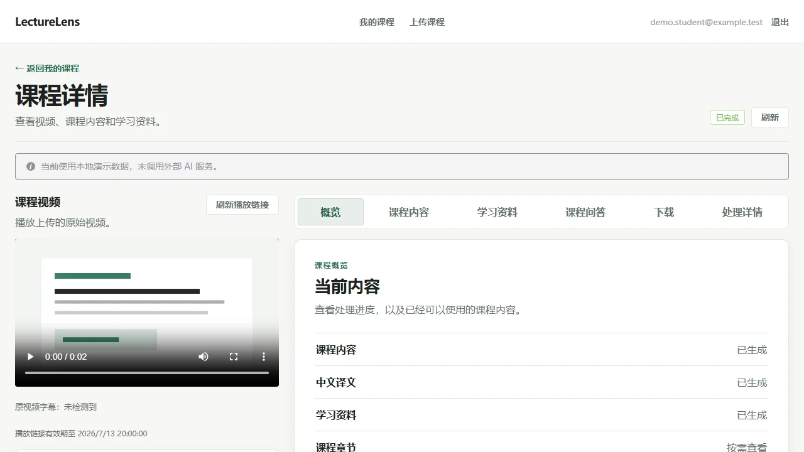
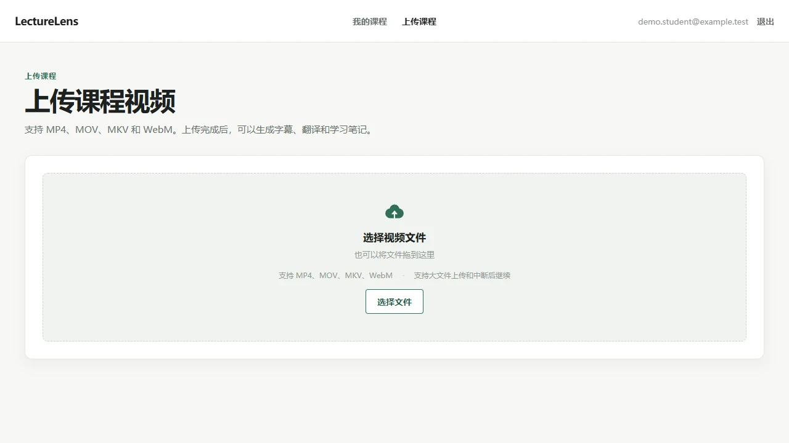
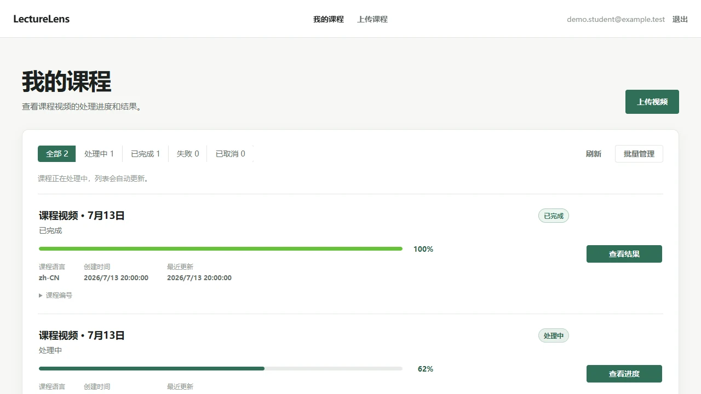
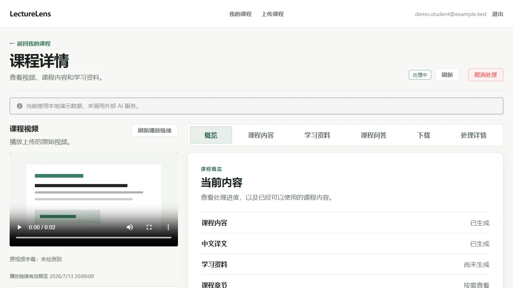
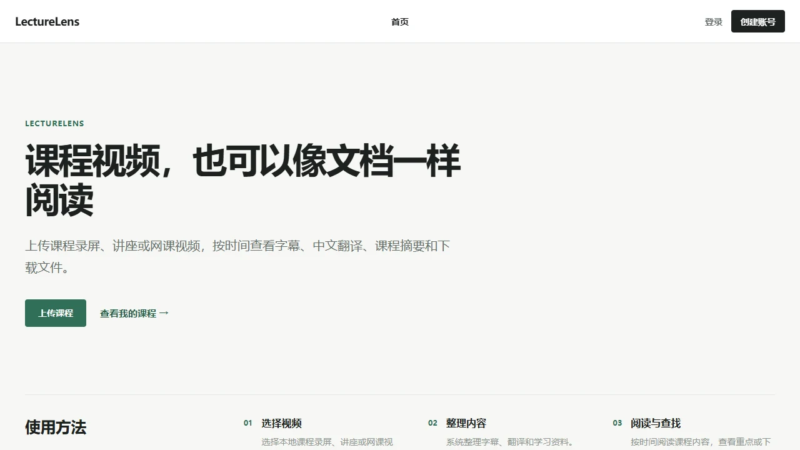
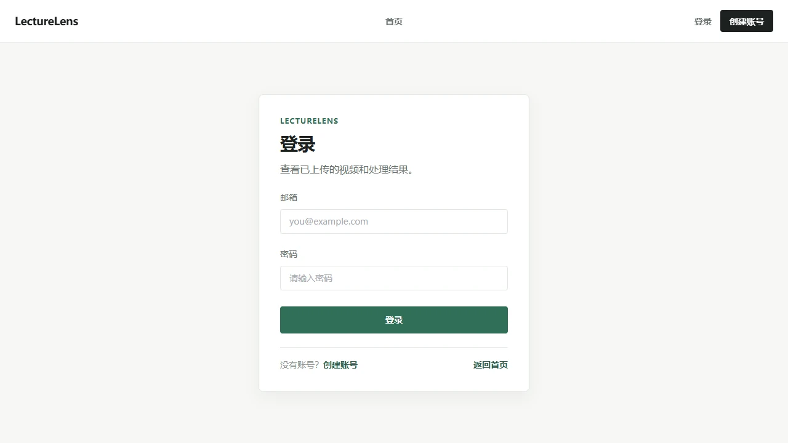
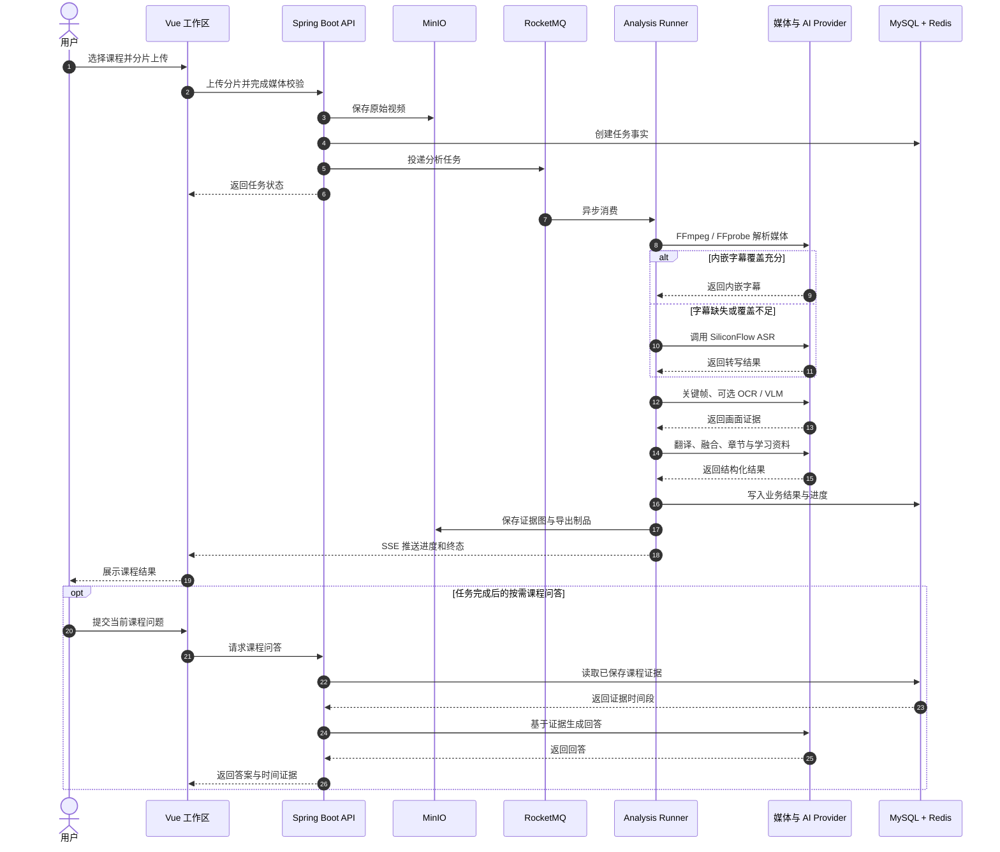

<div align="center">
  <h1>LectureLens</h1>
  <p><strong>面向课程视频的多模态学习工作台</strong></p>
  <p>把长课程转化为可按时间阅读、可定位证据、可问答、可导出的结构化学习资料</p>
  <p><em>A multimodal learning workspace for course videos.</em></p>
  <p>
    <a href="https://github.com/a27497/lecturelens/stargazers"></a>
    
    
    
    
    
    
    <a href="https://github.com/a27497/lecturelens/actions/workflows/ci.yml"></a>
    <a href="LICENSE"></a>
  </p>
</div>

<p align="center">
  <strong>45:17 Real ASR + VLM</strong> ·
  <strong>68:10 Long-video E2E</strong> ·
  <strong>1308 Backend Tests</strong> ·
  <strong>36 Frontend Tests</strong> ·
  <strong>4 Export Formats</strong>
</p>

<p align="center">
  <a href="#项目预览">项目预览</a> ·
  <a href="#核心能力">核心能力</a> ·
  <a href="#真实长视频验证">真实验证</a> ·
  <a href="#系统流程">系统流程</a> ·
  <a href="#安装概览">安装使用</a>
</p>

## 项目预览

> 以下截图使用合成测试数据生成，不包含真实账号、私人视频、API Key 或服务地址。

### 课程阅读与学习结果



| 上传课程 | 我的课程 |
| :---: | :---: |
|  |  |

<details>
<summary>查看上传、任务处理和登录等辅助页面</summary>

| 异步任务处理 | 产品首页 |
| :---: | :---: |
|  |  |



</details>

## 项目定位

LectureLens 是面向课程录屏、讲座和网课的本地部署学习工作台，把视频整理为可跳转的时间轴原文与翻译、章节和学习资料，并提供基于课程证据的单轮问答。系统优先读取内嵌字幕，覆盖不足时调用真实 ASR；OCR 与 VLM 可按需启用，基础设施和 Provider 凭据由部署者自行配置。

## 核心能力

### 1. 🎬 可靠的视频任务链路

> 大文件上传与长耗时分析不占用请求主链路，任务状态可以恢复，也不会被重复消费。

- **上传与存储**：分片上传支持缺失分片查询和断点续传；合并前核验大小、MD5、实际分片和媒体头，原始媒体与制品写入 MinIO。
- **异步执行**：RocketMQ 投递分析任务，有界 Runner 控制并发；MySQL 保存业务事实，Redis claim 防止重复执行并记录短期进度。
- **任务控制**：支持取消、失败重试、状态筛选和终态逻辑删除；SSE 断开后按有界退避重连，终态只触发一次详情刷新。

### 2. 🧩 时序多模态课程理解

> 字幕、画面文字、视觉描述和时间戳最终汇入同一条课程时间线。

- **字幕来源**：优先使用覆盖充分的内嵌字幕；字幕缺失或覆盖不足时调用 SiliconFlow ASR。
- **画面证据**：自适应关键帧规划过滤模糊、黑屏、空白和重复画面，再按预算执行可选 OCR 与有界 VLM。
- **时间线融合**：原文、译文、OCR、视觉描述和时间范围统一对齐；视觉分支不可用时，已有字幕主链仍可继续。

```text
[19:00–20:00]
Transcript   ...
Translation  ...
Visual       ...
Evidence     timestamp / keyframe
```

### 3. 📚 有时间证据的学习工作区

> 阅读、学习和问答都能回到原视频的具体时间范围。

- **边看边读**：视频、原文和译文在同一页面呈现，点击字幕、章节或证据即可跳转播放位置。
- **结构化资料**：生成覆盖课程首尾的章节，以及摘要、重点、术语和预生成问答。
- **问答与导出**：用户完成任务后按需发起课程范围问答；没有明确证据时拒答，并可下载 SRT、VTT、Markdown 和 JSON。

### 4. 🛡️ 可观测、可恢复与安全边界

> 外部 AI 可能超时、部分失败或返回无效结构，系统需要留下可诊断记录，同时守住凭据边界。

- **身份与资源**：JWT access/refresh rotation，Refresh Token 哈希存储；上传、播放、证据和制品下载统一执行 Owner Scope。
- **失败可追踪**：AI 调用记录保留阶段、Provider、模型、状态、次数与耗时；章节、视觉结果和学习资料通过校验后原子替换。
- **敏感信息控制**：Credential Leak Detector 区分课程术语与真实凭据；日志和 API 不暴露密钥、对象存储 key、本地路径、Prompt 或原始响应。

## 真实长视频验证

### 场景 A｜45:17 真实外部 ASR + VLM

| 指标 | 结果 |
| --- | --- |
| 视频与许可 | [Bare-Bones Basics of Full-Text Search](https://commons.wikimedia.org/wiki/File:BareBonesSearch.webm)，Wikimedia Commons，CC BY-SA 4.0 |
| 媒体 | 45:17，WebM，39.5 MB |
| 处理耗时 | `00:07:58` |
| 转写 | SiliconFlow ASR 成功；原文 / 译文 / 融合段为 46 / 46 / 46 |
| 视觉证据 | 关键帧 58；OCR 58/58；Qwen3-VL 44/44 |
| 章节 | 11 章，覆盖 `00:00:00–00:45:17`；时间轴空档 0 |
| 课程问答 | 返回 `19:00–20:00` 的课程证据 |
| 导出 | SRT、VTT、Markdown、JSON 全部成功 |

### 场景 B｜68:10 内嵌字幕长视频

| 指标 | 结果 |
| --- | --- |
| 媒体 | 68:10，H.264 1080p，381.7 MB |
| 字幕 | 1461 个内嵌字幕 cues |
| 融合与关键帧 | 最终融合段 69；关键帧 240 |
| 章节 | 时间轴覆盖 100%；最大空档 0 |
| 课程问答 | 课程内问题返回时间证据；课程外问题拒答 |
| 导出 | SRT、VTT、Markdown、JSON 全部成功 |

以上数据来自特定本地环境和模型配置，用于证明链路真实跑通，不代表性能、费用或时延 SLA。

验证基线：`main@81a300a`

自动化门禁：Backend `1308 tests`；Frontend `12 files / 36 tests`；TypeScript type-check、Production build 与 Production dependency audit 通过；GitHub Actions 持续执行 `Frontend Build` 和 `Backend Test`。

## 系统流程


```mermaid
sequenceDiagram
    autonumber
    actor User as 用户
    participant Web as Vue 工作区
    participant API as Spring Boot API
    participant Store as MinIO
    participant MQ as RocketMQ
    participant Runner as Analysis Runner
    participant MediaAI as 媒体与 AI Provider
    participant State as MySQL + Redis

    User->>Web: 选择课程并分片上传
    Web->>API: 上传分片并完成媒体校验
    API->>Store: 保存原始视频
    API->>State: 创建任务事实
    API->>MQ: 投递分析任务
    API-->>Web: 返回任务状态
    MQ->>Runner: 异步消费
    Runner->>MediaAI: FFmpeg / FFprobe 解析媒体
    alt 内嵌字幕覆盖充分
        MediaAI-->>Runner: 返回内嵌字幕
    else 字幕缺失或覆盖不足
        Runner->>MediaAI: 调用 SiliconFlow ASR
        MediaAI-->>Runner: 返回转写结果
    end
    Runner->>MediaAI: 关键帧、可选 OCR / VLM
    MediaAI-->>Runner: 返回画面证据
    Runner->>MediaAI: 翻译、融合、章节与学习资料
    MediaAI-->>Runner: 返回结构化结果
    Runner->>State: 写入业务结果与进度
    Runner->>Store: 保存证据图与导出制品
    Runner-->>Web: SSE 推送进度和终态
    Web-->>User: 展示课程结果
    opt 任务完成后的按需课程问答
        User->>Web: 提交当前课程问题
        Web->>API: 请求课程问答
        API->>State: 读取已保存课程证据
        State-->>API: 返回证据时间段
        API->>MediaAI: 基于证据生成回答
        MediaAI-->>API: 返回回答
        API-->>Web: 返回答案与时间证据
    end
```

MySQL 是最终业务事实来源，Redis 负责 claim、短期协调与进度；MinIO 保存上传媒体、证据图和导出制品。详细模块、状态机和事务边界见[架构设计](docs/ARCHITECTURE.md)。

## 技术栈

| 层次 | 技术 | 用途 |
| --- | --- | --- |
| Web | Node.js 24 LTS、Vue 3.5.39、TypeScript 5.9.3、Vite 8.1.0、Pinia 3.0.4、Element Plus 2.14.2 | 上传、播放、双语时间轴、学习资料和状态恢复 |
| API | Java 21、Spring Boot 3.5.15、MyBatis-Plus 3.5.16、Flyway | 鉴权、REST API、任务编排、持久化和数据库迁移 |
| 异步与状态 | RocketMQ 5.3.4、Redis 8.8.0、SSE | 任务投递、防重复 claim、短期进度和前端事件流 |
| 数据与对象存储 | MySQL 8.4 LTS、MinIO `RELEASE.2025-04-22T22-12-26Z` | 业务事实、原始媒体、证据图和生成制品 |
| 媒体与 AI | FFmpeg/FFprobe 8.0.3、Tesseract OCR、SiliconFlow ASR、OpenAI-compatible LLM/VLM、LangChain4j 1.17.0 | 媒体解析、转写、翻译、视觉理解和结构化生成 |
| 测试与部署 | JUnit 5、Mockito、AssertJ、Vitest 4.1、vue-tsc、GitHub Actions、Docker Compose v2 | 自动化回归、类型检查、构建和本地中间件编排 |

## 安装概览

1. 克隆仓库。
2. 将 `.env.real-ai.example` 复制为未跟踪的 `.env`。
3. 填写自己的基础设施密码和 AI Provider 凭据。
4. 启动 Docker Compose、后端和前端。
5. 注册本地账号，上传课程视频并创建分析任务。

```bash
git clone https://github.com/a27497/lecturelens.git
cd lecturelens
cp .env.real-ai.example .env
docker compose --env-file .env up -d
npm --prefix frontend ci
npm --prefix frontend run dev
```

启动后端前需要将 `.env` 安全加载到当前进程。完整的 Windows、Linux/macOS、AI Provider、端口映射、停止和故障排查步骤见[本地部署指南](docs/DEPLOYMENT.md)。

## 测试与质量保障

| 检查项 | 结果 |
| --- | --- |
| Backend | 1308 tests passed |
| Frontend | 12 files / 36 tests passed |
| TypeScript | passed |
| Production build | passed |
| Production dependency audit | passed，0 high vulnerabilities |

默认自动化测试使用 Mock、Fake 或禁用配置，不依赖真实 AI Key。CI 在 `push` 和 `pull_request` 上运行 Backend Test 与 Frontend Build，完整策略见[测试计划](TEST_PLAN.md)。

<details>
<summary>查看本地测试命令</summary>

```powershell
# 后端
cd backend
.\mvnw.cmd test

# 前端
cd ..\frontend
npm ci
npm run test:unit
npm run type-check
npm run build
npm audit --omit=dev --audit-level=high
```

</details>

## 项目结构

```text
LectureLens/
├── backend/              # Spring Boot API、Pipeline、Flyway 与测试
├── frontend/             # Vue 课程学习工作区
├── infra/                # RocketMQ 本地配置
├── scripts/vision/       # 合成课程视频与离线视觉评测
├── docs/
│   ├── DEPLOYMENT.md     # Windows、Linux/macOS 与 AI Provider 配置
│   └── ARCHITECTURE.md   # 模块、状态机与事务边界
├── compose.yaml          # 本地基础设施编排
└── .env.real-ai.example  # 真实 Provider 配置模板
```

部分内部 package 和标识为兼容既有代码与数据库而保留 `courselingo` 前缀，clone 后无需重命名。

## 安全与能力边界

- 基础设施和第三方 AI 请求使用部署者自己的密码与 API Key；`.env`、媒体、日志和生成物不得提交到仓库。
- 课程问答是当前课程范围内、证据约束的单轮问答，不是通用聊天机器人。
- 项目不使用向量数据库、Embedding、通用 RAG 或智能体循环。
- 当前仓库面向可复现的本地部署，不承诺商业多租户隔离、在线 SaaS 可用性或性能 SLA。

漏洞报告和安全非目标见[安全策略](SECURITY.md)。启用 OCR 或视觉分析前，部署者应确认第三方服务条款、调用费用和数据合规要求。

## 相关文档

- [本地部署指南](docs/DEPLOYMENT.md)
- [架构设计](docs/ARCHITECTURE.md)
- [API 契约](docs/API.md)
- [数据库设计](docs/DB_SCHEMA.md)
- [自适应课程画面理解与离线评测](docs/ADAPTIVE_VIDEO_UNDERSTANDING_R1.md)
- [前端 UX](docs/FRONTEND_UX.md)
- [测试计划](TEST_PLAN.md)
- [安全策略](SECURITY.md)
- [贡献指南](CONTRIBUTING.md)

<details>
<summary>本地离线视觉评测</summary>

仓库提供只依赖 Python 标准库和本机 FFmpeg/FFprobe 的合成视频与三策略评测脚本，命令和取舍见上方自适应课程画面理解文档。

</details>

## 参与贡献

欢迎提交范围清楚、可以复核的 Pull Request。提交前请运行与改动相关的检查，并确认没有凭据、大型媒体或生成目录；约定见[贡献指南](CONTRIBUTING.md)。

## License

许可协议详见 [MIT License](LICENSE)。
