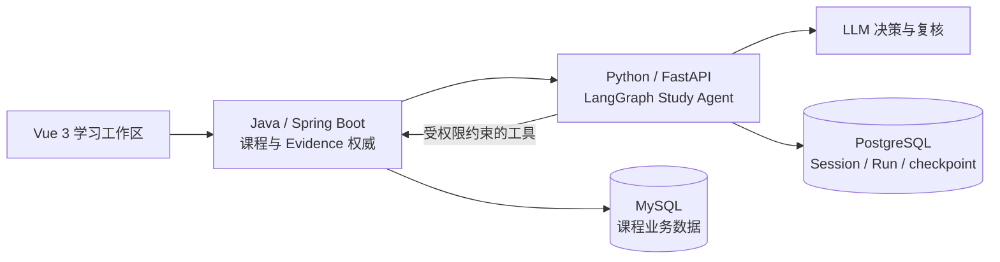

<div align="center">

# LectureLens

### 把课程视频，变成可以追问的学习过程

从课程视频到字幕、译文和学习资料；从一个问题到有时间戳的课程证据、AI 解释、练习与反馈。

**LectureLens 是一个围绕课程内容工作的 AI 学习平台。**

[查看产品界面](#产品体验) · [了解核心能力](#核心能力) · [技术实现](#技术实现) · [从源码运行](#从源码运行)

[](https://github.com/a27497/lecturelens/actions/workflows/ci.yml)
[](LICENSE)


<sub>课程工作区 · 基于合成测试数据的真实产品界面。下面展示已保存真实模型结果在原生界面中的呈现。</sub>

</div>

## 为什么做 LectureLens？

看课程视频时，遇到一个不懂的知识点，往往需要反复拖动进度条、查找字幕，再切换到其他工具提问。即使得到解释，也很难立刻找到它对应的课程原文。

LectureLens 将**视频、课程内容与学习交互放在同一个工作区**：不仅回答「这个知识点是什么」，还帮助你找到「课程在哪讲过」，并通过练习和反馈继续学习。

## 产品体验

### 01 · 视频变成可阅读的课程

上传课程录屏、讲座或网课视频，系统处理媒体内容并组织字幕、中文译文、课程学习材料和时间线。可以一边观看视频，一边按时间阅读和定位内容。


<sub>课程阅读界面使用合成测试数据，不代表一次真实模型处理的质量评测。</sub>

### 02 · 向 Study Agent 提问，答案能回到原视频

围绕一段课程提出学习目标，Study Agent 会在当前课程的 Evidence 中检索和补读，再生成解释与练习。展开引用可以看到**原文、证据编号和时间范围**，并从对应位置返回视频。当材料不足以支持问题时，Agent 可以澄清或拒答，而不是把无关命中拼成答案。


<sub>真实历史 qwen3-max 结果在原生课程工作区中展示；这是已保存的解释与引用，并非截图当天新发起的模型运行。</sub>

### 03 · 练习不是终点，还有证据反馈

解释之后可以完成自测题、保存作答并查看针对该版本作答的证据反馈。反馈引用课程内容，方便核对与修订，而不是用一个分数替代学习过程。


### 04 · 学习过程可追踪，也可恢复

学习会话、运行记录、练习和反馈保存在服务端。可以回看公开的 Agent 执行事件，包括工具调用、模型调用、Evidence ID 和终态；对于取消或中断的执行，系统还提供持久状态与恢复机制。


<sub>这些原生界面截图均来自同一公开课程的已保存历史学习记录。原始来源、版本、截图范围与授权说明见 [产品截图说明](docs/PRODUCT_GALLERY.md)。</sub>

## 核心能力

| 模块 | 能做什么 |
| --- | --- |
| **课程处理** | 视频上传与处理、字幕和译文、课程材料、时间线与进度查看 |
| **课程问答** | 按当前课程检索相关内容，回答并引用可定位的 Evidence |
| **Study Agent** | 围绕学习目标选择有界工具进行检索、补读、解释与出题 |
| **学习反馈** | 保存不可变的作答版本，生成与具体作答对应的证据反馈 |
| **执行记录** | 查看 Session、Run、公开 Trace，支持取消、恢复和历史查看 |
| **访问隔离** | 课程所有权、Evidence 版本与删除状态校验，避免跨课程混用材料 |

**一条学习路径：**

`上传视频 → 阅读课程 → 提出问题 → 查看 Evidence → 完成练习 → 获取反馈 → 回看 Trace`

## 技术实现

LectureLens 不只是把视频内容放进一次模型调用。课程事实由 Java 服务管理，Study Agent 则负责学习过程与受约束的工具使用。


```mermaid
flowchart LR
    U["Vue 3 学习工作区"] --> J["Java / Spring Boot\n课程与 Evidence 权威"]
    J --> A["Python / FastAPI\nLangGraph Study Agent"]
    A -->|受权限约束的工具| J
    A --> M["LLM 决策与复核"]
    J --> D[("MySQL\n课程业务数据")]
    A --> P[("PostgreSQL\nSession / Run / checkpoint")]
```

- **Java 21 / Spring Boot 3.5 / MySQL**：课程、用户与 Evidence 的权限和版本权威；媒体处理使用事务 Outbox、RocketMQ、MinIO、Redis 与 FFmpeg。
- **Python / FastAPI / LangGraph / PostgreSQL / pgvector**：Study Agent、课程检索、有界工具、持久化执行与反馈。
- **Vue 3 / TypeScript / Vite**：视频学习工作区、Agent 交互、引用跳转、作答和 Trace。
- **验证与防护**：独立的检索对照、授权负向测试、取消和晚到结果隔离、自动化回归。默认 Dense 检索的选择有离线评测依据，不将检索指标等同于答案质量。

[完整架构](docs/ARCHITECTURE.md) · [Study Agent 产品契约](docs/AGENT_PRODUCT_CONTRACT.md) · [检索实验](eval/retrieval-phase-a/README.md) · [可靠性设计](docs/C0_C3_EXECUTION.md)

## 验证过什么？

以下是**有来源的历史验证结果**，不是当前提交重新运行的测试成绩：

| 证据 | 已确认范围 |
| --- | --- |
| **2,067 项自动化测试通过** | 2026-09-22 求职版冻结时的 Java、Python/PostgreSQL 和前端测试合计；[验收记录](HUMAN_ACCEPTANCE_REPORT.md#job-search-freeze) |
| **2,160 次负向授权请求，0 次绕过** | 指定跨用户、课程、Evidence、Run 等测试路径；[隔离评测](eval/multi-user-phase-e/README.md) |
| **真实模型学习闭环验收** | 在已知 MIT OCW 公开课程片段上完成解释、引用、无证据拒答、保存作答、反馈及 Trace；[浏览器验收](eval/recruiter-demo-phase-d/README.md) |

这些结果证明的是各自的测试范围，不代表对所有课程的教学效果或生产级并发能力做出保证。

## 从源码运行

项目目前是**可自行部署的实验性版本，尚未提供面向公众的在线服务**。完整环境涉及 Java 21、Python 3.12、Node.js 24 LTS、Docker Compose、FFmpeg，以及单独配置的模型和基础服务。

```bash
git clone https://github.com/a27497/lecturelens.git
cd lecturelens
cp .env.real-ai.example .env
cp .env.agent.example .env.agent.local
```

以上仅用于准备配置文件，不等于完成启动。后续请按 [部署指南](docs/DEPLOYMENT.md) 配置服务、密钥、模型和课程处理管线；不应将示例凭据用于实际部署。

[部署说明](docs/DEPLOYMENT.md) · [API 文档](docs/API.md) · [Agent 服务](agent-service/README.md) · [更多产品截图](docs/PRODUCT_GALLERY.md)

## 项目范围

本项目重点是**课程证据约束下的学习 Agent 与可恢复工程链路**。作答反馈是可核对的学习建议，**不是自动评分**；长期记忆、自动复习调度尚未交付。真实模型演示基于已知公开课程，不声称已经完成未见课程的系统性泛化验证。历史故障、已知 Minor 和评测边界保留在 [验收报告](HUMAN_ACCEPTANCE_REPORT.md) 与 [评测索引](eval/README.md) 中。

## License & credits

代码使用 [MIT License](LICENSE)。

产品截图中的历史课程片段来自 Ana Bell 的 [MIT OpenCourseWare 6.0001, Lecture 3](https://ocw.mit.edu/courses/6-0001-introduction-to-computer-science-and-programming-in-python-fall-2016/resources/lecture-3-string-manipulation-guess-and-check-approximations-bisection/)，按 [CC BY-NC-SA 4.0](https://creativecommons.org/licenses/by-nc-sa/4.0/) 用于非商业展示；MIT 不为本项目背书。图片与课程内容不因代码采用 MIT License 而改变原有授权。
