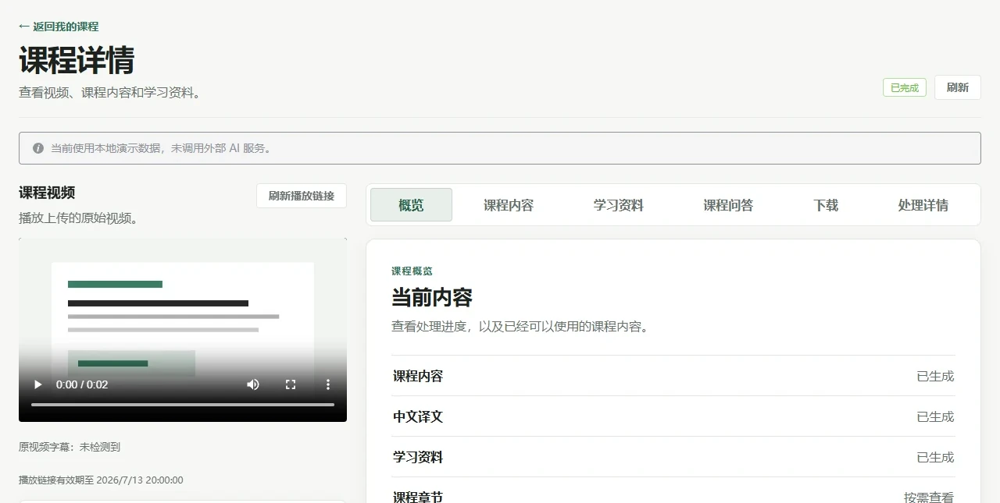
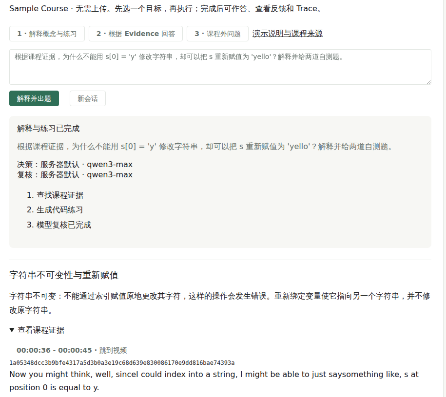
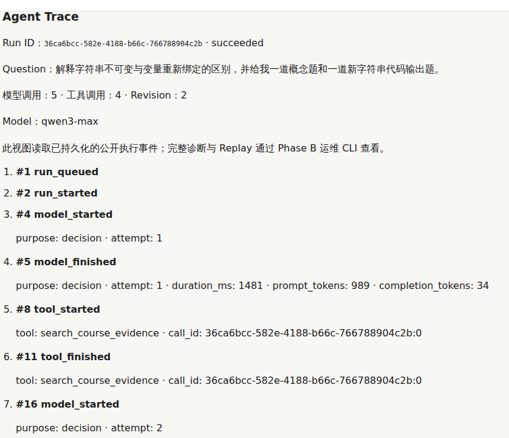
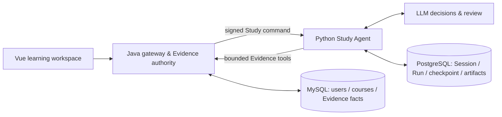

# LectureLens

**Evidence-grounded, recoverable Study Agent for course learning.**

LectureLens 将课程视频整理为可检索、可引用的学习材料。学习者提出目标后，Study Agent 通过有界工具查找和补读课程 Evidence，生成解释与练习；证据不足时拒答或澄清。作答、证据反馈与执行历史保存在服务端，可取消、追踪和恢复。

[Recruiter Demo](#recruiter-demo) · [Engineering Highlights](#engineering-highlights) · [Architecture](#architecture) · [Engineering Evidence](#engineering-evidence) · [Scope & Limits](#scope--limits) · [Quick Start](#quick-start)



*课程工作区截图使用公开的合成测试数据。下面的 Agent 截图来自已验收的真实模型 Sample Course。*

## Why a Study Agent

课程准备会生成字幕、翻译、时间线和学习材料；普通课程 QA 是独立的单轮 RAG 路径。Study Agent 则围绕一个学习目标，依据工具观察继续检索、补读、解释或停止，并把练习、作答、反馈及 Run 历史接成学习闭环。

**Course → Evidence → model-selected bounded tools → answer & practice → answer attempt → evidence feedback.** 模型决定下一步工具调用，程序控制课程访问、版本、预算、取消和产物提交。检索命中只是一组候选，不能授予课程访问权，也不能替代最终答案的证据支持。[设计与职责边界](docs/AGENT_PRODUCT_CONTRACT.md)

## Recruiter Demo

已有 MIT OpenCourseWare 公开 Python 课程片段演示：**提问 → 查看 Evidence ID、原文和视频时间 → 解释与练习 → 课程外问题拒答 → 保存作答与反馈 → 查看历史 Trace**。真实模型浏览器验收覆盖这五个场景；这是一门已知课程上的演示，不是未见课程质量测试。[演示步骤与验收](eval/recruiter-demo-phase-d/README.md) · [后续求职版回归](HUMAN_ACCEPTANCE_REPORT.md#job-search-freeze)



[](docs/images/recruiter-agent-trace.webp)

*两张截图分别来自同一 Sample Course 的不同真实验收 Run，裁图未包含账号栏。课程片段来自 Ana Bell / [MIT OCW 6.0001 Lecture 3](https://ocw.mit.edu/courses/6-0001-introduction-to-computer-science-and-programming-in-python-fall-2016/resources/lecture-3-string-manipulation-guess-and-check-approximations-bisection/)，按 [CC BY-NC-SA 4.0](https://creativecommons.org/licenses/by-nc-sa/4.0/) 署名，用于非商业项目展示；MIT 不为本项目背书。*

`/demo` 是**已配置的本机演示环境**入口，当前没有公开部署的可点击 Demo。普通构建若未配置 Sample Course，会在页面显示不可用状态；准备、登录和课程权限仍走原有业务链路。[本机演示准备说明](eval/recruiter-demo-phase-d/README.md#启动--复现)

## Engineering Highlights

| 设计 | 实际约束与用途 |
| --- | --- |
| **Evidence & Authority** | Java 按 owner、course、revision 和删除状态重查 Evidence；Python 检索索引只返回候选，旧快照与检索结果不能授予访问权。[架构](docs/ARCHITECTURE.md#evidence-与检索边界) |
| **Bounded tools** | Agent 的模型工具调用被预算和可见 Evidence 集合约束；课程读取通过 CHECK / SEARCH / READ / WINDOW 等受权接口。证据不足时走拒答或澄清路径。[执行说明](docs/L2_STUDY_AGENT.md) |
| **Recoverable execution** | PostgreSQL 保存 Session、Run、持久预算、幂等工具结果和 LangGraph checkpoint。取消后的晚到结果不能覆盖终态；崩溃恢复回读已提交结果。[恢复机制](docs/ARCHITECTURE.md#持久状态与恢复) · [故障实验](eval/multi-user-phase-e/README.md#隔离和故障实验) |
| **Observable Agent** | 当前及历史 Run 展示公开模型/工具事件、实际 token、延迟、Evidence ID 和终态；完整 checkpoint 诊断与 Replay 由受权运维 CLI 提供，网页不暴露私有上下文。[Trace / Replay](eval/agent-trace-phase-b/README.md) |
| **Practice & Feedback** | 解释与练习成为服务端产物；作答保存为不可变版本，独立反馈 Run 引用精确作答版本。反馈是可核对的学习建议，不是自动评分。[学习交互](docs/L3_LEARNING_FLOW.md) |
| **Retrieval evaluation** | 独立离线基准比较 24 个问题、70 条真实 Evidence。Cross-Encoder 提高排名指标却未带来对应的答案收益，因此默认仍为 Dense；失败题与协议失败保留。[检索评测](eval/retrieval-phase-a/README.md) |

可选的 [Course MCP stdio 适配](eval/course-mcp-phase-c/README.md)沿用 Java Authority，演示默认仍用 internal 工具通道。媒体准备使用事务 outbox、RocketMQ 和有界 Runner；它为课程 Evidence 提供输入，不充当 Agent 决策循环。[媒体可靠性](docs/C0_C3_EXECUTION.md)

## Architecture


```mermaid
flowchart LR
    V[Vue learning workspace] --> J[Java gateway & Evidence authority]
    J -->|signed Study command| A[Python Study Agent]
    A -->|bounded Evidence tools| J
    A <--> L[LLM decisions & review]
    A <--> P[(PostgreSQL: Session / Run / checkpoint / artifacts)]
    J <--> M[(MySQL: users / courses / Evidence facts)]
```

**Java 是课程访问的权威来源。** 它处理登录、课程与 Evidence 的 owner/revision/deletion 校验；Python 负责学习任务、模型工具循环、Session/Run 与反馈。PostgreSQL 保存 Agent 执行状态和派生索引，MySQL 保存课程业务事实；两侧不跨服务写对方的表。媒体摄取另连接 MinIO、RocketMQ 和 Redis。[完整架构与故障边界](docs/ARCHITECTURE.md)

## Engineering Evidence

| 已有证据 | 结论范围 |
| --- | --- |
| **2,067 automated tests passed** | 2026-09-22 求职版冻结时的本地 Python/PostgreSQL、Java 与前端验证合计；这是该冻结版本记录，不是当前工作树的新测试成绩。[验收与收口](HUMAN_ACCEPTANCE_REPORT.md#job-search-freeze) |
| **2,160 negative authorization requests, 0 bypass** | Phase E 所测跨用户、课程、Run、Evidence 与签名/版本路径；不是所有授权路径的穷举证明。[隔离审计](eval/multi-user-phase-e/README.md) |
| **Real-model recruiter flow verified** | 已知公开课程上，真实 Chromium 走原登录/Study 链路完成解释、Evidence、无证据拒答、反馈和历史 Trace；失败试次与后续定向修复均保留。[演示验收](eval/recruiter-demo-phase-d/README.md) · [求职版回归](HUMAN_ACCEPTANCE_REPORT.md#job-search-freeze) |

**Execution / isolation ≠ teaching quality ≠ production concurrency.** 确定性 Provider 测机制；真实模型样例只支持其实际课程和目标范围的结论。完整候选、失败历史和保留集边界见[评测索引](eval/README.md)。

## Scope & Limits

- **实验版本，尚未发布。** 求职版已冻结，线上配置未因验收改变；`/demo` 需要维护者准备公开课程和隔离演示配置。
- 已见公开课程的验收不证明未见课程泛化。自动评分、长期记忆和复习调度未交付；证据反馈不作为成绩。
- 未发布的多轮解释候选已接入结构化来源复核、修订观察与有来源的事实复用；真实多轮开发仍有误接受、协议失败及预算停止，未通过质量门槛。机制测试、全部失败和当前候选见[关系复核集成 Phase](eval/multiturn-v1/PHASE_RELATIONS.md)。
- Phase E 的并发检索出现真实 503 与失败 Run，不能据实验 worker 数宣称生产规模并发。[失败与瓶颈](eval/multi-user-phase-e/README.md)
- 崩溃恢复保留已提交工具结果和预算；未持久化的外部模型请求可能重发，不承诺 Provider exactly-once。[恢复语义](docs/ARCHITECTURE.md#持久状态与恢复)
- 求职版仍保留 5 个 Minor；原始失败和修复记录未改判。[已知问题](HUMAN_ACCEPTANCE_REPORT.md#仍保留的-5-个-minor)

## Tech Stack

| 层 | 技术 |
| --- | --- |
| Agent 与执行状态 | Python 3.12、FastAPI、LangGraph / PostgresSaver、PostgreSQL / pgvector |
| 课程与权威 Evidence | Java 21、Spring Boot 3.5、MyBatis-Plus、Flyway、MySQL 8.4 |
| 工作区 | Vue 3.5、TypeScript、Vite、Pinia、Element Plus |
| 媒体与基础设施 | FFmpeg、ASR / OCR、MinIO、RocketMQ、Redis、SSE |
| 验证 | pytest、JUnit、Vitest、Ruff、GitHub Actions |

## Quick Start

完整环境需要 Java 21、Node.js 24 LTS、Python 3.12、uv、Docker Compose、FFmpeg/FFprobe，以及单独配置的基础设施和模型连接。示例配置默认关闭 Study Agent 与实验反馈；首次启动也不会自动获得已准备的 Sample Course。

```bash
git clone https://github.com/a27497/lecturelens.git
cd lecturelens
test -e .env || cp .env.real-ai.example .env
test -e .env.agent.local || cp .env.agent.example .env.agent.local
```

按[部署指南](docs/DEPLOYMENT.md)配置基础设施、Java 与 Agent 的共同服务密钥、Dense 检索及可用的模型连接，再分别启动服务；不要将示例配置或本机演示凭据直接当成可用部署。无 Key 的确定性演示见 `.env.demo.example`，Python 验证命令见[服务说明](agent-service/README.md)。

媒体转写支持显式选择 SiliconFlow、百炼或 Mock。百炼同步 ASR 的凭据、分片配置与验证边界见[百炼 ASR](docs/ASR_BAILIAN.md)；转写成功不代表翻译或完整课程 Pipeline 已通过验收。

## More Documentation

[产品与职责契约](docs/AGENT_PRODUCT_CONTRACT.md) · [架构与故障语义](docs/ARCHITECTURE.md) · [部署](docs/DEPLOYMENT.md) · [API](docs/API.md) · [数据库](docs/DB_SCHEMA.md) · [评测索引](eval/README.md) · [CI](https://github.com/a27497/lecturelens/actions/workflows/ci.yml)

`agent-service/` 保存 Agent 核心，`backend/` 保存业务与 Evidence 服务，`frontend/` 保存学习工作区，`eval/` 保存公开评测证据。原始 Provider 响应、凭据、下载媒体和私有验收记录不入 Git。
