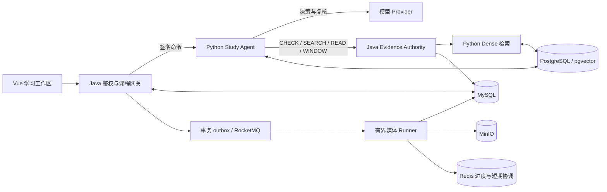

# LectureLens 当前架构

本文描述当前仓库的组件、状态和故障边界。Study Agent 已完成有限课程范围验收，仍属实验能力，尚未发布；线上配置保持不变。质量结论见 [AU 完成报告](../eval/phase-completion/FINAL_AU.md)，实验过程与失败记录见[评测索引](../eval/README.md)。接口字段和表结构分别以 [API](API.md) 与[数据库参考](DB_SCHEMA.md)为准。

## 组件与数据所有权

| 组件 | 职责与状态 |
| --- | --- |
| Vue / TypeScript | 课程阅读、学习目标、执行事件、练习、作答、反馈和历史恢复；通过 Java 访问课程与 Agent |
| Java / Spring Boot | 认证、上传、课程与媒体摄取、权威 Evidence、版本与删除检查、浏览器签名网关；按业务域组织代码 |
| Python / FastAPI / LangGraph | 学习任务决策、上下文选择、工具编排、Session/Run、学习产物、作答与反馈、模型连接管理 |
| MySQL / Flyway | 账号、上传、课程与媒体事实、Evidence 快照/变更、outbox、媒体执行租约 |
| PostgreSQL / pgvector | Agent 执行状态、事件、工具结果、LangGraph checkpoint、加密模型配置和派生 Evidence 索引 |
| MinIO | 私有原始媒体、中间音频、字幕、学习资料及视觉制品；对象路径由服务端生成 |
| Redis | 上传分片集合、短期 claim、进度缓存及限流；键有 TTL，不作为业务事实来源 |

Python 不读写 MySQL，Java 不直接写 Agent 表。浏览器不能指定可信 owner；Python 不接收用户 JWT。模型选择动作，程序控制权限、版本、预算、发布和停止条件。详细职责约束见[项目契约](AGENT_PRODUCT_CONTRACT.md)。

系统有三条独立路径：媒体摄取是确定性准备流程；普通课程 QA 是单轮 RAG；Study Agent 才执行模型选工具、读取观察、继续或停止的循环。Java 的 LangChain4j 是可选 Provider 适配，不承担 Agent runtime。

## Evidence 与检索边界

### 权威快照

Java `CourseEvidenceService` 按 owner/course/revision 物化不可变快照，当前 `courseId` 为 task ID。Evidence 保存来源 ID、时间范围、原文、规范文本、内容 hash、派生标记、截断与质量信息。翻译和视觉描述不能冒充字幕原文；融合摘要不重复作为独立原始证据索引。低质量证据保留用于复查，可检索性由规则标明。

源写入在同一事务中产生 `INVALIDATE`，物化产生 `UPSERT`，删除产生 `DELETE`。变更序列按提交顺序分配，避免游标跳过晚提交的小序号。分页固定 revision；来源更新后旧版本返回 stale，不能混合新旧页。旧快照保留至课程删除，但 `imageRef` 不是永久图片归档。

### 后台同步与查询

Java 在源事务中写 `evidence_index_sync`，合并同课程的待同步工作。后台用 `PLAN` 发送 ID/hash/时间清单，再以 `APPLY` 发送缺失正文；Python 使用固定版本本地 ONNX Embedding，按课程内正文和 chunk hash 复用向量。查询只携带 scope、revision、问题、允许的 Evidence ID 与时间范围，不传全文，也不触发建索引。

- 同步状态为 `PENDING / INDEXING / READY / FAILED / DELETED`；关闭时对外为 `DISABLED`。空 manifest 是合法空索引。
- claim 与确认使用短事务，网络/嵌入在事务外执行；确认必须仍匹配 claim ID 和 desired sequence。失败退避重试，过期 claim 可恢复，单课程失败不阻塞其他课程。
- Python 原子发布完整新版本；发布失败回滚，新 revision 不能命中旧版本。多 worker 必须使用相同模型与分块版本。
- READY/DELETED 定期与远端核对。状态 API 表示最后确认及当前源版本匹配，不承诺远端实时健康。
- 当前上限为每课程 2,000 条 Evidence、5,000 chunks；单次新增正文最多 750,000 字符 / 4 MiB，每条 8,000 字符。超限明确失败，不静默截断。
- 索引未就绪返回 409；忙、数据库或嵌入错误返回 503，Java 映射为 `RETRIEVAL_UNAVAILABLE`。Dense 启用后失败不静默切换检索模式。

检索结果只是候选 ID，[StudyEvidenceAuthority](../backend/src/main/java/com/example/courselingo/study/StudyEvidenceAuthority.java) 用当前权威快照解析正文，并在检索前后检查 owner、课程成功状态、删除与 revision。SEARCH/READ/WINDOW 还要求索引 READY；CHECK 只检查当前课程权限与版本。索引和历史快照不能授予当前访问权限。同步协议与配置见 [Evidence 同步](L1_EVIDENCE_SYNC.md)。

检索进程内的非阻塞锁由同步与查询共用，并发占用会返回 503。[多用户实验](../eval/multi-user-phase-e/README.md)记录了这一瓶颈；实验 worker 数和完成率不代表默认部署容量。默认检索仍为 Dense；BM25、RRF、Cross-Encoder 比较在独立[离线评测](../eval/retrieval-phase-a/README.md)中运行，不接入生产 app。

## Study Agent 生命周期

### 入口、决策与学习产物

Java 先验证当前用户、课程存在、处理成功及索引 READY，再签名调用 Python。Session 固定 owner/course/revision，同一 Session 最多一个活跃 Run。创建 Session/Run 使用 `request_key` 幂等；同 key 改内容或在已有活跃 Run 的 Session 再启动会返回冲突。每个 Python 进程有一个后台 worker，依次领取 PostgreSQL 持久队列中的任务。

模型通过标准 `tool_calls` 选择检索、相邻证据补读、受限计算、练习草稿或证据不足报告。工具结果以配对的 `tool_call_id` 回填下一次决策；每个响应最多三个调用，顺序执行并分别 checkpoint，产物工具必须在批次末尾。首次决策只开放检索，取得证据后才开放后续工具。

上下文最多保留八条候选引用；发送模型时按时间区间去重，每条最多 600 字符。决策内短编号必须映射回可见集合中的 canonical Evidence ID，不能作为持久来源。补读窗口同样受固定上限和当前授权约束。每次工具或生成上下文前后重新核验 Java owner/course/revision；Java 不可用时拒绝继续使用缓存证据。

练习草稿经过目标条件、逐字段来源、答案一致性和课程方法范围复核。复核意见可触发预算内修订，最多提交两份候选；参数、未知工具、重复调用和越权引用错误明确停止。受限 Python AST 工具没有导入、I/O、循环或任意方法执行能力。数值工具按声明条件核算，计算正确不能替代课程支持检查。通过后原子保存解释、两道练习和私有答案，或保存证据不足产物。工具契约及上下文规则见 [Agent 执行说明](L2_STUDY_AGENT.md)和[复核说明](L2_QUALITY_REVIEW.md)。

作答保存为不可变版本；反馈是引用精确 `source_attempt_id` 的独立 Run，复用队列、预算、模型快照和恢复协议。模型选授权来源，程序回填权威原文；学生引文必须匹配实际作答。新作答不会把旧反馈重新标为新版本，用户核对记录单独保存。`STUDY_FEEDBACK_ENABLED` 默认关闭，仅控制新反馈请求，已有运行和记录保持原语义。Session 可携带最近两个已完成轮次的有限摘要与产物引用；自动评分、长期学习记忆和复习调度尚未交付。见[学习交互](L3_LEARNING_FLOW.md)。

### 持久状态与恢复

| 状态 | 持久约束 |
| --- | --- |
| `study_session` | owner/course/revision 固定；Session ID 为 LangGraph thread ID |
| `study_run` | 目标、模式、状态、预算、deadline、worker token、冻结模型配置和失败代码 |
| `study_tool_result` | `run_id + call_id` 唯一；恢复先回读已提交结果 |
| `study_artifact` | 每 Run 最多一个学习产物，题面与私有答案分开读取 |
| 作答、反馈、核对记录 | 通过 Session/Run 外键关联，随课程派生状态清理 |
| `study_event` / checkpoint | Run 内事件序号单调；官方 `PostgresSaver` 同步保存节点恢复点 |

[StudyStore](../agent-service/src/lecturelens_agent/study/store.py) 使用专用 autocommit 连接上的 Session advisory lock，防止竞争 worker 同时写 checkpoint；不持有跨模型请求的业务事务。进程退出会释放锁，慢 worker 仍持锁时其他 worker 不接管。[StudyRuntime](../agent-service/src/lecturelens_agent/study/runtime.py) 在执行边界重查 Java 权限与 revision，业务写入在 PostgreSQL 行锁下校验 worker token、Run 状态和 deadline。

工具结果和产物已提交、checkpoint 尚未保存时崩溃，恢复回读原 `run_id + call_id`，不重复提交副作用。模型响应尚未持久化时崩溃可能重发外部请求；不承诺 Provider 恰好调用一次。恢复保留预算、deadline、原工具调用 ID 和模型配置。

### 预算、取消与删除

默认 Run 上限为 6 次模型调用、8 次逻辑工具执行、64,000 保守 token 预留和 90 秒 deadline。调用前持久扣减，内部权威读取另受查询/窗口上限约束；Provider 实际 usage 单独记录，缺失 usage 不计作零成本。deadline 从首次领取起计时，包含重启停机时间；配置范围为 30–300 秒。模型响应最多 128 KiB，请求按剩余运行时间限时；Authority HTTP 使用独立的 10 秒超时，返回后仍须通过 Run deadline 检查。

取消立即将 Run 标为 `cancelled`。外部请求可能继续到返回或 HTTP 超时，晚到结果不能发布或覆盖新 Run 状态。预算耗尽为 `budget_exceeded`；工具、Provider、持续格式错误、修订耗尽、权限或版本变化均终止执行。没有人工审批或 `waiting_user` 节点。

Java 删除课程后立即关闭课程、Session、Run、答案和事件访问。后台将 DELETE 变更同步到 Python，持久写入无正文 tombstone，撤销旧同步资格，阻止晚到请求恢复课程。派生索引随 DELETE 清除；学习记录、工具结果、事件和 checkpoint 的清理须取得 Session 锁，失败继续重试。必须等活动 worker 完成或退出后清理 checkpoint，避免旧线程写回。源 revision 变化使旧 Session 失效，新会话使用新 revision。

### 模型连接与传输

Python 按账号保存个人决策/复核连接，凭据以 Fernet 加密；新 Run 冻结连接版本和加密凭据。编辑、停用或删除连接不改变已有 Run；阻止已有运行需要取消，撤销凭据需在 Provider 端处理。无快照的旧 Run 保留旧环境默认路径，不追认新保证。

模型地址受 origin allowlist 和 URL 校验限制，不跟随重定向或环境代理；修改目标地址必须重新输入或明确清除密钥。密钥不回显、不写浏览器存储或公开事件。加密密钥必须持久保存，直接替换会使旧连接及快照无法解密。模型连接测试只验证可调用性，不能证明教学质量。配置见[模型管理](MODEL_MANAGEMENT.md)。

## 媒体摄取与异步任务

### 上传与任务状态

上传经过 `CREATED / UPLOADING / MERGING`，新上传只有在 MinIO 写入成功后才成为 `STORED`；本地 assembled 文件只是受控缓存。`UPLOADED` 仅兼容旧的本地上传。合并核验实际分片、大小、MD5 和媒体头，不能信任客户端 Content-Type 或文件名。Runner 按 owner 解析上传；缓存缺失或大小不符时从 MinIO 下载到临时文件，校验后安全替换，旧 `UPLOADED` 仍读取本地文件。

分析任务状态以 [AnalysisTaskStatus](../backend/src/main/java/com/example/courselingo/task/model/AnalysisTaskStatus.java) 为准：`CREATED / QUEUED / RUNNING / SUCCEEDED / FAILED / CANCELED / RETRYING`。音频提取、转写和翻译是执行阶段，不是独立任务状态。

retry 仅允许失败或取消任务，以原上传和目标语言创建新 task ID，保留原错误、日志与调用记录。cancel 仅允许非终态任务。列表和详情按服务端用户过滤，固定排序；查询不启动处理。

批量删除最多 100 个去重 ID，缺失或非本人任务使整批失败；只允许终态任务。带 owner、状态和未删除条件的更新必须全部成功，否则事务回滚。重复删除幂等。删除同事务保存 `deleted_at`、Evidence 墓碑和清理意图；外部对象提交后清理，失败重试，不删除可能被 retry 任务共享的原始上传。所有结果、播放、制品、章节、QA 和 SSE 经同一 owner/deletion guard 隐藏已删任务。

### 投递、执行与故障恢复

1. HTTP 入口鉴权、校验上传归属/状态并限流，在 MySQL 事务中创建任务、推进状态、写日志与 outbox。
2. 后台领取 outbox，以稳定 event ID 至少一次投递 RocketMQ；Consumer 丢弃不存在或已不可执行的旧消息。
3. 有界 Runner 通过 `task_execution` 领取数据库执行资格，Redis claim 只提供快速去重。FFmpeg、ASR、翻译和制品生成在异步执行器运行。
4. 持久结果提交后刷新 Redis 进度，SSE 与缓存冲突时以数据库状态为准。

[DurableTaskOutbox](../backend/src/main/java/com/example/courselingo/task/service/DurableTaskOutbox.java) 要求在业务事务中写入意图，网络投递在提交后进行。`task_outbox` 经 `PENDING → DELIVERING → SENT`，claim 默认五分钟；发送成功但确认前崩溃会以相同 event ID 重发。确认或失败更新须匹配 claim ID，过期投递者不能覆盖新领取者。MQ 失败指数退避，最多八次；耗尽转 `DEAD`，仍排队的创建任务成为 `FAILED/MQ_DELIVERY_EXHAUSTED`。清理事件持续重试。

[TaskExecutionLease](../backend/src/main/java/com/example/courselingo/task/service/TaskExecutionLease.java) 在任务行锁下检查 owner、未删除及 QUEUED 状态，并拒绝已有执行记录的 task ID。租约为 90 秒，默认每 15 秒续约、每 30 秒扫描；过期租约不能续活。失效任务成为 `FAILED/TASK_EXECUTION_INTERRUPTED` 并推进 content revision，用户重试创建新任务，不复用旧 worker 工作目录。最终成功发布与恢复、删除在短事务中串行化，并重查有效租约。跨 MySQL、RocketMQ、MinIO 提供至少一次投递和每 task ID 一次执行资格，不承诺分布式 exactly-once。

| 崩溃位置 | 恢复方式 |
| --- | --- |
| MQ 发送后、outbox 确认前 | 同 event ID 重投，Consumer/Runner 检查状态与执行资格 |
| 媒体 worker 执行中 | 租约过期后失败；显式重试创建新 task ID |
| Agent 模型响应 checkpoint 前 | 恢复原 Run，可能重发模型请求；已扣预算和 deadline 保留 |
| Agent 产物提交后、checkpoint 前 | 回读原工具结果，唯一键阻止重复副作用 |

故障验收与升级记录见[可靠性验证](C0_C3_EXECUTION.md)和[并发、取消与恢复实验](../eval/multi-user-phase-e/README.md)。

### 处理与发布

Pipeline 显式启用后按固定步骤准备字幕、翻译、视觉 Evidence、学习资料与制品。启用关键帧时，视觉预处理可与音频分支并行，后续 OCR/VLM 与融合消费结果；这仍是确定性流程。[PipelineAnalysisTaskWorkExecutor](../backend/src/main/java/com/example/courselingo/task/runner/PipelineAnalysisTaskWorkExecutor.java) 允许音频提取、转写或字幕持久化失败后继续尝试视觉路径，最终必须有可用视觉证据；视觉分支失败则可保留 ASR 结果。取消、中断和任务状态失效不能当作降级成功；两路均不可用时失败。退出前取消并等待视觉分支结束，再清理工作目录。禁用 Pipeline 或缺失必要 Provider 时明确失败。

模型、OCR 和图像处理在业务事务外执行；领域服务先解析、校验完整结果，再在短事务中发布。[GenerationFence](../backend/src/main/java/com/example/courselingo/task/service/GenerationFence.java) 在生成前记录 source revision 与 generation，发布时重锁任务，检查 owner、删除、失败/取消状态和来源版本，并拒绝 RUNNING 任务中已失效的执行租约。章节和学习资料同 scope 最新领取者胜出；追加式 QA 只做来源栅栏，并发提问不互相作废。源替换在原事务中递增 revision 并写 Evidence invalidation，旧来源或失效 worker 的结果不得覆盖当前数据。

| 结果 | 持久与失败语义 |
| --- | --- |
| 字幕 | 按 task/owner 原子替换，重复处理不追加重复片段 |
| 翻译与全文 | 按 task/owner/目标语言，完整对齐后在同一事务替换分段及全文；失败零翻译写入 |
| 学习资料 | 结构化校验后按 task/owner/目标语言原子替换，优先使用已保存的译文全文 |
| SRT / VTT / Markdown / JSON | 格式器校验内容，经 `ArtifactFileService` 保存；按 task/owner/类型/语言替换元数据 |
| 制品对象 | storage 写失败不写 DB；DB 失败尽量删除新对象，旧对象清理失败不阻断新元数据发布 |
| AI 调用审计 | 保存 Provider、模型、阶段、状态、时长、usage、fingerprint 和脱敏错误；重试记录本次调用事实 |

格式器检查时间、非空文本、源/译文 index 对齐及凭据泄漏，清理控制字符并按格式转义。结果 API 只聚合已持久化数据，读取不触发模型调用。

### 长视频与视觉证据

- **进程与资源：** FFmpeg 使用参数数组和受控目录，不拼接 shell。ASR/OCR 使用有界并发、超时和清理；中断取消排队工作并终止子进程，Redis claim 续期须匹配 request ID，进度缓存不替代数据库状态。
- **时间边界：** 优先使用覆盖充分的内嵌字幕；ASR 以实际 WAV 时长为权威，探测失败不调用模型。分片结果按顺序偏移、重编号，时间戳裁剪到真实 chunk 范围；字幕、融合、章节和视频上下文共用课程时长上限。
- **翻译：** 源/译文逐段对齐且须通过目标语言校验。结构缺项允许有界二分，语义纠正使用原 batch；二者共享拆分深度，网络重试独立计数。鉴权、配置、网络、超时及未知 index 错误不靠拆分掩盖，拒绝和拆分调用的 usage 仍计入审计。
- **视觉证据：** 关键帧先保障时间覆盖，再做质量过滤、去重和预算分配，保留渐进代码变化。OCR/VLM 单帧错误可审计，是否使任务失败由配置及可用分支决定。VLM 默认关闭；结果按 owner/task 幂等替换，调用在事务外、结果短事务发布、调用审计独立提交。
- **融合：** 默认关闭，规则组合已保存 ASR/OCR/VLM，不调用模型或修改源字幕。融合失败在 ASR 可用时可降级，视觉单路执行时须产出语义时间线。显式 rebuild 仅允许本人成功任务，保留授权及事务检查。

采样、视觉预算与离线评测见[自适应视频理解](ADAPTIVE_VIDEO_UNDERSTANDING_R1.md)，运行参数见[部署指南](DEPLOYMENT.md)。

## 课程阅读、QA 与浏览器恢复

普通课程 QA 是当前课程范围内的单轮、非流式请求。Java 验证 owner、问题和 Redis 限流后检索统一 Evidence；Dense 启用时使用已就绪索引，关闭时保留规则检索路径。时间范围、目标语言和允许 ID 限制仍由 Java 控制。

没有相关证据时，在模型调用前返回 `当前课程内容中没有找到明确依据`，保存空引用且无模型 usage。模型响应没有有效引用时同样拒答，不把全部候选自动当作引用；保留已发生的调用审计。QA 失败记录独立提交，外层回滚仍可诊断，但课程已删除时不再写失败正文。

章节按需读取字幕、翻译与语音融合证据，构造有界窗口；学习资料只作全局背景，不作时间边界证据。结构化模型输出无效时，允许同 Provider 一次文本模式恢复；两种 envelope 均无效时从原窗口生成确定性时间线，保留模型失败审计。有效结果准备好后才原子替换，其他失败不删除已有章节或改变分析任务状态。

`course_video_chunk` 是规则生成的固定时间窗口索引，长视频可扩大窗口以限制 chunk 数；章节是语义时间线。chunk rebuild 在内存构建成功后才替换，不调用模型；具体入口见 [API](API.md)。

- **播放与字幕：** 先经 owner 校验取得短期签名播放令牌，流接口重查签名、过期、upload 绑定和 owner，支持 Range 流式读取。内嵌字幕仅提取受支持的文本轨道为 WebVTT，不对图片字幕做 OCR；鉴权下载后使用 Blob URL，页面切换释放 URL。
- **媒体 SSE：** 推送任务状态、阶段、进度和可选分片进度；断线有界退避重连，详情查询补齐状态，终态仅刷新一次结果。数据库裁决缓存冲突。
- **Agent SSE：** 按持久事件 sequence 重连与去重，支持 `Last-Event-ID`。公开事件展示执行、工具、复核状态和安全计量，不包含隐藏推理、源正文、参考答案或评分依据。普通 Run 读取也不含答案，用户主动通过单独授权的 `ANSWERS` 命令读取。
- **页面状态：** 作答、反馈和历史从服务端恢复；引用按原始毫秒时间跳转，文本经 Vue 普通插值显示。API 错误映射为安全提示，不展示原始异常或内部路径。

## Trace / Replay 与 Course MCP

公开 View Trace 使用原 EVENTS。私有 Trace 从事件、工具结果、产物及 checkpoint 投影，包含模型可见 messages、schema 和响应诊断；存储在 PostgreSQL 的 `trace_detail` 不进入浏览器事件。导出须具备运维数据库访问，并在读取前后经 Java READ 授权。

Replay 通过 CREATE_SESSION/START 建立授权的新 Run，沿用预算和删除边界；recorded replay 重放历史响应，真实重跑产生新的模型调用，两种 usage 分开计量。操作入口与失败分类见 [Trace / Replay](../eval/agent-trace-phase-b/README.md)。

Course 工具默认使用 internal transport，可选官方 MCP SDK stdio Client/Server：Agent → MCP Client → MCP Server → 原 Java Authority。Server 无数据库、签名密钥或独立权限状态，只转发原签名请求；CHECK/SEARCH/READ/WINDOW 保留原权限与版本语义。MCP 错误进入原 Run 失败路径，不回退直连。见 [Course MCP](../eval/course-mcp-phase-c/README.md)。

## 安全与可观测性

- JWT access/refresh rotation，refresh token 哈希保存。上传、课程、结果和制品始终按服务端身份过滤；非法 scope 不泄露资源是否存在。
- 内部 HMAC 绑定 audience、POST、实际路径、时间戳和原始请求体 hash；retrieval 与 study audience 隔离，不同端点签名不能互换。签名不能替代 owner/revision/deletion 检查。
- MinIO bucket 禁止公开读写，API 不返回内部 object key 或本地路径。共享凭据泄漏检测识别 Bearer、明确密钥标签和私钥形态，普通教学术语不作为凭据。
- HTTP 日志记录安全 trace/request ID、无 query string 的路径、状态与时长，不记录请求/响应正文、Cookie 或 Authorization。错误脱敏并限长；Java AI 调用审计只保存元数据，Python 私有 Trace 按上述授权边界读取。
- tracing scope 在 HTTP、MQ 和有界线程池间传播，结束后恢复或清理 ThreadLocal/MDC，防止线程复用串号。MQ 只携带任务标识、语言和安全 trace 元数据。
- Micrometer 只用低基数状态/阶段/类型标签，不使用用户、任务、路径或正文。Actuator 只暴露 health/info/metrics，隐藏健康细节和环境；安全响应头包含 nosniff、DENY、no-referrer 和 no-store。
- 公开记录、私有诊断与模型凭据有不同读取边界。原始评测响应、媒体和私有记录保留在被忽略的 `.data/`，不提交 Git。

完整安全范围见 [SECURITY.md](../SECURITY.md)。

## 运行模式与验证入口

Compose 承载 MySQL、Redis、MinIO、RocketMQ 及独立 Agent PostgreSQL；Java、Python、Vue 分别启动。所需版本和命令见[根 README](../README.md)、[Python 服务 README](../agent-service/README.md)和[部署指南](DEPLOYMENT.md)，避免在架构文档重复维护依赖版本。

无 Key Demo 保留正常上传、MQ、Runner、FFmpeg、持久化和制品边界，只显式替换 AI Provider。`.env.demo.example` 禁用真实 ASR/LLM/OCR/VLM，启动 guard 拒绝 Demo 与真实 ASR/LLM 混用；真实失败不会自动切换 Mock。Python `AGENT_LLM_MODE=mock` 同样是显式演示，真实/mock Run 不能交叉恢复。

[CI](../.github/workflows/ci.yml)在 push/PR 上运行 Python lint/真实 PostgreSQL 测试、Java 测试、前端单测/构建/依赖审计，以及真实基础设施上的 Mock AI E2E。确定性 Provider 验证执行机制；真实模型质量单独评测，不能由机制通过推导。未配置独立测试数据库造成的 skip 不算完整通过。

- [测试计划](../TEST_PLAN.md)：各层验证入口。
- [AU 完成报告](../eval/phase-completion/FINAL_AU.md)：冻结学习闭环的任务质量与机制证据。
- [并发与隔离实验](../eval/multi-user-phase-e/README.md)：固定响应、真实模型、取消/恢复和检索失败分别统计。
- [评测索引](../eval/README.md)：候选身份、历史失败、冻结数据与保留集边界；已有结果不代表未见课程泛化。
