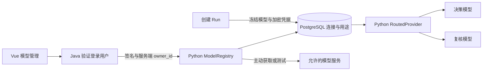

# 统一模型管理：用户连接与 Agent 模型用途

2026-09-15。入口：顶部导航「模型管理」或学习助手中的「管理模型」，页面路径 `/settings/models`。

## 已实现

- 每个登录账号独立创建、编辑、启停和删除模型服务连接。每个账号最多 20 个连接，每个连接最多 80 个模型 ID。
- 配置连接名称、服务基础地址、API Key 和模型列表。模型 ID 可手工填写，也可从已保存服务的 `/models` 获取；获取后进入搜索/勾选面板，默认不勾选新增项，只有“添加所选”的模型进入草稿，保存连接后才参与用途选择。取消选取不改列表。
- “整理已添加模型”可从现有列表中勾选要保留的模型，修改同样在保存连接后生效。当前用于决策/复核的模型会保留，先更换并保存用途后才能移除。
- 添加/整理的候选列表在最多 240px 的区域内连续滚动，手机端进一步受视口高度限制；无需翻页，搜索、勾选计数及确认按钮留在滚动区外。搜索后回到列表顶部，已勾选项保留。
- 获取后默认显示“课程 Agent 候选”，已知专用型号归入“其他用途”，未知型号保留并标记“用途待识别”；可切换“全部”。用途说明区分官方资料与按名称推测，官方工具能力不等于本项目单次工具测试，更不等于课程质量达标。
- 同系列日期版本折叠展示，搜索时展开精确 ID；选中项跨搜索、分类保留。整理已有模型默认显示全部，不自动移除专用或未知型号。
- 决策/复核选择器支持输入搜索与连接分组；模型可用性每页显示 6 项，支持搜索和折叠，不随 80 项列表撑长页面。
- 提供 25 个服务/地域预设，按国内、国际、聚合平台和本地服务分组，可搜索服务名称与常用模型。覆盖百炼四地域、DeepSeek、Kimi、智谱、MiniMax、豆包、混元、千帆、OpenAI、Gemini、Grok、Z.AI、Mistral、OpenRouter、硅基流动、Groq、Together AI 及三种本地服务。
- 预设填写名称与基础地址；常用模型通过按钮显式添加，也可手填或获取列表。它们是配置参考，不代表账号权限、工具兼容性或已通过测试。切换预设建立新连接草稿，清空未提交密钥，不覆盖已保存连接。
- 分别为 Agent **决策**和**草稿复核**选择模型，支持不同连接、不同模型。设置只影响新创建的 Run；已有 Run 保存并继续使用原始连接版本。
- 用户主动点击测试才发送一次简短工具调用（最多 64 输出 tokens、8 秒超时）。结果记录工具调用是否通过、耗时、检查时间与连接版本。失败提示脱敏；编辑连接后旧检查失效。没有自动收费测试。
- 可以清除用途选择，随后删除最后一个连接。清除后使用服务器默认；若默认未配置，新 Run 明确要求先选择模型。

第一版支持 **Chat Completions 兼容的标准工具调用协议**，消费方是 Python Study Agent。Embedding、ASR、视觉分析及 Java 课程准备链路仍使用部署配置。模型列表或连接测试通过不证明模型适合教学；之前 L2.2 质量门槛仍未通过。

### 服务目录与兼容边界（2026-09-17）

目录集中保存在 Python 包内的 [model_presets.json](../agent-service/src/lecturelens_agent/study/model_presets.json)，包含每项官方文档来源、模型示例和注意事项。`LIST` 返回 `presets` 与 `presets_checked_at`，前端直接消费该目录，服务端从同一目录生成精确 origin 白名单；没有客户端提交白名单、通配域名或启动时联网刷新。目录需要随服务商变更维护；获取模型列表失败时可以手工填写控制台 ID。

百炼预设使用普通 API 的北京、新加坡、香港及弗吉尼亚共享地址，Key 与地域应匹配；工作空间专属域名须显式加入 `AGENT_MODEL_ALLOWED_ORIGINS`。Claude 可经 OpenRouter 等兼容平台配置，使用该平台的 Key；Anthropic 原生协议、Azure/Bedrock 专属鉴权、编程订阅不是本轮新增能力。

本轮是服务目录与配置交互扩展，没有修改推理参数或模型消息协议。部分思考模型要求额外参数或完整思考消息回传，仍需单独适配和多轮工具调用验收，不能将这些预设称为已验证的 Study Agent 配置。没有使用真实云端 Key 或进行收费调用。

参考了 [OpenCode 的连接/模型配置流程](https://opencode.ai/docs/providers) 和 [DeepSeek Harness 的模型与执行框架分工](https://www.deepseek.com/harness/)。没有引入另一个 Agent 执行框架。

## 职责与数据流



Java 的 `ModelManagementController` 仅做登录校验、输入字段约束和签名转发。浏览器不能提交 owner_id。Python 验证签名 audience、时间、路径和正文，按 owner_id 处理连接与用途。Java 不新增模型配置表或学习决策逻辑。

新增 PostgreSQL 表 `agent_model_connection`、`agent_model_routing`；`study_run.model_config` 保存每次 Run 的冻结配置。调用事件和普通 Run 响应只提供模型名、连接名、ID 与版本，凭据不进入公开响应或 SSE。旧 Run 没有配置快照时，使用旧环境默认路径，不能追认它们具有新快照保证。

真实模式不再要求启动前填写全局模型 URL/model：服务可先启动，再由用户在页面配置。保留 `AGENT_LLM_*` 作为服务器只读默认。`AGENT_LLM_MODE=mock` 仍是明确的固定输出演示，不会使用个人模型路由，也不会在真实请求失败时自动启用。

## 凭据、地址与更新语义

- API Key 通过 Fernet 加密保存。可设置独立的 `AGENT_MODEL_ENCRYPTION_KEY`；为空时，从已有 `AGENT_SERVICE_SECRET` 进行带用途区分的密钥派生。部署时必须持久保存所用密钥；直接换掉它会导致现有连接及 Run 快照无法解密。
- 页面不回显 API Key，也不把它写入 localStorage。修改连接时，省略密钥字段表示保留；勾选清除才会删除连接中的密钥。改变目标地址时必须重新输入密钥或明确清除，防止旧密钥被自动发往新地址。
- 凭据也加密保存在 Run 快照中，因此编辑、停用、清除连接凭据或删除连接不会改变旧 Run。旧快照随该课程 Run 清理。要立即阻止已创建运行继续调用，应取消运行；需要撤销密钥时，在服务商端撤销。
- Web 用户不能任意访问服务器内网地址。允许的服务 origin 包括内置云服务、本机 8091/11434/1234 端口，以及显式服务器默认地址；自定义 origin 通过 `AGENT_MODEL_ALLOWED_ORIGINS` 追加。禁止 URL 内账号、查询参数、fragment、控制字符与路径跳转，不跟随重定向，不使用环境代理。
- 管理测试最多 2 个并发，不持有跨网络调用的数据库事务。模型发现响应最多 2 MiB，最多展示 1000 个去重后的有效 ID，独立于每个连接最多保存 80 个模型的限制。跳过无效条目并返回数量；超过上限或服务商声明后续页时明确提示目录不完整，其他型号可手填。不会跟随服务商返回的任意分页 URL。
- 编辑、删除和测试都检查连接版本。测试过程中连接被修改时，晚到结果不会标记新版本可用。被用途选择引用的连接需要先改选或清除用途才能删除。

## API

浏览器：`POST /api/agent/models/command`；Python 内部：`POST /internal/v1/models/command`。

| operation | 请求内容 | 结果 |
| --- | --- | --- |
| LIST | 无 | 当前用户的连接、用途与服务器默认是否可用 |
| SAVE | connection；更新另带 connection_id/version | 连接 ID 与新版本；不回显密钥 |
| DISCOVER | connection_id/version | 模型 ID 列表、有效总数、截断/后续页标志、跳过数，不自动保存 |
| PROBE | connection_id/version/model | 工具调用检查与耗时 |
| ROUTE | bindings.decision / bindings.review | 保存用途选择；各含 connection_id/model |
| CLEAR_ROUTES | 无 | 清除个人用途，恢复服务器默认路径 |
| DELETE | connection_id/version | 删除未被用途引用的连接 |

绑定 `{}` 表示显式选择服务器默认；默认未配置时不可选。不能引用其他用户的连接。启用与密钥编辑均通过 SAVE，key 的缺省与明确清除具有不同语义。

## 运行与验证

按 [Agent 服务说明](../agent-service/README.md) 启动 Java/Python 并启用 `STUDY_AGENT_ENABLED=true`。浏览器登录后打开模型管理；本机地址指 Python Agent 所在机器，而不是远程浏览器的电脑。

```bash
# 可选：生成独立加密密钥并妥善保存；不要把生成结果提交到 Git。
uv run --directory agent-service python -c 'from cryptography.fernet import Fernet; print(Fernet.generate_key().decode())'

# 真实独立 PostgreSQL 验证配置、密钥、作用域、冻结路由和恢复。
AGENT_TEST_DATABASE_URL=postgresql://.../lecturelens_agent_test uv run --directory agent-service pytest -q

# 需要已启动本地双服务、前端与 llama.cpp。创建两个独立验收账号；不调用云模型。
uv run --no-project --with playwright --with httpx python scripts/eval/check-model-management.py
```

原始浏览器账号/令牌、服务日志和截图保存在忽略目录 `.data/model-management/`。测试模型/工具夹具仅验证协议与路由；真实本地模型的简短连接测试也不替代课程质量评测。

### 本轮验收结果

2026-09-15：[可公开验证摘要](../eval/model-management/verification.json)。

- Python 102 项通过，使用独立真实 PostgreSQL 测试库；Java 1,365 项通过；前端 16 个文件、52 项通过。Python lint/format、TypeScript 与生产构建通过。
- Chromium 通过实际 Vue → Java → Python → PostgreSQL 链路创建个人连接、获取模型、测试工具调用，并分别保存决策/复核用途；刷新后恢复成功。服务启动时没有全局默认模型配置。
- 本地 Qwen2.5-3B-Instruct Q4_K_M 经 llama.cpp 完成一次真实工具调用检查，耗时 4,531 ms。没有调用付费云端服务；云服务地址预设未进行真实凭据验证。
- 第二个账号看不到第一个账号的连接，跨账号测试/删除被拒绝，客户端伪造 owner_id 被拒绝。390 px 移动端无横向溢出。
- 已删除本轮两个测试账号及其刷新令牌、模型连接和用途记录；临时服务停止，数据卷与其他项目服务保留。

以上验收覆盖连接管理和模型路由机制，没有重新评测课程教学质量；L2.2 质量门槛仍未通过。

### 服务预设扩展验证（2026-09-17）

- Python 模型管理 23 项通过，使用独立真实 PostgreSQL 测试库、无跳过；覆盖全部预设保存、密钥隔离及精确 origin 限制。Ruff 检查通过。
- 前端模型管理 6 项通过，TypeScript 与生产构建通过；构建仍有既有依赖注释和大包提示。
- Chromium 使用临时账号，经 HTTPS → Java → Python → PostgreSQL 检查 25 项预设、按模型搜索、快捷添加、保存/刷新恢复与服务切换；390px 手机视口无横向溢出。临时连接和账号已清理。
- 已更新当前公网入口。仅测试配置流程，没有真实云端推理调用，没有开展 L2.2 质量评测。

同日的模型选取交互修正：前端模型管理 7 项测试、TypeScript 与构建通过；Chromium 使用拦截模型 API 的 80 模型夹具验证显式勾选/取消、只保存所选、整理时保留正在使用的模型、决策与复核搜索、分页和手机布局。该检查仅验证前端交互，没有修改用户连接或发送真实模型请求；无需重跑 Python/Java 服务测试。


### 目录筛选与用途说明（2026-09-17）

展示说明位于 `frontend/src/lib/modelDiscovery.ts`，只影响选型界面，不参与授权或 Agent 运行决策。百炼已核实说明仅应用到目录中匹配的百炼预设；自定义服务同名模型不继承官方能力认证。名称规则只用于专用用途提示，未知型号不隐藏，允许手动添加。当前说明不提供自动价格比较，也不承诺最新排名。

目录优化轮未修改推理适配或发起云端推理。后续已单独完成下述百炼适配与真实开发试跑，L2.2 质量门槛仍未通过。

验证：Python 模型管理 25 项通过（独立真实 PostgreSQL，无跳过），前端模型管理/分类 10 项通过，Ruff、TypeScript 和生产构建通过。Chromium 在桌面及 390px 视口用 140 型号 API 夹具验证用途过滤、日期版本展开/搜索、跨分类保留勾选、80 项之外的型号检索、240px 滚动及显式保存。公网前端已发布，Python 服务已更新并通过健康检查；浏览器检查拦截模型 API，没有改动真实用户配置或调用云模型。


### 百炼调用适配与真实试跑（2026-09-17）

百炼官方共享/匹配的工作空间兼容地址下，Qwen Plus/Flash/Turbo、Qwen3 Max 和明确支持关闭思考的 Qwen3.8 Max/Flash/27B 型号显式关闭思考；单工具使用指定函数、多工具使用 auto 并严格校验结果。其他服务不继承该配置，思考专用型号仍未适配。网络/鉴权/限流/截断错误脱敏分类，学习页面提供对应提示，这些错误不自动重试。决策工具格式错误在原有 Run 预算内最多给一次明确纠正机会，页面显示进度；失败调用仍记录已知用量。

用户已配置的 qwen-plus 决策、qwen3-max 复核在隔离库完成六道开发题试跑，4/6 Run 成功，但课程内完整达标 1/4、完整拒答 0/2。详见 [完整报告](../eval/bailian-pilot/README.md)。调用链路可用不等于课程质量达标，L3 继续暂缓。

后续短复核与格式纠正回归 C：6/6 Run 完成，完整拒答 2/2，课程内完整达标仍为 1/4；三份错误练习被模型复核漏过。属于已见开发题，不是新保留集；详见 [最新回归](../eval/bailian-pilot/REGRESSION.md)。

再后续 D/E 逐字段复核没有提高完整语义，E 只完成 4/6，未替换线上 C。用户模型配置未改动，仅发布了学习题目/答案换行显示修复。候选与失败记录见 [D/E 报告](../eval/bailian-pilot/FIELD_REVIEW.md)。

同一 qwen3-max 的八份固定草稿定向诊断中，C/E 均判对 6/8；E 的误接受下降但出现误拒绝。该检查没有更换模型或发布 E，也不证明选型排名，见 [复核器诊断](../eval/reviewer-probe/README.md)。
