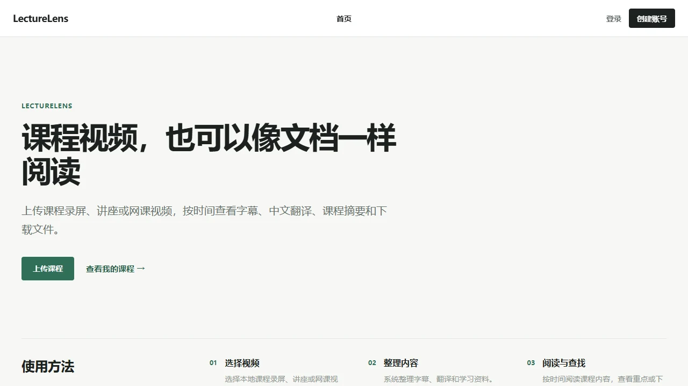
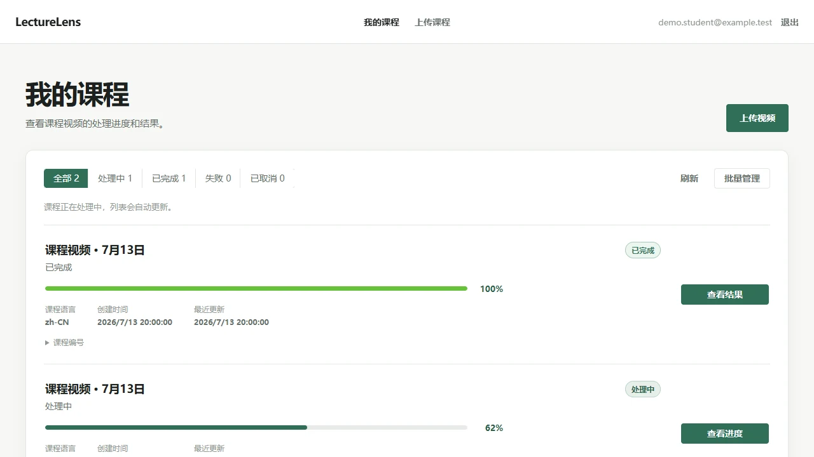
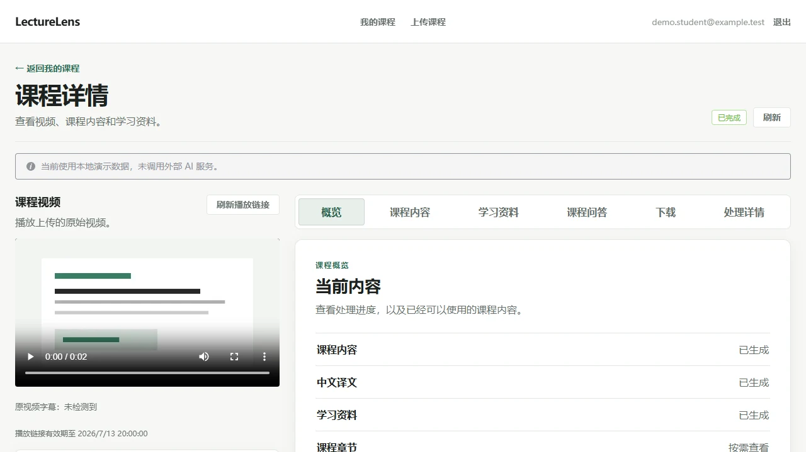
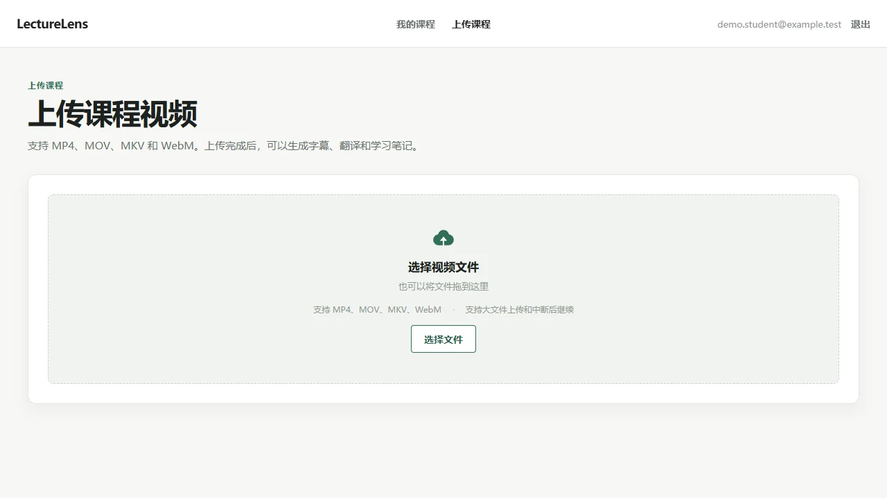
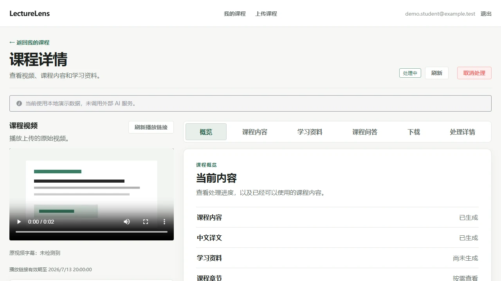
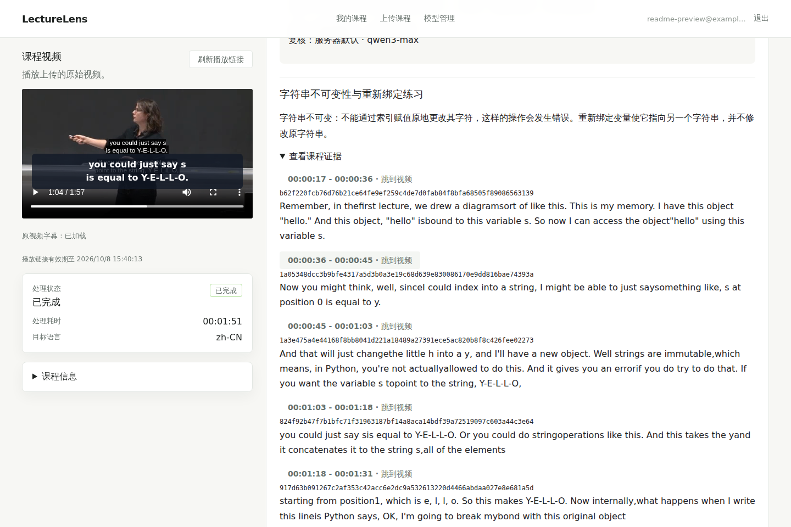
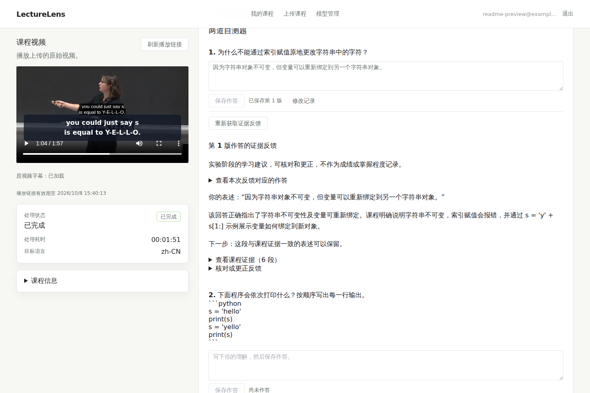
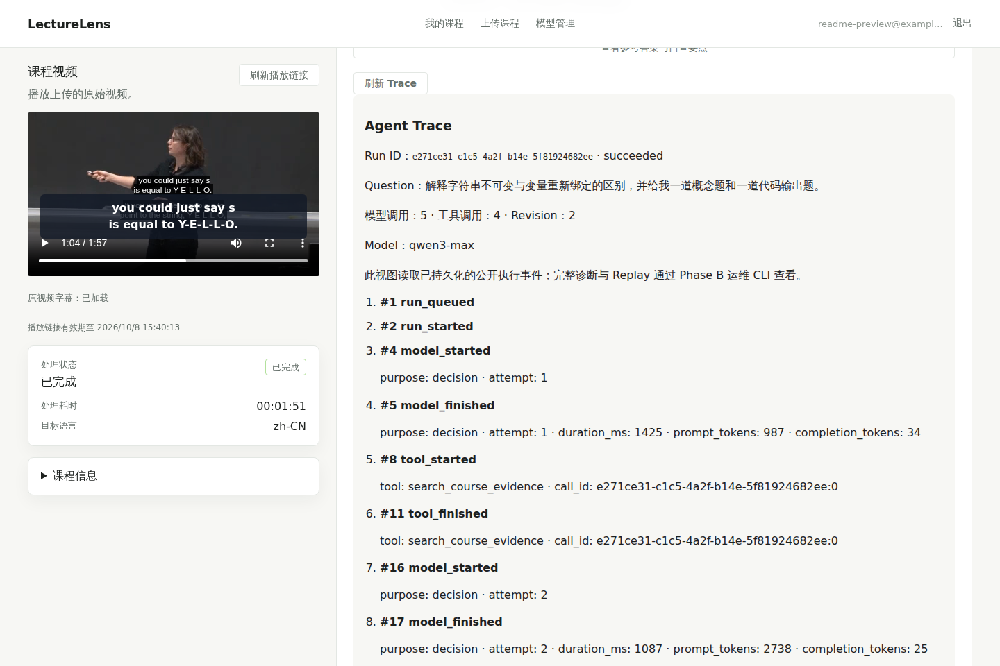

# LectureLens · 产品界面与截图说明

这是 LectureLens 原生产品界面的展示素材索引，不是新的 Demo 应用、产品功能清单之外的交互，也不是额外的模型测试结果。

[返回 README](../README.md)

## 课程产品界面

下面的界面截图来自 **本地合成测试课程**，展示了实际实现的导航与界面，不证明截图数据由外部模型生成。

| 页面 | 图片 |
| --- | --- |
| 产品首页 |  |
| 我的课程 |  |
| 课程学习工作区 |  |
| 课程内容阅读 |  |
| 上传课程 |  |
| 媒体处理状态 |  |

## 原生 Study Agent · 已保存的真实历史结果

这三张 1440 × 960 PNG 是 **原生浏览器界面直接截图**，不是合成 UI、官网静态海报或后期改写的文字。画面展示的课程视频、模型结果、作答和公开 Trace 均来自一门已知公开课程的已保存历史记录。

**重要版本与身份：**

- 课程：Ana Bell / MIT OCW 6.0001 Fall 2016, Lecture 3，11:00–12:57 课程视频片段。
- 原历史内容：2026-09-22 已保存的 qwen3-max Study Agent 记录（2026-09-21 的另一组历史记录独立保留，不与这组拼接）。
- 截图展示：2026-10-08 使用 LectureLens `c7430cb27a920b8694fa19bec8004010a0b72181` 原生 UI 对已保存内容进行读取和展示。
- Practice Run：`e271ce31-c1c5-4a2f-b14e-5f81924682ee`；Feedback Run：`dc488910-10b2-4add-bee7-0e53dcb99a58`。
- 原生登录、权限校验、课程 Evidence、视频字节、练习版本、反馈与公开 Trace 均经过副本环境验证。此次用于截图的查看没有新增模型、ASR 或付费 Provider 调用。
- 视频左侧可看到视频原有画内字幕和 UI 字幕的叠加；展示账户为单独创建的虚构邮箱，不是用户本人资料。
- 图片捕获了界面在当时的显示状态，**不代表当前仍可用的媒体签名链接**；视频链接随时间会过期并可按产品机制刷新。

### 1. 视频、解释与可定位 Evidence

### 2. 已保存的作答与证据反馈

### 3. 公开 Agent Trace

此前另两张局部 Agent 截图来自已验收的其他真实 Run，与上述全尺寸截图不合并成同一次运行：

- [Agent Evidence 局部](images/recruiter-agent-evidence.webp)
- [Agent Trace 局部](images/recruiter-agent-trace.webp)

## 准确性与授权

- 课程原视频及字幕来源：[MIT OpenCourseWare 6.0001 Lecture 3](https://ocw.mit.edu/courses/6-0001-introduction-to-computer-science-and-programming-in-python-fall-2016/resources/lecture-3-string-manipulation-guess-and-check-approximations-bisection/)；Ana Bell；[CC BY-NC-SA 4.0](https://creativecommons.org/licenses/by-nc-sa/4.0/)；仅用于非商业展示。MIT 不为本项目背书。
- 本仓库代码为 MIT License；这**不改变**视频、字幕、课程材料的原有许可。
- 展示内容不证明未见课程的表现、生产并发或自动评分质量。证据范围见 [Phase D 真实模型浏览器验收](../eval/recruiter-demo-phase-d/README.md)、[求职版冻结验收](../HUMAN_ACCEPTANCE_REPORT.md) 与 [评测索引](../eval/README.md)。
- 不公开源数据副本的凭据、私人运行配置、原始 Provider 响应或其他用户材料。
