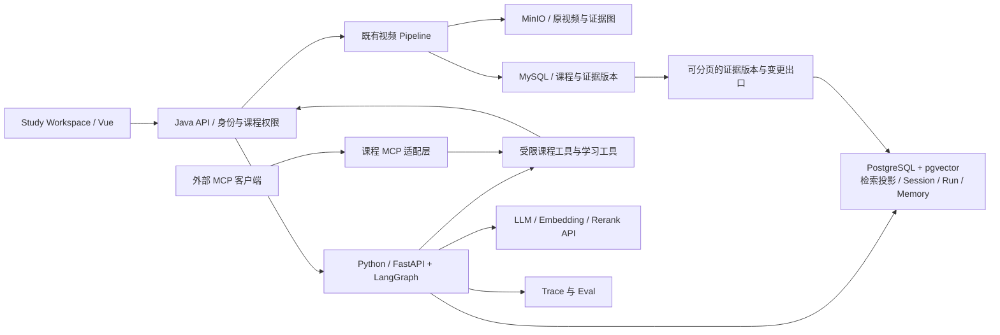
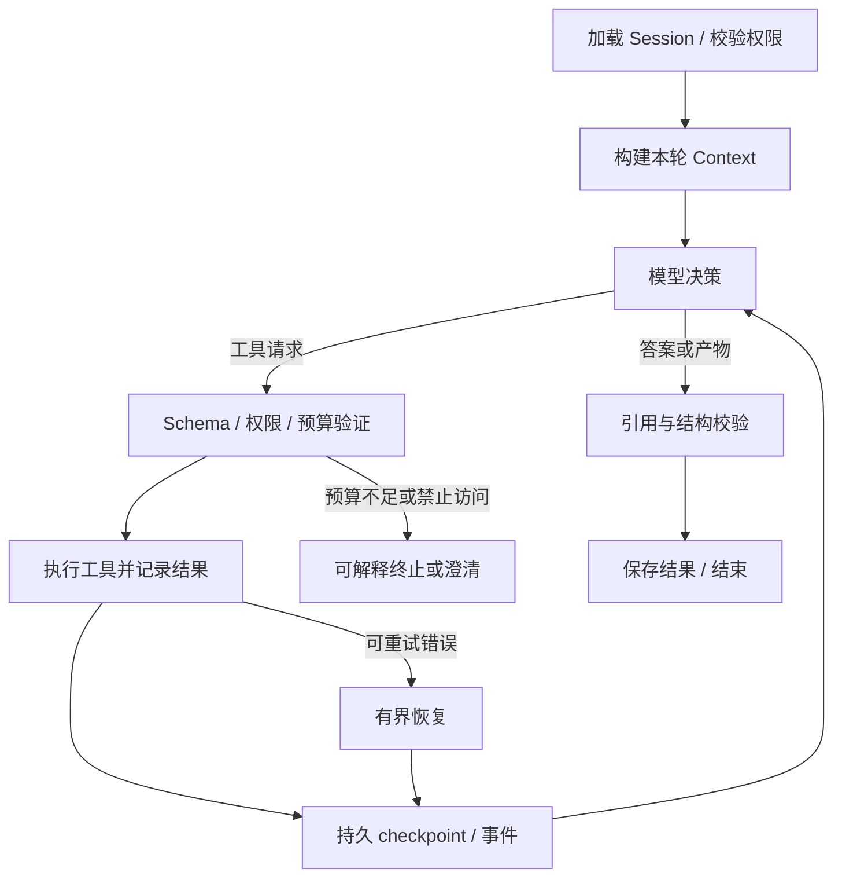

# LectureLens Study Agent 升级蓝图

日期：2026-09-11。评估基线：`main@f71641e`。状态：Agent 能力仍为建设蓝图；C0–C3 基线清理的实际交付见 [C0_C3_EXECUTION.md](C0_C3_EXECUTION.md)。

用户目标：国内高要求、较高薪酬的 **Agent 应用研发 / AI 后端工程** 岗位；不考虑以算法、训练、微调或强化学习为主的岗位。技术债与保留/删除明细见 [AGENT_MIGRATION_AUDIT.md](AGENT_MIGRATION_AUDIT.md)。

## 1. 项目定位与完成标准

建议定位：**基于课程多模态证据、能够执行学习任务并持续调整复习安排的 Study Agent。**

保留课程视频这一垂直场景，突出“证据有出处、工具有边界、任务可恢复、结果可评测”。新增 Python 服务承担 Agent 的核心逻辑，Java 承担视频摄取与业务基础能力。

第一条主流程：

> 用户：“帮我理解这节课的倒排索引，结合老师的幻灯片给我两道题；我答完后，帮我安排今天 20 分钟的复习。”

Agent 按需要检索字幕与幻灯片证据，补读原始时间范围，给出可跳转引用，生成有评分依据的练习；接收答案后保存学习事件，指出错误所在的证据，生成可编辑的复习安排。证据不足时补检索或询问，仍不足则明确说明；不能根据自身常识伪造“课程里说过”。

一次演示至少包含：正常完成、证据不足、工具失败恢复、用户取消、另一用户越权尝试、课程删除后旧引用失效。这些是应用工程演示，不等于上线规模与真实用户成效。

区分三种执行：

| 类型 | 本项目场景 | 决策归属 |
| --- | --- | --- |
| 确定性 workflow | 上传、ASR/OCR/VLM、持久化、索引构建 | 程序控制顺序和失败策略 |
| 普通 RAG | 一个明确课程问题，检索后回答 | 固定检索生成路径，可作为简单请求的低成本路径 |
| Agent | 模型根据学习目标和工具结果选择下一步、补证据或生成练习 | 模型在受限工具集内决定行动，系统控制授权与预算 |

LLM 输出一个叫 `action` 的 JSON 再由代码固定执行，不足以单独证明完成了上述 Agent 能力。至少要有真实 tool-call 协议、tool result 回填和由 observation 影响的继续/结束决策。

## 2. 国内岗位样本及其含义

以下为 2026-09-11 检索到的定向样本，并非市场占比调查或薪酬统计。区分校招、社招和岗位级别，不把任一薪资区间等同于该技术栈的价值。

| JD 样本与来源 | 样本边界 | 对项目的启发 |
| --- | --- | --- |
| [拼多多 Agent 研发，牛客招聘页](https://www.nowcoder.com/jobs/detail/460527) | 2027 届校招；页面列示 25–45K × 16 薪，投递期 2026-08-17 起 | 关注任务规划、上下文/记忆、工具、RAG、异步系统、权限与评估；接受 Python/Java/Go/C++ 中至少一种。训练为加分项，本蓝图不据此增加训练模块 |
| [飞享数据 LangGraph Agent 工程师，智联](https://www.zhaopin.com/jobdetail/CC245321380J40817430109.htm) | 中高级，3–5 年；可读页面未提供明确薪资 | Python 异步/类型、LangGraph 状态与条件循环、错误处理、可观测性、GitHub 案例和 CI |
| [INMO Agent 研发，领英职位页](https://cn.linkedin.com/jobs/view/ai-agent%E7%A0%94%E5%8F%91%E5%B7%A5%E7%A8%8B%E5%B8%88-at-inmo-4458438747) | 页面注明来源于猎聘；3 年以上，列示 20–30K/月 | 接受 Python 或 Java；要求实际产品交付、框架原理、Context、工具/MCP、评估、容错和成本优化 |
| [索格深材高级 Agent 研发，智联](https://www.zhaopin.com/jobdetail/CCL1526303040J40966428015.htm) | 1–3 年；科学软件应用场景，不采用其行业知识要求 | 将业务系统封装为 Tool/MCP，建设会话状态、重试恢复、权限、Trace 与任务完成率评测 |

推断：这些工程岗位共同要求的是端到端工程能力和效果迭代能力；语言要求并不统一。**本项目推荐新增 Python，是为了覆盖 Python/Agent 生态岗位并形成真实异步服务开发证据，Java 经验仍有价值。** 不以“所有高薪岗位只要 Python”为前提。

工程研发的优先级：

| 层次 | 应当能够讲清楚并拿出证据的能力 |
| --- | --- |
| 基础 | Python 类型、异步 I/O、取消与资源释放；HTTP/SSE；SQL、事务、索引；测试和部署 |
| Agent 核心 | 工具 schema、模型工具调用、状态图、边界控制、持久状态、context 预算 |
| 检索质量 | 数据来源、chunk、embedding、词法与向量检索、rerank、引用与拒答；能够做对照实验 |
| 工程深度 | 重试幂等、崩溃恢复、删除传播、权限隔离、token/延迟/费用观测、bad-case 回归 |
| 求职呈现 | 可复现代码、清楚的设计取舍、失败案例与修复数据、完整 Demo |

基础数据结构和服务性能仍要掌握；不新增 PyTorch 训练、SFT/RLHF、GPU 集群、CUDA 或模型榜单复现。用户工作年限和投递时间尚未提供，因此不把项目计划绑定于某一校招资格或资深职级。

## 3. 框架与平台选择

只选一套主要 Agent runtime，其他平台用于理解或互通验证，不把框架集成数量作为成果。

| 选项 | 当前官方能力 | 本项目决策 |
| --- | --- | --- |
| Python LangChain / LangGraph | LangChain 提供模型、工具和 middleware 组成的 agent；LangGraph 提供底层状态编排和持久执行。两者并非互斥。[LangChain](https://docs.langchain.com/oss/python/langchain/overview)、[LangGraph](https://docs.langchain.com/oss/python/langgraph/overview) | **主选。** 用 LangGraph 明确状态与业务写入边界，复用 LangChain 模型/工具组件；简单循环可直接基于 create_agent。避免同时手写另一套 scheduler/checkpointer |
| Spring AI / LangChain4j | Java 中也有 Tool Calling、RAG 和 MCP 相关能力。[Spring AI](https://docs.spring.io/spring-ai/reference/api/index.html)、[LangChain4j Tools](https://docs.langchain4j.dev/tutorials/tools/) | 纯 Java 岗位的有效备选；当前求职主线用 Python，不在已有 Java 服务上再叠一套 Agent 框架 |
| Dify | 官方的新 Agent 提供工具、Skill 和工作流复用；已具备 MCP 接入/暴露能力。[新 Agent](https://dify.ai/blog/introducing-new-dify-agent)、[MCP](https://dify.ai/blog/v1-6-0-built-in-two-way-mcp-support) | 理解企业快速交付方式；L4 用作可选外部 MCP 客户端演示。自己的状态、鉴权、评测仍需能解释，当前不额外部署整套 Dify |
| Coze Studio | 官方开源平台提供 Agent 构建和编排能力。[官方仓库](https://github.com/coze-dev/coze-studio/blob/main/README.zh_CN.md) | 同属平台型路线；有明确 JD 要求再做一次课程工具集成，不与 Dify 同时扩张 |
| Langfuse / LangSmith | Langfuse 提供 traces、datasets、experiments 与评测；LangChain 文档也推荐用 LangSmith 观察工具与状态。[Langfuse](https://langfuse.com/docs)、[LangChain](https://docs.langchain.com/oss/python/langchain/overview) | 默认 Langfuse，接入一个即可。先有脱敏 trace 导出和 eval runner，观测平台作为可选依赖，避免影响 Demo 可运行性 |

选择 LangGraph 的理由是本场景需要混合确定性业务步骤与模型决策、需要恢复和可检查状态，并且有对应 JD 样本；不是依据未经验证的市场份额排名。MCP、Skills 是扩展边界，不能替代 Agent runtime。

## 4. 目标架构与迁移边界



### 推荐技术组合

- Java 21 / Spring Boot：继续维护认证、上传、课程权限、媒体任务、证据原件与播放下载。避免为升级而重命名全部内部包与数据库。
- Python / FastAPI / Pydantic / LangGraph：新增 `agent-service/`，承担检索、Agent run、学习任务和记忆。使用受支持的 Python 版本并锁定依赖；实施时再验证具体版本兼容性。
- PostgreSQL + pgvector：新增 Agent 数据库，同时承担检索投影、checkpoint 和学习状态，减少为每项能力新增一个存储。pgvector 官方提供向量搜索和与全文检索组合的建议。[pgvector](https://github.com/pgvector/pgvector)
- 中文词法检索在初期用明确分词的 BM25 基线；不要把 PostgreSQL 默认英文全文检索当作开箱即用的中文方案。单课程小规模可以缓存按版本构建的 BM25；跨课程/大数据量再用测量结果决定专用搜索服务。
- 现有 Redis、RocketMQ、MinIO 先保留。RocketMQ 负责媒体长任务；Agent 内部工具调用使用函数或有界 HTTP，不逐步转为 MQ 消息。
- Vue 与 TypeScript 保留，新增 Agent workspace、流式状态和产物卡片；不因招聘关键词改写 React。

混合架构会增加一次服务调用、部署组件和数据同步成本，这是明确的取舍。MySQL 与 PostgreSQL 各自拥有清晰的数据边界；不允许 Java/Python 双写同一业务表。当前不同时引入 Qdrant/Milvus/Elasticsearch/Neo4j。以后有实际数据量瓶颈再选一种替换。

### 服务与数据边界

1. 浏览器继续通过 Java 入口完成身份验证；Agent 请求附带服务端签发、短时且限定 audience/scope 的用户执行上下文。Python 再验证身份，工具层独立验证资源归属。userId 不来自模型参数。
2. Java 是课程权限、原始证据版本和删除状态的事实来源。首版用 `course_id = 现有 task_id` 做兼容映射，并明确一门课程对应一个上传任务；后续确需跨版本/多视频课程再独立课程实体。
3. Java 提供可分页证据快照和持久变更游标（含删除 tombstone）；Python 按游标拉取、重试、幂等落库。可利用 outbox 生成变更记录，但初期不用再实现一套 Python RocketMQ 消费。索引就绪单独有状态，不将视频完成等同于 RAG 就绪。
4. Python 拥有 Session、AgentRun、学习产物和 Memory；通过内部 API 读取 Java 证据、验证当前版本和课程权限，不直接任意 SQL 读取 MySQL。
5. 检索必须在候选生成时使用 owner/course/revision 范围，生成前再核验课程当前有效性。不能先全库检索后仅在 UI 隐藏跨用户结果。鉴权不可用时拒绝访问缓存证据。
6. MCP Server 复用同一服务层和授权策略；它是额外入口，不是绕过 Java 权限的快捷通道。

## 5. 调整后的 L0–L6

| 阶段 | 核心交付 | 退出条件 |
| --- | --- | --- |
| **L0：基线与技术债** | 清理计划 C0–C3；重现 Demo；证据契约；最小数据集和 run/trace 约定 | CI 与实际能力一致，环境可重建；无生产 Noop 假成功；故障/证据边界清楚 |
| **L1：可评测 Evidence RAG** | 有版本 Evidence；embedding + 向量检索；BM25/hybrid；rerank 对照；时间引用与拒答 | 超过旧词法基线或解释无收益的原因；权限、版本、删除与引用可检验 |
| **L2：可恢复 Study Agent** | 工具协议、模型工具调用、受限循环、Run/Session/checkpoint、流式事件、取消、最小学习产物 | 完成“解释 + 出题”的多工具任务；重启恢复、超预算、工具异常可控 |
| **L3：Context 与学习 Memory** | context 选择与压缩、对话引用、答题事件、可修改/删除的长期偏好与薄弱知识点 | 多轮指代、跨会话偏好和复习调整有效；不串用户、不将推测记成事实 |
| **L4：MCP 与 Skill 互通** | 暴露少量只读课程工具；版本化技能包与加载机制；外部客户端实测 | 外部客户端能发现、调用并返回同源证据；Skill 确实影响行为且有测试 |
| **L5：评测和可靠性收口** | 聚合 L0 起积累的 Trace、eval、bad cases；质量/延迟/费用对照与故障报告 | 冻结测试集上的效果可复算；关键故障与隔离用例通过；预算可观测 |
| **L6：产品与求职交付** | Workspace 完整闭环、真实 Demo、架构/决策记录、E2E、README 与简历材料 | 一位新使用者可以启动、完成主流程、查看证据和复算结果 |

Eval、Trace、权限与最小 UI 从前期贯穿建设；L5/L6 是收口，不是首次出现。复杂 Multi-Agent、通用规划器、审批平台、任意代码执行留到明确业务需要时。基础取消、澄清、允许用户修改记忆不依赖大型 HITL 平台。

## 6. L1：Evidence 与 RAG 实施边界

### 证据契约

最小字段建议：

```text
evidence_id, owner_id, course_id, ingestion_revision
source_type, source_refs[], start_ms, end_ms, language
raw_text_ref, normalized_text, image_ref
derived_from[], extraction_quality, normalization_version
content_hash, created_at, deleted_at
```

`evidence_id` 绑定不可变来源版本与片段标识，同一版本重试产生同一 ID；内容变更产生新 revision。向量模型、维度与 chunker 版本存在索引元数据，更新时建新索引版本并原子切换。不要使用会随 delete-then-insert 改变的数据库自增 ID 作为唯一长期引用。

字幕、OCR 是提取的源材料；译文、VLM 解释、融合摘要是派生内容。保留 provenance，支持回看源图或源字幕。首期通过这些文本进入检索，只有必要时工具读取关键帧图像；不自建多模态 embedding 模型，也不训练 reranker。

### 检索链路

```text
问题 + Session 中明确的课程范围
  → 轻量 query normalization（多轮时才做指代改写）
  → 时间条件 + 词法/向量候选（权限前置）
  → 合并与去重（如 RRF）
  → 可选现成 reranker
  → 补读相邻时间段/原文
  → 按 token 预算选取 Evidence
  → 生成 + 引用校验 / 证据不足
```

先完成 dense-only，再比较 BM25、hybrid 和 rerank，不把每一层都设为无条件启用。以现成多语言 embedding/rerank 模型或 API 为候选，通过课程中英混合样本选择。模型应通过契约测试，包括超时、批次、空结果及维度一致性。

保留时间查询这一强能力：“20 分钟左右”优先使用时域过滤；跨模态同一时段候选要去重，避免字幕/译文/融合摘要重复挤满上下文。大型总览可以读取章节与全局摘要，但具体断言仍回到原始证据。

上下文输出必须返回 `visible_evidence_ids`。最终引用只允许引用本次实际提供的版本与片段，禁止用检索总数代替实际 prompt 中的证据集合。合法 ID 只能证明来源合法，不能证明语义支持；语义正确性通过评测和必要的答案检查验证。

## 7. L2：Agent、工具与状态

### 第一批工具

| 工具 | 职责 | 副作用与边界 |
| --- | --- | --- |
| `search_course_evidence` | 课程内检索，返回 evidence IDs、文本和来源 | 只读；课程/时间/TopK 有上限；身份由服务端注入 |
| `read_evidence_window` | 补读某片段相邻字幕或指定关键帧 | 只读；不能访问任意路径或任意外部 URL |
| `get_course_outline` | 返回章节与当前可用资料 | 只读；明确生成来源和版本 |
| `create_practice_set` | 基于证据生成结构化练习和评分依据 | 生成草稿；题目必须关联证据，答案不能提前泄露给作答视图 |
| `save_study_artifact` | 保存练习/笔记/复习计划 | 幂等写；`run_id + tool_call_id` 对应同一业务结果 |
| `record_practice_result`（L3） | 保存用户提交的答案与反馈 | 主观题评语与实际作答分开存储；不能捏造用户回答 |

“Tool Registry”首版只是版本化的工具清单、schema、handler、超时与作用域元数据，不建设动态插件市场。工具只暴露需要的资源；不要提供通用 SQL、shell、任意 HTTP 工具。

### 执行图与运行约束



最小状态：`session_id`、`run_id`、owner、course/revision 范围、messages、当前目标、evidence refs、artifact refs、token/time budget、工具调用记录、状态、checkpoint/version。长文本和图像不反复塞入 state，使用引用按需读取。

Run 状态：`queued/running/waiting_user/succeeded/failed/cancelled/budget_exceeded`。一 Session 首版只允许一个活跃 Run；新消息排队或明确拒绝，避免双写 checkpoint。`session_id` 与框架 thread ID 绑定，和本轮 run ID 分开。

起始工程预算示例：每轮最多 6 次模型调用、8 次工具执行、90 秒总 deadline；单个只读工具最多 1 次自动重试。它们是起始配置，不是性能承诺；根据 eval 观察收敛。每次调用前检查预算，限制并行工具数，识别连续重复工具和无新证据循环。

checkpoint 不自动保证外部写入恰好一次。保存产物需要数据库唯一幂等键、结果回读以及恢复测试；失效 worker 通过执行版本或租约被阻止再次提交。使用所选框架的持久化实现，遵循其恢复语义。[LangGraph persistence](https://docs.langchain.com/oss/python/langgraph/persistence)

HTTP 创建 Run 返回 ID；SSE 发送 `run_started/tool_started/tool_finished/evidence_selected/artifact_created/run_finished` 等事件，带单调 event sequence。前端断线按游标恢复，取消通过独立端点传到 worker。流式输出先以步骤事件和最终答案为基础，后续支持文本增量。展示工具行为与简短说明，不记录或展示隐藏思维链。

## 8. L3：Context 与 Memory

将四类内容分开：

| 内容 | 生命周期 | 注入方式 |
| --- | --- | --- |
| 课程证据 | 课程版本 | 通过检索/工具按需读取；不叫用户记忆 |
| Session 状态与近期对话 | 当前学习会话，可持久恢复 | 最近若干轮 + 保留引用 ID 的滚动摘要 |
| 学习事件 | 用户真实作答与操作 | 原始事实记录，可审查与更正 |
| 长期偏好/薄弱项 | 跨 Session，有来源/时间/版本 | 与本轮目标相关时选择性加载，可编辑、删除 |

这与框架区分短期会话状态和跨会话长期存储的方式相符，但具体记忆策略由产品定义。[LangChain Memory](https://docs.langchain.com/oss/python/concepts/memory)

示例：“希望中文、每次 20 分钟”是明确偏好；“对倒排索引不熟悉”应来自具体作答，而非模型根据语气推测。两次答错只能支持“这些题尚未掌握”，不能伪称经过科学测量的学习能力分数。

Context 预算先分配系统规则、工具 schema、本轮问题、近期对话、证据和少量记忆，为输出预留 token。长期原文留在存储；压缩摘要保留未完成动作与引用关系。用户更正记忆优先于历史推断，记录来源、更新时间和过期条件；删除课程后清理或脱敏引用该课程的派生记忆。

验收包含：指代上一轮的“第二个概念”、跨会话偏好、更正错误记忆、删除记忆、相互矛盾的偏好、课程切换、不串用户、长对话压缩后引用仍有效。

## 9. L4：MCP 与 Skill

先把三个只读课程工具暴露为 MCP：检索、读取证据、读取课程大纲。至少用一个独立客户端验证发现、调用、错误响应、鉴权与来源一致性。需要 Web 远程接入时采用兼容的 Streamable HTTP；本地演示可使用 stdio。实施时固定 SDK 与协议版本并核对客户端支持，不能假设所有客户端版本天然互通。[MCP 架构](https://modelcontextprotocol.io/docs/learn/architecture)

Skill 是包含说明、参考材料及可选脚本的能力包，不是 Tool 的另一个名字。可制作 `evidence-grounded-explanation` 和 `practice-review` 两个包，采用 SKILL.md 与资源结构，并实现按任务选择加载、版本记录和回归测试。[Agent Skills 官方概述](https://agentskills.io/home)

Skill 指导模型如何组织“找证据→解释→出题”等过程，工具提供实际数据或动作，MCP 解决外部能力交换。首期只允许仓库内受版本控制的 Skill，不增加上传任意脚本或下载执行插件的入口。

## 10. Eval / AgentOps：从 L0 开始，L5 收口

### 数据与对照实验

建议建立约 100 条人工复核问题，覆盖至少 5 个有授权的课程/片段，包含中英混合、术语改写、时间定位、仅视觉可回答、跨片段综合和无法回答场景。再建设约 30 条多步学习任务，以及不少于 15 条权限、失败恢复与预算用例。这些是建议规模，不是现有数据。

按课程划分开发与保留测试，避免同一视频的相邻片段跨集合泄漏。每条包含 task/input、允许课程、可接受证据、答案要点或产物约束、不可接受行为。模型可协助拟题，必须人工检查来源、答案与歧义，不用生产模型自己生成再自己打分作为唯一证据。

先比较四个变体：当前 keyword QA、dense RAG、hybrid、hybrid+rerank；再比较固定 RAG 和 Agent。保持语料、模型、prompt/索引版本、题集一致。Agent 应在需要多步操作的任务上体现收益；简单问答若固定 RAG 更快更省，保留快速路径。

### 指标与建议门槛

| 指标 | 计算/验证方式 | 用途 |
| --- | --- | --- |
| Recall@K、MRR/nDCG | 标注可接受证据；区分“命中任一证据”和“覆盖全部必需证据” | 判断召回与排序，不能只看最终答案 |
| 引用合法率、引用支持度 | ID/版本/时间程序校验 + 人工/校准后的 judge 判断断言支持 | 不把“有 citation”当作“答对” |
| 不可回答拒答率、可回答误拒率 | 两组分开统计 | 防止全拒答刷高安全/忠实指标 |
| Task success | 同时检查解释、引用、题目、状态变更/产物等业务约束 | 以结果为准，不要求固定唯一工具调用顺序 |
| 重复副作用与越权 | 程序断言/故障注入，列出样本与分母 | 必须在纳入门禁的用例中为 0；不外推为绝对安全 |
| 首事件、首 token、总耗时 P50/P95 | 包含失败/超时并说明冷启动和并发配置 | 首事件不能冒充首 token |
| token/调用数/费用 | 累加所有 attempt、embedding、rerank 和模型调用 | 单个最终成功 response 的 usage 不代表总费用 |
| 每成功任务成本 | 所有尝试费用 / 成功任务数；另外列每请求成本 | 防止失败重试成本被排除 |
| 记忆正确性 | 事实来源、更正/删除、跨用户隔离和多轮任务成功 | 不用记忆条数替代效果 |

可讨论的初始发布目标：回答类 Recall@10 ≥ 0.85；人工核验引用支持度 ≥ 0.90；多步任务成功率 ≥ 0.80；关键权限、预算和幂等用例全部通过。**这些是项目拟定门槛，不是行业标准或已达成绩。** 先测 baseline，按错误代价和题集难度校准；冻结保留集后不为过关而改题。

非确定性 Agent 对关键题重复运行至少 3 次，报告每次结果、均值及波动；样本不够时避免精确宣传 p95 和微小提升。judge 使用固定 rubric/版本，通过人工抽样校准，同时报告 disagreement，不能单凭同一模型的自评分发布效果。

### 可观测与回归

一条 trace 关联 `ingestion_revision/session_id/run_id/tool_call_id`、模型/prompt/tool/skill/index 版本、检索候选与分数、选入证据、每次调用 usage、超时和恢复原因。日志默认使用脱敏摘要或引用；受控 eval 样例可以保留完整可复现内容。SDK trace 采样策略不能导致预算统计缺漏。

CI 执行确定性工具/schema/权限/状态测试及少量固定回放 E2E；真实模型 eval 独立预算执行并保存报告。将线上或人工 Demo 的错误变成带原因分类的 bad case：检索缺失、证据脏、规划错误、工具错误、上下文遗漏、错误记忆、输出无支持、超时/预算。重放记录与重新调用模型分别标注。

## 11. 交付顺序与范围控制

### 第一轮可投递的工程作品

完成 L0、L1、L2 的核心闭环；拥有最小多轮 Session、一个真实学习产物、可展示 trace、可运行数据集、故障恢复及基础 Workspace。达到这一点才可将 README 主定位改为 Study Agent，并如实列出 L3/L4 待办。

### 完整主项目

补齐 L3 学习反馈与记忆、L4 MCP/Skill，收口 L5 评测与 L6 求职材料。演示“语义改写检索”“视觉证据”“多轮学习与记忆更正”“工具故障恢复”四类代表场景，而不是只展示一段预录成功对话。

建议后续工作包：

| 工作包 | 主要产物 |
| --- | --- |
| A 基线清理 | 审计 C0–C3、稳定证据出口、固定 Demo |
| B 检索闭环 | Python skeleton、索引/删除同步、baseline eval、RAG API |
| C Agent 闭环 | 状态图、工具、预算、checkpoint、SSE、学习产物 |
| D 学习连续性 | Session context、作答事件、记忆管理与评测 |
| E 互通与质量 | MCP/Skill、实验报告、故障注入、依赖/运行文档 |
| F 产品交付 | Workspace、真实 Demo、架构图、简历与面试讲解 |

不提供缺乏工时、Python 熟练度和可用模型预算依据的周数承诺。优先级是 A→B→C；D/E/F 的 UI、Trace 和数据准备可伴随前期能力进行，但不额外建设通用平台。

明确延后：Multi-Agent、通用 ReAct 平台、复杂 Plan-and-Execute、A2A、GraphRAG、任意代码沙箱、Kubernetes 集群、SFT/RL、向量数据库横评平台、自动联网收集私人课程。HITL 只做到必要的澄清、取消、可修改记忆和有副作用操作的明确确认。

## 12. README 与简历如何收口

README 的首屏顺序建议：产品任务与演示 → Agent 工具/状态图 → 证据检索 → Eval/可靠性数据 → 本地启动 → 技术决策。原视频 pipeline 作为 ingestion 架构说明保留，上传、MQ、Redis 不再占据全部项目叙事。

最终材料至少包含：可运行仓库与锁文件、mock 和真实模式、许可清楚的样例、指标原始结果与实验配置、三项关键架构取舍、一个失败复盘、部署/重启/删除验证记录。

简历在实现和实测后填入以下事实，不能提前把蓝图写成成果：

> 基于 Python/FastAPI/LangGraph 构建课程学习 Agent，复用 Java 多模态摄取服务，实现证据检索、工具调用、会话恢复与学习产物生成；在 N 个课程、M 条保留测试任务上达到 X 的任务成功率，引用支持度 Y，P95 延迟 Z，相比基线改善……。

另用一条说明实际负责的可靠性问题，例如消除 MQ 故障窗口、实现工具幂等与恢复、完成删除到索引的传播。面试时能从一个失败 trace 解释根因、改动与回归结果，比列出十个框架名称更能证明这套系统由自己掌握。
